<!-- GENERATED FILE - DO NOT EDIT. Run `make roadmap` (scripts/render_roadmap.py). Edit tasks/TODO-NNN.md + streams/WNN-*.md instead. -->

> 🇩🇪 Deutsche Übersetzung: [`TODO_de.md`](TODO_de.md). **English is the canonical source** — on divergence the English original wins.

# TODO Roadmap — Backlog & Task Tracking

Persistent, prioritized backlog. This file is the single status board for **tasks, streams, and their relationships** — what is planned, in progress, and done. Each open item is processed **as its own commit**; the `Commit` column is filled with the hash and date once an item is `DONE`.

> **What belongs here vs. elsewhere.** This roadmap holds **task/stream data only**. Project-context documents that are not tied to a specific task or stream live as separate files and are linked from here:
>
> - **Endpoint inventory** → [`docs/API/endpoint-inventory.md`](docs/API/endpoint-inventory.md)
> - **Whitelist SSoT audit (2026-05-28)** → [`docs/findings/audit-findings-2026-05-28.md`](docs/findings/audit-findings-2026-05-28.md)
> - **Whole-repo architecture audit (2026-05-30)** → [`docs/findings/ARCH_REVIEW_WHOLE_REPO.md`](docs/findings/ARCH_REVIEW_WHOLE_REPO.md)
> - Architectural decisions → [`docs/decisions.md`](docs/decisions.md) · Session log → [`docs/journal.md`](docs/journal.md) · How-tos → [`docs/howto/`](docs/howto/)

> **Generated file.** `TODO.md` / `TODO_de.md` are generated from the per-task files (`tasks/TODO-NNN.md`) and the stream/include sources under [`streams/`](streams/). **Never hand-edit the dashboard** — edit the sources and run `make roadmap` (roadmap-as-data, ADR-018; see the [how-to](docs/howto/howto-track-and-claim-tasks.md)).

> **Reading guide:** start with the [Stream summary](#stream-summary) for the big picture, then open the per-task file under [`tasks/`](tasks/) for each TODO's Reference / Acceptance Criteria / Notes.

**Status legend:** 🔴 OPEN · 🟡 IN PROGRESS · 🟢 DONE · ⚪ DEFERRED / OBSOLETE

**Priority legend:** 🔥 P9-P7 (high, urgent) · 📌 P6-P4 (medium, normal) · 🌿 P3-P1 (low, nice to have) · ⚪ (done / deferred — N/A)

**Dependency notation:** `→ TODO-X` = hard (X must be finished first) · `~ TODO-X` = soft (work easier after X, but stubbable) · `—` = none

## 🔥 Open streams - by priority

| Stream | Owner | Top-Prio | Notion | Epic | Open (🟡 WIP) | Done | Prio-Profil |
| --- | --- | --- | --- | --- | --- | --- | --- |
| **[W58](#w58---close-the-integration-test-coverage-gaps-on-the-critical-moneydatacorrectness-paths-real-pg-nets-where-mocked--false-green)** | codex* | 🔥 P8 | — | Close the integration-test coverage gaps on the critical money/data/correctness paths (real-PG nets where mocked = false green) | 14 (4) | 0/14 | 2×P8 · 1×P7 · 2×P6 · 5×P5 · 3×P4 · 1×P3 |
| **[W35](#w35---supabase-orbit-v2-schema-rbac--onboarding-defaults)** | lpc-000* | 🔥 P7 | — | Supabase Orbit V2 schema, RBAC & onboarding defaults | 2 | 1/3 | 1×P7 · 1×P5 |
| **[W37](#w37---infrastructure-tooling--administrative-tasks)** | thuan-427* | 🔥 P7 | — | Infrastructure, tooling & administrative tasks | 9 | 5/14 | 1×P7 · 2×P6 · 1×P5 · 2×P4 · 2×P3 · 1×P1 |
| **[W40](#w40---supabase-public-schema-optimization-live-audit-2026-06-10)** | — | 🔥 P7 | — | Supabase public schema optimization (live audit 2026-06-10) | 5 | 0/5 | 2×P7 · 1×P5 · 1×P4 · 1×P3 |
| **[W52](#w52---clean-and-consolidate-over-deletion-incident-18-jun--recover-jans-wrongly-deleted-appointments-fix-the-root-cause-over-deletion-and-prevent-recurrence)** | lpc-000* | 🔥 P7 | — | Clean-and-Consolidate over-deletion incident (18 Jun) — recover Jan's wrongly deleted appointments, fix the root-cause over-deletion, and prevent recurrence | 4 (2) | 10/14 | 1×P7 · 3×P1 |
| **[W07](#w07---security-blockers--hardening)** | nhatminhtrieu* | 📌 P6 | — | Security blockers & hardening | 3 (1) | 13/16 | 1×P6 · 1×P2 · 1×P1 |
| **[W21](#w21---termine-prod--supabase-reconciliation)** | Minh | 📌 P6 | [epic](https://www.notion.so/3756ab7a191681988041d8ecc7618503) | Termine prod ↔ Supabase reconciliation | 3 | 18/21 | 1×P6 · 1×P5 · 1×P3 |
| **[W31](#w31---transactional-email-pipeline-postmark-in-orbit-be)** | thuan-742* | 📌 P6 | [epic](https://app.notion.com/p/3796ab7a191681889b6ae0412590e272) | Transactional email pipeline (Postmark) in orbit-be | 1 | 10/11 | 1×P6 |
| **[W53](#w53---termine-reconciliation)** | nhatminhtrieu* | 📌 P6 | — | Termine Reconciliation | 3 | 10/13 | 1×P6 · 2×P5 |
| **[W54](#w54---clean--consolidate-refactor--net-first-correctness-then-structure-decomposition-of-the-4527-line-cleanup_service-god-flow)** | Hung | 📌 P6 | — | Clean & Consolidate refactor — net-first, correctness-then-structure decomposition of the 4527-line cleanup_service god-flow | 5 (2) | 4/9 | 1×P6 · 4×P4 |
| **[W57](#w57---consolidate-the-fragmented-booking-endpoints-behind-one-booking-service--populateexpose-event-attendees)** | cc-999* | 📌 P6 | — | Consolidate the fragmented booking endpoints behind one booking service + populate/expose event attendees | 5 (2) | 1/6 | 2×P6 · 3×P5 |
| **[W13](#w13---sales-availability-re-architecture-orbit-owned-sync-into-supabase-orbit-schema)** | Hung | 📌 P5 | [epic](https://www.notion.so/3726ab7a191681e3a4d2fdf5c20da763) | Sales-availability re-architecture: Orbit-owned sync into Supabase `orbit` schema | 2 | 6/8 | 2×P5 |
| **[W27](#w27---general-bugfix)** | nhatminhtrieu* | 📌 P5 | [epic](https://www.notion.so/3766ab7a19168114b473d00670af22c0) | General bugfix | 2 (1) | 7/9 | 2×P5 |
| **[W34](#w34---google-workspace-sync-integrity--endpoint-consolidation)** | lpc-000* | 📌 P5 | — | Google Workspace sync integrity & endpoint consolidation | 2 | 5/7 | 2×P5 |
| **[W50](#w50---customer-feedback--field-reported-ux-gaps)** | dev_tien* | 📌 P5 | — | Customer feedback — field-reported UX gaps | 1 | 1/2 | 1×P5 |
| **[W51](#w51---analysis-pass--gap-reports--track-jl-cc--asol-gap-analysis-findings-as-actionable-checklists-that-link-to-the-implementation-tasks)** | — | 📌 P5 | — | Analysis-pass & gap reports — track jl-cc / asol-gap-analysis findings as actionable checklists that link to the implementation tasks | 2 | 0/2 | 2×P5 |
| **[W14](#w14---performance-dashboard-auditability--trust)** | Minh | 📌 P4 | [epic](https://www.notion.so/3726ab7a1916812d8f26d90fd9c09894) | Performance-dashboard auditability & trust | 2 | 16/18 | 1×P4 · 1×P3 |
| **[W39](#w39---orbit_green-schema-hardening-alpha-audit-2026-06-10)** | lpc-000* | 🌿 P3 | — | orbit_green schema hardening (alpha audit 2026-06-10) | 2 | 5/7 | 1×P3 · 1×P2 |
| **[W49](#w49---publicinternal-proposals-parity--salesperson-working-hours-completeness-telli-0-proposals-rca)** | lpc-001 | 🌿 P3 | — | Public/internal proposals parity & salesperson working-hours completeness (Telli 0-proposals RCA) | 1 (1) | 5/6 | 1×P3 |
| **[W04](#w04---special-cases--db)** | caphefalumi-831* | 🌿 P2 | — | Special cases → DB | 1 (1) | 3/4 | 1×P2 |
| **[W08](#w08---reliability--data-integrity)** | Toan | 🌿 P2 | [epic](https://www.notion.so/3736ab7a19168122a53dd0e821b4ab57) | Reliability & data integrity | 1 | 9/10 | 1×P2 |
| **[W10](#w10---architecture--data-layer-consolidation)** | lpc-000* | 🌿 P2 | — | Architecture & data-layer consolidation | 1 | 30/31 | 1×P2 |
| **[W11](#w11---documentation-accuracy)** | lpc-000* | 🌿 P2 | — | Documentation accuracy | 1 | 4/5 | 1×P2 |
| **[W23](#w23---agent-memory-cross-project-read)** | lpc-000 | 🌿 P2 | — | Agent Memory (cross-project read) | 1 | 4/5 | 1×P2 |
| **[W29](#w29---telli-x-orbit-terminbuchung--6-ai-voice-appointment-tools-on-the-live-orbit-public-api)** | nhatminhtrieu* | 🌿 P2 | [epic](https://app.notion.com/p/3776ab7a1916814596f2cc04a213cffe) | Telli x Orbit Terminbuchung — 6 AI-voice appointment tools on the live Orbit public API | 2 | 15/17 | 1×P2 · 1×P1 |

> `*` after an owner = derived from the latest task claim (the stream has no explicit owner).

## 📊 Overview - 485 TODOs

### Stream summary

| Stream | Owner | Top-Prio | Notion | Epic | Status | Done | Prio-Profil |
| --- | --- | --- | --- | --- | --- | --- | --- |
| **[W01](TODO_archive.md#w01---stop-the-writes)** | nhatminhtrieu* | — | — | Stop the writes | 🟢 Closed | 4/4 | — |
| **[W02](TODO_archive.md#w02---restore-truth-in-db)** | nhatminhtrieu* | — | — | Restore truth in DB | 🟢 Closed | 2/2 | — |
| **[W03](TODO_archive.md#w03---clean-up-reads)** | huan* | — | — | Clean up reads | 🟢 Closed | 4/4 | — |
| **[W04](#w04---special-cases--db)** | caphefalumi-831* | 🌿 P2 | — | Special cases → DB | 🔴 Open | 3/4 | 1×P2 |
| **[W05](TODO_archive.md#w05---prevention)** | lpc-001* | — | — | Prevention | 🟢 Closed | 10/10 | — |
| **[W06](TODO_archive.md#w06---logging-guard)** | lpc-002* | — | — | Logging guard | 🟢 Closed | 1/1 | — |
| **[W07](#w07---security-blockers--hardening)** | nhatminhtrieu* | 📌 P6 | — | Security blockers & hardening | 🔴 Open | 13/16 | 1×P6 · 1×P2 · 1×P1 |
| **[W08](#w08---reliability--data-integrity)** | Toan | 🌿 P2 | [epic](https://www.notion.so/3736ab7a19168122a53dd0e821b4ab57) | Reliability & data integrity | 🔴 Open | 9/10 | 1×P2 |
| **[W09](TODO_archive.md#w09---performance)** | thuan-427* | — | — | Performance | 🟢 Closed | 6/6 | — |
| **[W10](#w10---architecture--data-layer-consolidation)** | lpc-000* | 🌿 P2 | — | Architecture & data-layer consolidation | 🔴 Open | 30/31 | 1×P2 |
| **[W11](#w11---documentation-accuracy)** | lpc-000* | 🌿 P2 | — | Documentation accuracy | 🔴 Open | 4/5 | 1×P2 |
| **[W12](TODO_archive.md#w12---classification-correctness--doc-drift)** | violetchan-2509* | — | — | Classification correctness & doc-drift | 🟢 Closed | 12/12 | — |
| **[W13](#w13---sales-availability-re-architecture-orbit-owned-sync-into-supabase-orbit-schema)** | Hung | 📌 P5 | [epic](https://www.notion.so/3726ab7a191681e3a4d2fdf5c20da763) | Sales-availability re-architecture: Orbit-owned sync into Supabase `orbit` schema | 🔴 Open | 6/8 | 2×P5 |
| **[W14](#w14---performance-dashboard-auditability--trust)** | Minh | 📌 P4 | [epic](https://www.notion.so/3726ab7a1916812d8f26d90fd9c09894) | Performance-dashboard auditability & trust | 🔴 Open | 16/18 | 1×P4 · 1×P3 |
| **[W15](TODO_archive.md#w15---performance-dashboard-endpoint-coverage--all-tabs)** | Huan | — | [epic](https://www.notion.so/3736ab7a191681af99d2cab9bd4cd9b7) | Performance-dashboard endpoint coverage — all tabs | 🟢 Closed | 18/18 | — |
| **[W16](TODO_archive.md#w16---panterservice-lead-duplication-shutdown--orbit_greenleads-dedup)** | Duc Anh | — | [epic](https://www.notion.so/3736ab7a1916812aa326fcba1d44861c) | PanterService lead-duplication shutdown & `orbit_green.leads` dedup | 🟢 Closed | 8/8 | — |
| **[W17](TODO_archive.md#w17---closer-performance--schema-foundations-self-booking-lineage--structured-funnel)** | Hung | — | [epic](https://www.notion.so/3746ab7a191681e3a24ff09eedb90b4d) | Closer Performance · schema foundations (self-booking lineage + structured funnel) | 🟢 Closed | 5/5 | — |
| **[W18](TODO_archive.md#w18---closer-performance--leaderboard-endpoint-full-funnel--revenue)** | hazhaz-447* | — | [epic](https://www.notion.so/3746ab7a191681e4aa2bc9e86256db1e) | Closer Performance · leaderboard endpoint (full funnel + revenue) | 🟢 Closed | 3/3 | — |
| **[W19](TODO_archive.md#w19---closer-performance--capacity-endpoint-kapazität-sub-tab)** | Thuan | — | [epic](https://www.notion.so/3746ab7a19168114a095e39e148e4611) | Closer Performance · capacity endpoint (Kapazität sub-tab) | 🟢 Closed | 3/3 | — |
| **[W20](TODO_archive.md#w20---closer-performance--tests--fe-contract)** | hazhaz-447* | — | [epic](https://www.notion.so/3746ab7a19168187ab82f3930d389330) | Closer Performance · tests & FE contract | 🟢 Closed | 3/3 | — |
| **[W21](#w21---termine-prod--supabase-reconciliation)** | Minh | 📌 P6 | [epic](https://www.notion.so/3756ab7a191681988041d8ecc7618503) | Termine prod ↔ Supabase reconciliation | 🔴 Open | 18/21 | 1×P6 · 1×P5 · 1×P3 |
| **[W22](TODO_archive.md#w22---salesperson-onboarding-readiness)** | hazhaz-672* | — | [epic](https://www.notion.so/3756ab7a1916817d8682d2b4d62591cc) | Salesperson onboarding readiness | 🟢 Closed | 4/4 | — |
| **[W23](#w23---agent-memory-cross-project-read)** | lpc-000 | 🌿 P2 | — | Agent Memory (cross-project read) | 🔴 Open | 4/5 | 1×P2 |
| **[W24](TODO_archive.md#w24---sql-injection-hardening)** | Huan | — | [epic](https://www.notion.so/3766ab7a191681c9b765d9fb2c072608) | SQL Injection Hardening | 🟢 Closed | 4/4 | — |
| **[W25](TODO_archive.md#w25---customer-visit-duplication-detection--calendar-blocker-cleanup)** | Minh | — | [epic](https://www.notion.so/3766ab7a19168157a1befcae0f2a9c58) | Customer-visit duplication detection & calendar-blocker cleanup | 🟢 Closed | 5/5 | — |
| **[W26](TODO_archive.md#w26---recommendation-engine-window-anchoring-strategy-travel-time-vs-appointment)** | caphefalumi | — | [epic](https://www.notion.so/3766ab7a19168175ae03d93436beb563) | Recommendation-engine window-anchoring strategy (travel-time vs. appointment) | 🟢 Closed | 6/6 | — |
| **[W27](#w27---general-bugfix)** | nhatminhtrieu* | 📌 P5 | [epic](https://www.notion.so/3766ab7a19168114b473d00670af22c0) | General bugfix | 🔴 Open | 7/9 | 2×P5 |
| **[W28](TODO_archive.md#w28---issue-tracking-v2-roadmap-as-data)** | lpc-000 | — | — | Issue-tracking v2 (roadmap-as-data) | 🟢 Closed | 10/10 | — |
| **[W29](#w29---telli-x-orbit-terminbuchung--6-ai-voice-appointment-tools-on-the-live-orbit-public-api)** | nhatminhtrieu* | 🌿 P2 | [epic](https://app.notion.com/p/3776ab7a1916814596f2cc04a213cffe) | Telli x Orbit Terminbuchung — 6 AI-voice appointment tools on the live Orbit public API | 🔴 Open | 15/17 | 1×P2 · 1×P1 |
| **[W30](TODO_archive.md#w30---adopt-the-asol-issue-tracking-package)** | lpc-000 | — | — | Adopt the asol-issue-tracking package | 🟢 Closed | 5/5 | — |
| **[W31](#w31---transactional-email-pipeline-postmark-in-orbit-be)** | thuan-742* | 📌 P6 | [epic](https://app.notion.com/p/3796ab7a191681889b6ae0412590e272) | Transactional email pipeline (Postmark) in orbit-be | 🔴 Open | 10/11 | 1×P6 |
| **[W32](TODO_archive.md#w32---recurring-appointments--series-deletion)** | dev-hieu* | — | — | Recurring appointments & series deletion | 🟢 Closed | 2/2 | — |
| **[W33](TODO_archive.md#w33---route-optimization--regional-clustering)** | hazhaz-308* | — | — | Route optimization & regional clustering | 🟢 Closed | 2/2 | — |
| **[W34](#w34---google-workspace-sync-integrity--endpoint-consolidation)** | lpc-000* | 📌 P5 | — | Google Workspace sync integrity & endpoint consolidation | 🔴 Open | 5/7 | 2×P5 |
| **[W35](#w35---supabase-orbit-v2-schema-rbac--onboarding-defaults)** | lpc-000* | 🔥 P7 | — | Supabase Orbit V2 schema, RBAC & onboarding defaults | 🔴 Open | 1/3 | 1×P7 · 1×P5 |
| **[W36](TODO_archive.md#w36---dashboard--simulation-live-data-backend)** | nhatminhtrieu* | — | — | Dashboard & simulation live data (backend) | 🟢 Closed | 4/4 | — |
| **[W37](#w37---infrastructure-tooling--administrative-tasks)** | thuan-427* | 🔥 P7 | — | Infrastructure, tooling & administrative tasks | 🔴 Open | 5/14 | 1×P7 · 2×P6 · 1×P5 · 2×P4 · 2×P3 · 1×P1 |
| **[W38](TODO_archive.md#w38---data-pipeline--supabase--orbit-sync-enrichment)** | antigravity* | — | — | Data pipeline — Supabase → Orbit sync enrichment | 🟢 Closed | 1/1 | — |
| **[W39](#w39---orbit_green-schema-hardening-alpha-audit-2026-06-10)** | lpc-000* | 🌿 P3 | — | orbit_green schema hardening (alpha audit 2026-06-10) | 🔴 Open | 5/7 | 1×P3 · 1×P2 |
| **[W40](#w40---supabase-public-schema-optimization-live-audit-2026-06-10)** | — | 🔥 P7 | — | Supabase public schema optimization (live audit 2026-06-10) | 🔴 Open | 0/5 | 2×P7 · 1×P5 · 1×P4 · 1×P3 |
| **[W41](TODO_archive.md#w41---test-full-pipeline-unknownunclassified-bucket-regression-rca-2026-06-10)** | viley* | — | — | test-full-pipeline UNKNOWN/UNCLASSIFIED bucket regression (RCA 2026-06-10) | 🟢 Closed | 7/7 | — |
| **[W42](TODO_archive.md#w42---decommission-the-legacy-bare-orbit-schema-green-only)** | antigravity-7598* | — | — | Decommission the legacy bare `orbit` schema (green-only) | 🟢 Closed | 10/10 | — |
| **[W43](TODO_archive.md#w43---ci-staging--release-quality-gate-local--alpha--beta--prod)** | violetchan-2509* | — | — | CI staging & release quality gate (local → alpha → beta → prod) | 🟢 Closed | 21/21 | — |
| **[W44](TODO_archive.md#w44---ai-doc-schema-endpoint-documentation--make-every-ai-docs-endpoint-self-describing-for-ai-agents)** | nhatminhtrieu* | — | — | AI-doc schema endpoint documentation — make every /ai-docs endpoint self-describing for AI agents | 🟢 Closed | 11/11 | — |
| **[W45](TODO_archive.md#w45---provision-engine--correctness-security--completion-be-side-of-the-2026-06-12-befe-gap-report)** | caphefalumi-831* | — | — | Provision engine — correctness, security & completion (BE side of the 2026-06-12 BE↔FE gap report) | 🟢 Closed | 30/30 | — |
| **[W46](TODO_archive.md#w46---ci-unit-test-performance--drive-the-unit-test-pipeline-stage-under-1-minute)** | caphefalumi-831* | — | — | CI unit-test performance — drive the unit-test pipeline stage under 1 minute | 🟢 Closed | 4/4 | — |
| **[W47](TODO_archive.md#w47---interactive-appointment-actions-from-email-confirmcancelreschedule)** | lpc-003 | — | — | Interactive appointment actions from email (confirm/cancel/reschedule) | 🟢 Closed | 5/5 | — |
| **[W48](TODO_archive.md#w48---self-hosted-gitlab-container-registry-for-ci-base-images)** | lpc-003 | — | — | Self-hosted GitLab Container Registry for CI base images | 🟢 Closed | 12/12 | — |
| **[W49](#w49---publicinternal-proposals-parity--salesperson-working-hours-completeness-telli-0-proposals-rca)** | lpc-001 | 🌿 P3 | — | Public/internal proposals parity & salesperson working-hours completeness (Telli 0-proposals RCA) | 🔴 Open | 5/6 | 1×P3 |
| **[W50](#w50---customer-feedback--field-reported-ux-gaps)** | dev_tien* | 📌 P5 | — | Customer feedback — field-reported UX gaps | 🔴 Open | 1/2 | 1×P5 |
| **[W51](#w51---analysis-pass--gap-reports--track-jl-cc--asol-gap-analysis-findings-as-actionable-checklists-that-link-to-the-implementation-tasks)** | — | 📌 P5 | — | Analysis-pass & gap reports — track jl-cc / asol-gap-analysis findings as actionable checklists that link to the implementation tasks | 🔴 Open | 0/2 | 2×P5 |
| **[W52](#w52---clean-and-consolidate-over-deletion-incident-18-jun--recover-jans-wrongly-deleted-appointments-fix-the-root-cause-over-deletion-and-prevent-recurrence)** | lpc-000* | 🔥 P7 | — | Clean-and-Consolidate over-deletion incident (18 Jun) — recover Jan's wrongly deleted appointments, fix the root-cause over-deletion, and prevent recurrence | 🔴 Open | 10/14 | 1×P7 · 3×P1 |
| **[W53](#w53---termine-reconciliation)** | nhatminhtrieu* | 📌 P6 | — | Termine Reconciliation | 🔴 Open | 10/13 | 1×P6 · 2×P5 |
| **[W54](#w54---clean--consolidate-refactor--net-first-correctness-then-structure-decomposition-of-the-4527-line-cleanup_service-god-flow)** | Hung | 📌 P6 | — | Clean & Consolidate refactor — net-first, correctness-then-structure decomposition of the 4527-line cleanup_service god-flow | 🔴 Open | 4/9 | 1×P6 · 4×P4 |
| **[W55](TODO_archive.md#w55---telesales-customer-visits-must-be-place_typeonline--one-time-prod-backfill--a-re-runnable-maintenance-endpoint)** | Thuan | — | — | Telesales customer visits must be place_type=online — one-time prod backfill + a re-runnable maintenance endpoint | 🟢 Closed | 2/2 | — |
| **[W56](TODO_archive.md#w56---classification-override-coverage--post-classification-overrides-must-apply-on-every-replica-host-rule-lambda-rule-v2-meta-classification-and-be-parity-tested)** | caphefalumi* | — | — | Classification override coverage — post-classification overrides must apply on every replica (host rule, lambda rule, V2 meta-classification) and be parity-tested | 🟢 Closed | 4/4 | — |
| **[W57](#w57---consolidate-the-fragmented-booking-endpoints-behind-one-booking-service--populateexpose-event-attendees)** | cc-999* | 📌 P6 | — | Consolidate the fragmented booking endpoints behind one booking service + populate/expose event attendees | 🔴 Open | 1/6 | 2×P6 · 3×P5 |
| **[W58](#w58---close-the-integration-test-coverage-gaps-on-the-critical-moneydatacorrectness-paths-real-pg-nets-where-mocked--false-green)** | codex* | 🔥 P8 | — | Close the integration-test coverage gaps on the critical money/data/correctness paths (real-PG nets where mocked = false green) | 🔴 Open | 0/14 | 2×P8 · 1×P7 · 2×P6 · 5×P5 · 3×P4 · 1×P3 |

### Roadmap structure & claims

```mermaid
flowchart TD
    W04["W04<br/>Special cases → DB<br/>3/4<br/>caphefalumi-831*"]:::open
    W07["W07<br/>Security blockers & hardening<br/>13/16<br/>nhatminhtrieu*"]:::open
    W08["W08<br/>Reliability & data integrity<br/>9/10<br/>Toan"]:::open
    W10["W10<br/>Architecture & data-layer consolidation<br/>30/31<br/>lpc-000*"]:::open
    W11["W11<br/>Documentation accuracy<br/>4/5<br/>lpc-000*"]:::open
    W13["W13<br/>Sales-availability re-architecture: Orbit-owned sync into Supabase `orbit` schema<br/>6/8<br/>Hung"]:::open
    W14["W14<br/>Performance-dashboard auditability & trust<br/>16/18<br/>Minh"]:::open
    W21["W21<br/>Termine prod ↔ Supabase reconciliation<br/>18/21<br/>Minh"]:::open
    W23["W23<br/>Agent Memory (cross-project read)<br/>4/5<br/>lpc-000"]:::open
    W27["W27<br/>General bugfix<br/>7/9<br/>nhatminhtrieu*"]:::open
    W29["W29<br/>Telli x Orbit Terminbuchung — 6 AI-voice appointment tools on the live Orbit public API<br/>15/17<br/>nhatminhtrieu*"]:::open
    W31["W31<br/>Transactional email pipeline (Postmark) in orbit-be<br/>10/11<br/>thuan-742*"]:::open
    W34["W34<br/>Google Workspace sync integrity & endpoint consolidation<br/>5/7<br/>lpc-000*"]:::open
    W35["W35<br/>Supabase Orbit V2 schema, RBAC & onboarding defaults<br/>1/3<br/>lpc-000*"]:::open
    W37["W37<br/>Infrastructure, tooling & administrative tasks<br/>5/14<br/>thuan-427*"]:::open
    W39["W39<br/>orbit_green schema hardening (alpha audit 2026-06-10)<br/>5/7<br/>lpc-000*"]:::open
    W40["W40<br/>Supabase public schema optimization (live audit 2026-06-10)<br/>0/5<br/>unclaimed"]:::open
    W49["W49<br/>Public/internal proposals parity & salesperson working-hours completeness (Telli 0-proposals RCA)<br/>5/6<br/>lpc-001"]:::open
    W50["W50<br/>Customer feedback — field-reported UX gaps<br/>1/2<br/>dev_tien*"]:::open
    W51["W51<br/>Analysis-pass & gap reports — track jl-cc / asol-gap-analysis findings as actionable checklists that link to the implementation tasks<br/>0/2<br/>unclaimed"]:::open
    W52["W52<br/>Clean-and-Consolidate over-deletion incident (18 Jun) — recover Jan's wrongly deleted appointments, fix the root-cause over-deletion, and prevent recurrence<br/>10/14<br/>lpc-000*"]:::open
    W53["W53<br/>Termine Reconciliation<br/>10/13<br/>nhatminhtrieu*"]:::open
    W54["W54<br/>Clean & Consolidate refactor — net-first, correctness-then-structure decomposition of the 4527-line cleanup_service god-flow<br/>4/9<br/>Hung"]:::open
    W57["W57<br/>Consolidate the fragmented booking endpoints behind one booking service + populate/expose event attendees<br/>1/6<br/>cc-999*"]:::open
    W58["W58<br/>Close the integration-test coverage gaps on the critical money/data/correctness paths (real-PG nets where mocked = false green)<br/>0/14<br/>codex*"]:::open
    W10 -.-> W11
    W04 -.-> W10
    W21 --> W29
    W39 -.-> W10
    W49 -.-> W57
    W57 -.-> W58
    W49 --> W29
    W04 ~~~ W07
    W07 ~~~ W08
    W08 ~~~ W10
    W10 ~~~ W11
    W11 ~~~ W13
    W13 ~~~ W14
    W14 ~~~ W21
    W21 ~~~ W23
    W23 ~~~ W27
    W27 ~~~ W29
    W29 ~~~ W31
    W31 ~~~ W34
    W34 ~~~ W35
    W35 ~~~ W37
    W37 ~~~ W39
    W39 ~~~ W40
    W40 ~~~ W49
    W49 ~~~ W50
    W50 ~~~ W51
    W51 ~~~ W52
    W52 ~~~ W53
    W53 ~~~ W54
    W54 ~~~ W57
    W57 ~~~ W58
    click W04 "streams/W04-special-cases-to-db.md"
    click W07 "streams/W07-security-hardening.md"
    click W08 "streams/W08-reliability.md"
    click W10 "streams/W10-architecture.md"
    click W11 "streams/W11-documentation.md"
    click W13 "streams/W13-sales-availability.md"
    click W14 "streams/W14-dashboard-trust.md"
    click W21 "streams/W21-termine-reconciliation.md"
    click W23 "streams/W23-agent-memory.md"
    click W27 "streams/W27-general-bugfix.md"
    click W29 "streams/W29-telli-terminbuchung.md"
    click W31 "streams/W31-transactional-email.md"
    click W34 "streams/W34-gworkspace-sync-integrity.md"
    click W35 "streams/W35-supabase-v2-rbac-onboarding.md"
    click W37 "streams/W37-infra-tooling-admin.md"
    click W39 "streams/W39-orbit-green-schema-hardening.md"
    click W40 "streams/W40-supabase-public-optimization.md"
    click W49 "streams/W49-proposals-working-hours-correctness.md"
    click W50 "streams/W50-customer-feedback.md"
    click W51 "streams/W51-analysis-pass-reports.md"
    click W52 "streams/W52-clean-consolidate-overdelete-incident.md"
    click W53 "streams/W53-termine-sync-annotation.md"
    click W54 "streams/W54-clean-consolidate-refactor.md"
    click W57 "streams/W57-booking-consolidation-attendees.md"
    click W58 "streams/W58-integration-test-hardening.md"
    classDef open fill:#ffe3e3,stroke:#c92a2a,color:#1a1a1a;
    classDef wip fill:#fff3bf,stroke:#e8590c,color:#1a1a1a;
    classDef done fill:#d3f9d8,stroke:#2b8a3e,color:#1a1a1a;
    classDef obsolete fill:#e9ecef,stroke:#868e96,color:#1a1a1a;
    classDef external fill:#f8f9fa,stroke:#adb5bd,color:#1a1a1a,stroke-dasharray:4 3;
```

### Numbers

- **Total:** 485 TODOs
- 🟢 **DONE:** 396 (TODO-001, TODO-002, TODO-003, TODO-004, TODO-006, TODO-007, TODO-008, TODO-009, TODO-010, TODO-011, TODO-012, TODO-013, TODO-014, TODO-015, TODO-016, TODO-017, TODO-018, TODO-019, TODO-020, TODO-021, TODO-022, TODO-023, TODO-024, TODO-025, TODO-026, TODO-027, TODO-028, TODO-029, TODO-030, TODO-031, TODO-032, TODO-033, TODO-034, TODO-035, TODO-036, TODO-037, TODO-038, TODO-039, TODO-040, TODO-041, TODO-042, TODO-043, TODO-045, TODO-046, TODO-047, TODO-048, TODO-049, TODO-050, TODO-051, TODO-052, TODO-053, TODO-054, TODO-055, TODO-058, TODO-060, TODO-061, TODO-062, TODO-063, TODO-064, TODO-065, TODO-066, TODO-068, TODO-069, TODO-070, TODO-071, TODO-072, TODO-073, TODO-074, TODO-075, TODO-076, TODO-077, TODO-078, TODO-079, TODO-080, TODO-081, TODO-082, TODO-083, TODO-084, TODO-085, TODO-086, TODO-087, TODO-088, TODO-089, TODO-090, TODO-091, TODO-092, TODO-093, TODO-094, TODO-095, TODO-096, TODO-097, TODO-098, TODO-099, TODO-100, TODO-101, TODO-102, TODO-103, TODO-104, TODO-105, TODO-106, TODO-107, TODO-108, TODO-109, TODO-110, TODO-111, TODO-112, TODO-113, TODO-114, TODO-115, TODO-116, TODO-117, TODO-118, TODO-119, TODO-120, TODO-121, TODO-122, TODO-123, TODO-124, TODO-125, TODO-126, TODO-127, TODO-128, TODO-129, TODO-130, TODO-131, TODO-132, TODO-133, TODO-134, TODO-135, TODO-136, TODO-137, TODO-138, TODO-139, TODO-140, TODO-141, TODO-142, TODO-143, TODO-144, TODO-145, TODO-146, TODO-147, TODO-148, TODO-149, TODO-150, TODO-151, TODO-152, TODO-153, TODO-154, TODO-155, TODO-156, TODO-157, TODO-159, TODO-160, TODO-161, TODO-162, TODO-163, TODO-164, TODO-165, TODO-166, TODO-167, TODO-168, TODO-169, TODO-170, TODO-171, TODO-172, TODO-173, TODO-174, TODO-175, TODO-176, TODO-177, TODO-178, TODO-181, TODO-183, TODO-184, TODO-185, TODO-186, TODO-187, TODO-190, TODO-191, TODO-192, TODO-193, TODO-194, TODO-197, TODO-198, TODO-199, TODO-200, TODO-201, TODO-202, TODO-203, TODO-211, TODO-212, TODO-213, TODO-214, TODO-215, TODO-216, TODO-217, TODO-218, TODO-219, TODO-220, TODO-221, TODO-222, TODO-223, TODO-224, TODO-225, TODO-226, TODO-227, TODO-228, TODO-229, TODO-230, TODO-231, TODO-232, TODO-233, TODO-234, TODO-235, TODO-236, TODO-237, TODO-238, TODO-239, TODO-240, TODO-241, TODO-244, TODO-246, TODO-247, TODO-248, TODO-249, TODO-250, TODO-251, TODO-252, TODO-253, TODO-254, TODO-255, TODO-256, TODO-257, TODO-258, TODO-259, TODO-260, TODO-261, TODO-262, TODO-263, TODO-264, TODO-265, TODO-266, TODO-267, TODO-268, TODO-269, TODO-270, TODO-271, TODO-272, TODO-273, TODO-274, TODO-275, TODO-276, TODO-277, TODO-278, TODO-279, TODO-280, TODO-281, TODO-282, TODO-283, TODO-285, TODO-286, TODO-288, TODO-289, TODO-290, TODO-291, TODO-292, TODO-293, TODO-294, TODO-295, TODO-296, TODO-297, TODO-298, TODO-299, TODO-300, TODO-301, TODO-302, TODO-303, TODO-305, TODO-306, TODO-307, TODO-308, TODO-309, TODO-311, TODO-312, TODO-314, TODO-315, TODO-316, TODO-317, TODO-318, TODO-319, TODO-320, TODO-321, TODO-322, TODO-323, TODO-324, TODO-325, TODO-326, TODO-327, TODO-328, TODO-329, TODO-330, TODO-331, TODO-332, TODO-333, TODO-334, TODO-335, TODO-336, TODO-337, TODO-338, TODO-339, TODO-341, TODO-343, TODO-344, TODO-345, TODO-346, TODO-347, TODO-348, TODO-352, TODO-353, TODO-354, TODO-356, TODO-357, TODO-360, TODO-361, TODO-362, TODO-363, TODO-364, TODO-365, TODO-366, TODO-367, TODO-369, TODO-371, TODO-372, TODO-373, TODO-374, TODO-375, TODO-376, TODO-377, TODO-378, TODO-379, TODO-380, TODO-381, TODO-382, TODO-383, TODO-384, TODO-385, TODO-386, TODO-387, TODO-388, TODO-392, TODO-396, TODO-398, TODO-399, TODO-400, TODO-401, TODO-406, TODO-407, TODO-408, TODO-410, TODO-411, TODO-412, TODO-413, TODO-415, TODO-416, TODO-417, TODO-418, TODO-419, TODO-420, TODO-423, TODO-424, TODO-425, TODO-426, TODO-427, TODO-428, TODO-432, TODO-433, TODO-438, TODO-439, TODO-440, TODO-441, TODO-442, TODO-444, TODO-445, TODO-446, TODO-447, TODO-452, TODO-453, TODO-454, TODO-455, TODO-456, TODO-457, TODO-458, TODO-459, TODO-461, TODO-469, TODO-486)
- 🔴 **OPEN:** 75 (TODO-044, TODO-056, TODO-057, TODO-158, TODO-179, TODO-180, TODO-182, TODO-188, TODO-189, TODO-195, TODO-196, TODO-204, TODO-205, TODO-206, TODO-207, TODO-208, TODO-209, TODO-210, TODO-242, TODO-243, TODO-245, TODO-284, TODO-287, TODO-310, TODO-355, TODO-368, TODO-370, TODO-389, TODO-390, TODO-391, TODO-393, TODO-394, TODO-395, TODO-397, TODO-402, TODO-405, TODO-409, TODO-414, TODO-421, TODO-422, TODO-429, TODO-430, TODO-431, TODO-434, TODO-435, TODO-436, TODO-437, TODO-443, TODO-448, TODO-449, TODO-450, TODO-451, TODO-460, TODO-462, TODO-463, TODO-464, TODO-465, TODO-467, TODO-468, TODO-470, TODO-471, TODO-472, TODO-473, TODO-474, TODO-475, TODO-476, TODO-477, TODO-478, TODO-479, TODO-480, TODO-481, TODO-482, TODO-483, TODO-484, TODO-485)
- ⚪ **DEFERRED / OBSOLETE:** 14 (TODO-005, TODO-059, TODO-067, TODO-304, TODO-313, TODO-340, TODO-342, TODO-349, TODO-350, TODO-358, TODO-359, TODO-403, TODO-404, TODO-466)

### Prioritization

| Band | Count open | TODOs open |
| --- | --- | --- |
| 🔥 **high** (P9-P7, urgent) | 8 | TODO-470, TODO-471, TODO-182, TODO-206, TODO-207, TODO-245, TODO-422, TODO-472 |
| 📌 **medium** (P6-P4, normal) | 45 | TODO-243, TODO-355, TODO-389, TODO-393, TODO-395, TODO-429, TODO-460, TODO-464, TODO-467, TODO-473, TODO-474, TODO-056, TODO-057, TODO-179, TODO-180, TODO-210, TODO-242, TODO-310, TODO-370, TODO-391, TODO-394, TODO-397, TODO-430, TODO-431, TODO-436, TODO-462, TODO-463, TODO-465, TODO-468, TODO-475, TODO-476, TODO-477, TODO-478, TODO-479, TODO-195, TODO-208, TODO-368, TODO-390, TODO-448, TODO-449, TODO-450, TODO-451, TODO-480, TODO-481, TODO-482 |
| 🌿 **low** (P3-P1, nice to have) | 22 | TODO-188, TODO-196, TODO-204, TODO-209, TODO-402, TODO-421, TODO-437, TODO-483, TODO-044, TODO-158, TODO-205, TODO-287, TODO-405, TODO-409, TODO-414, TODO-485, TODO-189, TODO-284, TODO-434, TODO-435, TODO-443, TODO-484 |

### Buckets

| Bucket | Total | Status |
| --- | --- | --- |
| **Correctness** | 135 | 113 done (TODO-001, TODO-002, TODO-003, TODO-004, TODO-007, TODO-016, TODO-017, TODO-027, TODO-045, TODO-060, TODO-061, TODO-062, TODO-063, TODO-084, TODO-086, TODO-092, TODO-108, TODO-113, TODO-118, TODO-120, TODO-129, TODO-130, TODO-141, TODO-142, TODO-144, TODO-145, TODO-146, TODO-150, TODO-163, TODO-168, TODO-170, TODO-171, TODO-173, TODO-175, TODO-177, TODO-178, TODO-192, TODO-203, TODO-211, TODO-212, TODO-213, TODO-223, TODO-224, TODO-226, TODO-240, TODO-244, TODO-246, TODO-256, TODO-257, TODO-259, TODO-262, TODO-265, TODO-266, TODO-269, TODO-274, TODO-280, TODO-294, TODO-295, TODO-300, TODO-305, TODO-314, TODO-333, TODO-345, TODO-346, TODO-348, TODO-356, TODO-357, TODO-363, TODO-364, TODO-365, TODO-367, TODO-371, TODO-373, TODO-374, TODO-375, TODO-377, TODO-378, TODO-380, TODO-381, TODO-382, TODO-384, TODO-386, TODO-387, TODO-396, TODO-407, TODO-408, TODO-410, TODO-411, TODO-413, TODO-415, TODO-416, TODO-417, TODO-418, TODO-419, TODO-420, TODO-432, TODO-433, TODO-438, TODO-439, TODO-441, TODO-442, TODO-444, TODO-445, TODO-446, TODO-447, TODO-452, TODO-454, TODO-455, TODO-456, TODO-458, TODO-459, TODO-461, TODO-469), 17 open (TODO-196, TODO-210, TODO-243, TODO-310, TODO-402, TODO-409, TODO-421, TODO-422, TODO-430, TODO-431, TODO-435, TODO-436, TODO-437, TODO-443, TODO-460, TODO-464, TODO-485), 5 obsolete (TODO-059, TODO-304, TODO-358, TODO-403, TODO-404) |
| **Migration** | 10 | 7 done (TODO-052, TODO-083, TODO-135, TODO-153, TODO-154, TODO-199, TODO-202), 2 open (TODO-057, TODO-180), 1 obsolete (TODO-005) |
| **Cleanup** | 18 | 14 done (TODO-006, TODO-037, TODO-039, TODO-050, TODO-064, TODO-172, TODO-222, TODO-232, TODO-260, TODO-261, TODO-263, TODO-292, TODO-341, TODO-360), 4 open (TODO-056, TODO-205, TODO-208, TODO-390) |
| **Hardening** | 15 | 12 done (TODO-009, TODO-010, TODO-011, TODO-046, TODO-047, TODO-081, TODO-149, TODO-169, TODO-225, TODO-291, TODO-372, TODO-486), 2 open (TODO-204, TODO-287), 1 obsolete (TODO-359) |
| **Prevention** | 53 | 40 done (TODO-012, TODO-013, TODO-014, TODO-015, TODO-018, TODO-048, TODO-068, TODO-097, TODO-098, TODO-103, TODO-104, TODO-105, TODO-107, TODO-109, TODO-116, TODO-117, TODO-127, TODO-133, TODO-134, TODO-155, TODO-157, TODO-191, TODO-193, TODO-194, TODO-219, TODO-220, TODO-227, TODO-231, TODO-239, TODO-264, TODO-279, TODO-296, TODO-308, TODO-309, TODO-317, TODO-328, TODO-334, TODO-362, TODO-385, TODO-457), 13 open (TODO-470, TODO-471, TODO-472, TODO-473, TODO-474, TODO-475, TODO-476, TODO-477, TODO-479, TODO-480, TODO-481, TODO-482, TODO-483) |
| **Security** | 23 | 19 done (TODO-008, TODO-019, TODO-020, TODO-021, TODO-022, TODO-023, TODO-024, TODO-025, TODO-026, TODO-070, TODO-114, TODO-115, TODO-186, TODO-190, TODO-267, TODO-286, TODO-297, TODO-376, TODO-401), 4 open (TODO-182, TODO-284, TODO-389, TODO-478) |
| **Stability** | 39 | 35 done (TODO-028, TODO-029, TODO-030, TODO-031, TODO-032, TODO-085, TODO-087, TODO-121, TODO-151, TODO-181, TODO-228, TODO-230, TODO-233, TODO-234, TODO-237, TODO-238, TODO-241, TODO-255, TODO-268, TODO-275, TODO-282, TODO-283, TODO-285, TODO-301, TODO-307, TODO-311, TODO-316, TODO-326, TODO-329, TODO-332, TODO-347, TODO-361, TODO-383, TODO-406, TODO-412), 4 open (TODO-245, TODO-405, TODO-434, TODO-484) |
| **Performance** | 27 | 22 done (TODO-033, TODO-034, TODO-035, TODO-036, TODO-174, TODO-197, TODO-200, TODO-201, TODO-288, TODO-289, TODO-290, TODO-302, TODO-318, TODO-319, TODO-320, TODO-322, TODO-323, TODO-324, TODO-325, TODO-354, TODO-400, TODO-440), 5 open (TODO-158, TODO-206, TODO-207, TODO-209, TODO-465) |
| **Architecture** | 133 | 107 done (TODO-038, TODO-040, TODO-053, TODO-054, TODO-055, TODO-058, TODO-065, TODO-066, TODO-072, TODO-073, TODO-074, TODO-075, TODO-076, TODO-077, TODO-078, TODO-079, TODO-080, TODO-089, TODO-090, TODO-091, TODO-093, TODO-094, TODO-095, TODO-096, TODO-100, TODO-101, TODO-102, TODO-110, TODO-111, TODO-112, TODO-119, TODO-124, TODO-125, TODO-126, TODO-131, TODO-132, TODO-137, TODO-138, TODO-139, TODO-140, TODO-143, TODO-147, TODO-148, TODO-152, TODO-156, TODO-159, TODO-160, TODO-161, TODO-162, TODO-164, TODO-165, TODO-166, TODO-167, TODO-176, TODO-183, TODO-184, TODO-185, TODO-187, TODO-198, TODO-214, TODO-215, TODO-216, TODO-217, TODO-218, TODO-221, TODO-235, TODO-258, TODO-270, TODO-271, TODO-272, TODO-273, TODO-276, TODO-277, TODO-278, TODO-281, TODO-293, TODO-298, TODO-299, TODO-303, TODO-306, TODO-312, TODO-315, TODO-327, TODO-330, TODO-331, TODO-335, TODO-336, TODO-337, TODO-338, TODO-339, TODO-343, TODO-344, TODO-352, TODO-366, TODO-369, TODO-379, TODO-388, TODO-392, TODO-398, TODO-399, TODO-423, TODO-424, TODO-425, TODO-426, TODO-427, TODO-428, TODO-453), 19 open (TODO-179, TODO-188, TODO-242, TODO-355, TODO-368, TODO-393, TODO-394, TODO-395, TODO-397, TODO-414, TODO-429, TODO-448, TODO-449, TODO-450, TODO-451, TODO-462, TODO-463, TODO-467, TODO-468), 7 obsolete (TODO-067, TODO-313, TODO-340, TODO-342, TODO-349, TODO-350, TODO-466) |
| **Docs** | 32 | 27 done (TODO-041, TODO-042, TODO-043, TODO-049, TODO-051, TODO-069, TODO-071, TODO-082, TODO-088, TODO-099, TODO-106, TODO-122, TODO-123, TODO-128, TODO-136, TODO-229, TODO-236, TODO-247, TODO-248, TODO-249, TODO-250, TODO-251, TODO-252, TODO-253, TODO-254, TODO-321, TODO-353), 5 open (TODO-044, TODO-189, TODO-195, TODO-370, TODO-391) |

## Per-stream tasks

> Closed streams moved to the archive: [`TODO_archive.md`](TODO_archive.md) (33).

### W04 - Special cases → DB

[stream file](streams/W04-special-cases-to-db.md)

#### Status & dependency map

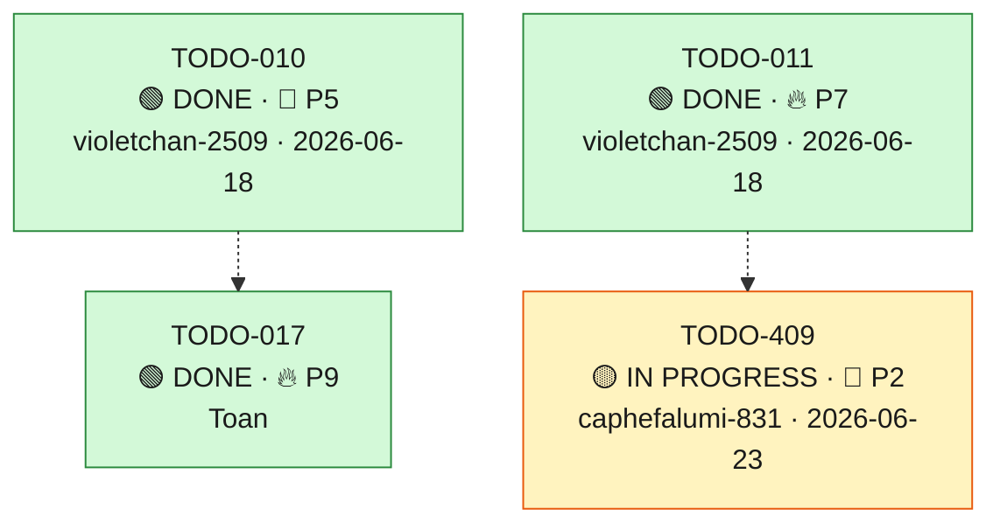

| ID | Title | Bucket | Stream | Prio | Status | Dependency | Reference | Agent-ID | Commit |
| --- | --- | --- | --- | --- | --- | --- | --- | --- | --- |
| **[TODO-010](tasks/TODO-010.md)** | Replace hardcoded `PARTNER_SERVICE_CALENDAR_ID` with a DB flag | Hardening | **W04** | 📌 P5 | 🟢 DONE | — | [Audit §MED-9](../docs/findings/audit-findings-2026-05-28.md) | violetchan-2509 | `5765020` |
| **[TODO-011](tasks/TODO-011.md)** | Replace hardcoded `PROTECTED_SALESPERSON_ID` with `sales.is_protected_from_deletion` | Hardening | **W04** | 🔥 P7 | 🟢 DONE | — | [Audit §MED-10](../docs/findings/audit-findings-2026-05-28.md) | violetchan-2509 | `d115795` |
| **[TODO-017](tasks/TODO-017.md)** | Close Gärtner orphan-cleanup backdoor: scope to writer calendar + move in-process | Correctness | **W04** | 🔥 P9 | 🟢 DONE | `~ TODO-010` | [Gärtner RCA Part 1 §RCA-1](../docs/findings/GARTNER_CALENDAR_RCA_AND_GUIDE.md) · `[cleanup_service.py:4264-4281](../app/services/v1/orbit/cleanup_service.py#L4264-L4281)` · `[external_scripts.py:31-52](../app/utils/external_scripts.py#L31-L52)` | Toan | `4ba4e585` |
| **[TODO-409](tasks/TODO-409.md)** | RCA-2 residuals: remove LEAD_SOURCE_OVERRIDE + strict lead-query scoping (Gaertner shared-lead-id collision) | Correctness | **W04** | 🌿 P2 | 🟡 IN PROGRESS | `~ TODO-011` | [Gärtner RCA Part 1 §RCA-2 + Part 2 fix plan #1/#3](../docs/findings/GARTNER_CALENDAR_RCA_AND_GUIDE.md) · `lambda/shared/services/lambda_enrichment.py:75` · `calendar_sync_service.py:7878` (cancel_booking_by_lead) / `:8131` (delete_booking_by_lead_with_remote) | caphefalumi-831 | WIP |

### W07 - Security blockers & hardening

[stream file](streams/W07-security-hardening.md)

#### Status & dependency map

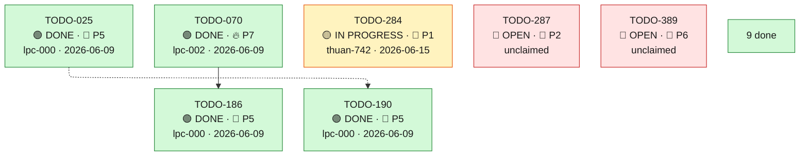

| ID | Title | Bucket | Stream | Prio | Status | Dependency | Reference | Agent-ID | Commit |
| --- | --- | --- | --- | --- | --- | --- | --- | --- | --- |
| **[TODO-019](tasks/TODO-019.md)** | Add auth to `POST /cleans/invalid-addresses`; structurally guard all `cleans_*` routers | Security | **W07** | 🔥 P9 | 🟢 DONE | — | [AR §C1](../docs/findings/ARCH_REVIEW_WHOLE_REPO.md) · `[cleans_lead.py:115](../app/api/v1/cleans_lead.py#L115)` | lpc-002 | `a7dad784` |
| **[TODO-020](tasks/TODO-020.md)** | Stop returning `str(exc)` to clients (global handler + per-handler sweep) | Security | **W07** | 🔥 P7 | 🟢 DONE | — | [AR §H1](../docs/findings/ARCH_REVIEW_WHOLE_REPO.md) · `[main.py:187](../app/main.py#L187)` | lpc-002 | `114b630f` |
| **[TODO-021](tasks/TODO-021.md)** | Env-drive `ALLOWED_ORIGINS`; forbid `*` + credentials (CORS + Socket.IO) | Security | **W07** | 🔥 P7 | 🟢 DONE | — | [AR §H2](../docs/findings/ARCH_REVIEW_WHOLE_REPO.md) · `[main.py:788](../app/main.py#L788)` | lpc-002 | `2ad77cb6` |
| **[TODO-022](tasks/TODO-022.md)** | Remove hardcoded `JWT_SECRET_KEY` / `SEED_USER_PASSWORD` fallbacks; fail-fast | Security | **W07** | 🔥 P7 | 🟢 DONE | — | [AR §H3](../docs/findings/ARCH_REVIEW_WHOLE_REPO.md) · `[config.py:302](../app/core/config.py#L302)` | lpc-002 | `af6db0d7` |
| **[TODO-023](tasks/TODO-023.md)** | Run containers as non-root (`USER app`) across all Dockerfiles | Security | **W07** | 🔥 P7 | 🟢 DONE | — | [AR §H4](../docs/findings/ARCH_REVIEW_WHOLE_REPO.md) · `Dockerfile`, `Dockerfilebase`, `lambda/Dockerfile` | lpc-002 | `7730bf57` |
| **[TODO-024](tasks/TODO-024.md)** | Validate `profile_id` as UUID / bound `set_config` (SQLi sink in sales.py) | Security | **W07** | 📌 P5 | 🟢 DONE | — | [AR §M1](../docs/findings/ARCH_REVIEW_WHOLE_REPO.md) · `[sales.py:75](../app/api/v1/orbit/sales.py#L75)` | lpc-002 | `836016db` |
| **[TODO-025](tasks/TODO-025.md)** | Move GitLab PyPI tokens to BuildKit secret mounts (out of image layers) | Security | **W07** | 📌 P5 | 🟢 DONE | — | [AR §M2](../docs/findings/ARCH_REVIEW_WHOLE_REPO.md) · `Dockerfile:12-14,39-41` | lpc-000 | `8cf4a78d` |
| **[TODO-026](tasks/TODO-026.md)** | Allowlist + private-range block for server-side logo URL fetch (SSRF) | Security | **W07** | 📌 P5 | 🟢 DONE | — | [AR §M3](../docs/findings/ARCH_REVIEW_WHOLE_REPO.md) · `[image_cache_utils.py:56](../app/utils/image_cache_utils.py#L56)` | lpc-002 | `ab64c892` |
| **[TODO-070](tasks/TODO-070.md)** | Authorize termin writes by event owner, not client-supplied `salesperson_id` (partnerservice 404) | Security | **W07** | 🔥 P7 | 🟢 DONE | — | RCA 2026-06-02 · `[cached_event_repository.py:728](../app/dal/orbit/repositories/cached_event_repository.py#L728)` | lpc-002 | `b1a2b2c1` |
| **[TODO-186](tasks/TODO-186.md)** | Harden termin-write authz: authorize by JWT-authenticated caller (defense-in-depth over TODO-070) + gate update_event_status | Security | **W07** | 📌 P5 | 🟢 DONE | `→ TODO-070` | TODO-070 · MR !2057 (merged fix, commit b1a2b2c1) · MR !2063 (this hardening) | lpc-000 | `8a39694e` |
| **[TODO-190](tasks/TODO-190.md)** | Move Lambda image GitLab PyPI tokens to BuildKit secret mounts (out of image layers) | Security | **W07** | 📌 P5 | 🟢 DONE | `~ TODO-025` | [AR §M2](../docs/findings/ARCH_REVIEW_WHOLE_REPO.md) · TODO-025 · `lambda/Dockerfile*`, `lambda_build_push_ecr_*.sh` | lpc-000 | `54d1e4b7` |
| **[TODO-284](tasks/TODO-284.md)** | Rotate alpha secrets leaked in CI job logs + stop CI from printing secret values | Security | **W07** | 🌿 P1 | 🟡 IN PROGRESS | — | [job 118590](https://gitlab.gesys.automate-solutions.net/gesys1/refereral_app/ref_app_be/-/jobs/118590) `alpha_unit_test 2/2` trace · →TODO-282 (hermetic render_deploy_env, stops future dumps) | thuan-742 | WIP |
| **[TODO-286](tasks/TODO-286.md)** | Fail-fast on `SUPABASE_JWT_SECRET` (+ soft-warn `CALENDAR_PRIVATE_KEY`) at startup | Security | **W07** | 🌿 P1 | 🟢 DONE | — | [RCA Alpha env-unification — Incident A/B, Step 4](../docs/findings/RCA_ALPHA_ENV_UNIFICATION_INCIDENTS.md) · `[config.py:464](../app/core/config.py#L464)` | lpc-001 | `94370dc` |
| **[TODO-287](tasks/TODO-287.md)** | Make `hil_booking_meta` write in `create_hil_booked_event` concurrency-safe via `on_conflict` upsert | Hardening | **W07** | 🌿 P2 | 🔴 OPEN | — | [RCA Alpha env-unification — Incident C](../docs/findings/RCA_ALPHA_ENV_UNIFICATION_INCIDENTS.md) · `[calendar_sync_service.py:7656](../app/services/v1/orbit/calendar_sync_service.py#L7656)` | — | — |
| **[TODO-376](tasks/TODO-376.md)** | BE login endpoint: thin wrapper over Supabase auth + how-to | Security | **W07** | 📌 P6 | 🟢 DONE | — | — | nhatminhtrieu | `08d2d08` |
| **[TODO-389](tasks/TODO-389.md)** | Add KPI salesperson-access auth dependency to v1 kpi sales-capacity and its breakdown | Security | **W07** | 📌 P6 | 🔴 OPEN | — | gap analysis docs/refinement/20260619-performance-dashboard-be-fe-gap-analysis.md (G5) · app/api/v1/orbit/kpi.py sales-capacity routes lack CurrentProfile/check_kpi_salesperson_access while every other KPI route injects it | — | — |

### W08 - Reliability & data integrity

[stream file](streams/W08-reliability.md)

#### Status & dependency map

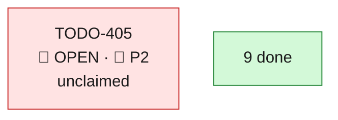

| ID | Title | Bucket | Stream | Prio | Status | Dependency | Reference | Agent-ID | Commit |
| --- | --- | --- | --- | --- | --- | --- | --- | --- | --- |
| **[TODO-027](tasks/TODO-027.md)** | Commit the runtime webhook subscription (orphaned-channel fix) | Correctness | **W08** | 🔥 P9 | 🟢 DONE | — | [AR §C2](../docs/findings/ARCH_REVIEW_WHOLE_REPO.md) · `[sync_metadata_repository.py:192](../app/dal/orbit/repositories/sync_metadata_repository.py#L192)` | Toan | `74688b3` |
| **[TODO-028](tasks/TODO-028.md)** | Fix `RedisManager.acquire_lock` blocking semantics (deadline + sleep / native Lock) | Stability | **W08** | 🔥 P7 | 🟢 DONE | — | [AR §H5](../docs/findings/ARCH_REVIEW_WHOLE_REPO.md) · `[redis_manager.py:144](../app/core/redis_manager.py#L144)` | Toan | `346b2b2` |
| **[TODO-029](tasks/TODO-029.md)** | Set explicit timeouts on every outbound call (HERE, Google OAuth, S3, `requests.post`) | Stability | **W08** | 🔥 P7 | 🟢 DONE | — | [AR §H7](../docs/findings/ARCH_REVIEW_WHOLE_REPO.md) · `scheduling_service.py:88`, `google_calendar.py:89` | lpc-001 | `718722b9` |
| **[TODO-030](tasks/TODO-030.md)** | Make startup webhook subscription non-blocking / feature-flagged | Stability | **W08** | 📌 P5 | 🟢 DONE | — | [AR §M4](../docs/findings/ARCH_REVIEW_WHOLE_REPO.md) · `[lifespan_new.py:130](../app/core/lifespan_new.py#L130)` | — | `31c082a` |
| **[TODO-031](tasks/TODO-031.md)** | Add Celery reliability defaults (`acks_late`, `reject_on_worker_lost`, `soft_time_limit`) | Stability | **W08** | 📌 P5 | 🟢 DONE | — | [AR §M5](../docs/findings/ARCH_REVIEW_WHOLE_REPO.md) · `[celery_app.py:59](../app/core/celery_app.py#L59)` | Toan | `65910542` |
| **[TODO-032](tasks/TODO-032.md)** | Stop silently swallowing webhook Celery task failures (retry / DLQ) | Stability | **W08** | 📌 P5 | 🟢 DONE | — | [AR §M6](../docs/findings/ARCH_REVIEW_WHOLE_REPO.md) · `worker_jobs.py:493` | Toan | `65910542` |
| **[TODO-220](tasks/TODO-220.md)** | Regression test pinning c241032c6498 schema portability (orbit-schema beta RCA) | Prevention | **W08** | 🔥 P7 | 🟢 DONE | — | [pipeline 49978 beta_migrate_all_database](https://gitlab.gesys.automate-solutions.net/gesys1/refereral_app/ref_app_be/-/pipelines/49978) · `migrations_orbit_green/versions/c241032c6498_add_termin_zugesagt_and_hangout_link.py` · `tests/integration/orbit/test_termin_zugesagt_migration_orbit_schema_guard.py` | lpc-002 | `83214c8` |
| **[TODO-405](tasks/TODO-405.md)** | Fix CI deploy smoke gates (SMOKE_BASE_URL unset + alpha/beta version mismatch) so deploys verify and aren't falsely red | Stability | **W08** | 🌿 P2 | 🔴 OPEN | — | Incident `docs/findings/20260619_CALENDAR_DATA_INTEGRITY_INCIDENT.md` · pipeline 51865 (v1.5.35): prod_post_deploy_readiness failed 'SMOKE_BASE_URL is not set'; alpha_smoke_gate/beta_smoke_gate version mismatch · `tests/smoke/test_deploy_smoke.py`, `tests/smoke/deploy_client.py`, `.gitlab-ci.yml` smoke-gate jobs | — | — |
| **[TODO-406](tasks/TODO-406.md)** | Anomaly monitor + alert for bulk / non-Orbit calendar deletions and empty-day drops (scheduled SQL, mirror *_rate_monitor) | Stability | **W08** | 🌿 P1 | 🟢 DONE | — | Incident `docs/findings/20260619_CALENDAR_DATA_INTEGRITY_INCIDENT.md` · existing pattern: `scripts/trigger_termin_status_ausstehend_rate_monitor.py`, `scripts/notify_termine_drift.py` (ADR-022 drift email) · pg_cron precedent: `migrations_orbit_green/versions/6dbf4dba66e4_schedule_pg_cron_kpi_daily_aggregates.py` · TODO-384 (guard), TODO-385 (attribution), TODO-402 (dedup) | lpc-000 | `ed4cf0977` |
| **[TODO-412](tasks/TODO-412.md)** | import_german_sql_data soft_delete_missing safety: default off + empty/partial-source guard | Stability | **W08** | 🔥 P7 | 🟢 DONE | — | [import_german_sql_data consistency 2026-06-20](../.local/decisions/20260620-import-german-sql-data-consistency.md) · `scripts/import_german_sql_data.py:1246` (config.get('soft_delete_missing', True)) · `scripts/import_german_sql_data.py:925` (_soft_delete_missing_rows) · W52 (Clean-and-Consolidate over-deletion incident — same data-loss class) | lpc-000 | `0f1ac202` |

### W10 - Architecture & data-layer consolidation

[stream file](streams/W10-architecture.md)

#### Status & dependency map

```mermaid
---
config:
  layout: elk
---
flowchart TD
    TODO_037["TODO-037<br/>🟢 DONE · 🔥 P7<br/>lpc-002 · 2026-06-09"]:::done
    TODO_038["TODO-038<br/>🟢 DONE · 🔥 P7<br/>lpc-002 · 2026-06-09"]:::done
    TODO_039["TODO-039<br/>🟢 DONE · 📌 P5<br/>lpc-002 · 2026-06-09"]:::done
    TODO_040["TODO-040<br/>🟢 DONE · 🌿 P2<br/>lpc-000 · 2026-06-17"]:::done
    TODO_172["TODO-172<br/>🟢 DONE · 🌿 P2<br/>lpc-004 · 2026-06-15"]:::done
    TODO_292["TODO-292<br/>🟢 DONE · 🌿 P2<br/>lpc-001 · 2026-06-15"]:::done
    TODO_293["TODO-293<br/>🟢 DONE · 🌿 P3<br/>lpc-002 · 2026-06-16"]:::done
    TODO_294["TODO-294<br/>🟢 DONE · 🌿 P2<br/>lpc-002 · 2026-06-15"]:::done
    TODO_303["TODO-303<br/>🟢 DONE · 🌿 P2<br/>lpc-000 · 2026-06-15"]:::done
    TODO_305["TODO-305<br/>🟢 DONE · 🌿 P2<br/>lpc-000 · 2026-06-16"]:::done
    TODO_306["TODO-306<br/>🟢 DONE · 🌿 P3<br/>lpc-002 · 2026-06-16"]:::done
    TODO_308["TODO-308<br/>🟢 DONE · 🔥 P7<br/>lpc-003 · 2026-06-16"]:::done
    TODO_314["TODO-314<br/>🟢 DONE · 🌿 P3<br/>lpc-001 · 2026-06-16"]:::done
    TODO_330["TODO-330<br/>🟢 DONE · 🌿 P2<br/>lpc-000 · 2026-06-16"]:::done
    TODO_331["TODO-331<br/>🟢 DONE · 🌿 P2<br/>lpc-000 · 2026-06-17"]:::done
    TODO_336["TODO-336<br/>🟢 DONE · 🌿 P2<br/>lpc-000 · 2026-06-17"]:::done
    TODO_337["TODO-337<br/>🟢 DONE · 🌿 P2<br/>lpc-000 · 2026-06-17"]:::done
    TODO_338["TODO-338<br/>🟢 DONE · 🌿 P2<br/>lpc-000 · 2026-06-17"]:::done
    TODO_339["TODO-339<br/>🟢 DONE · 🌿 P2<br/>lpc-000 · 2026-06-17"]:::done
    TODO_340["TODO-340<br/>⚪ DEFERRED / OBSOLETE · 🌿 P2<br/>unclaimed"]:::obsolete
    TODO_341["TODO-341<br/>🟢 DONE · 🌿 P2<br/>lpc-000 · 2026-06-17"]:::done
    TODO_342["TODO-342<br/>⚪ DEFERRED / OBSOLETE · 🌿 P2<br/>unclaimed"]:::obsolete
    TODO_343["TODO-343<br/>🟢 DONE · 🌿 P2<br/>lpc-000 · 2026-06-17"]:::done
    TODO_349["TODO-349<br/>⚪ DEFERRED / OBSOLETE · 🌿 P2<br/>unclaimed"]:::obsolete
    TODO_350["TODO-350<br/>⚪ DEFERRED / OBSOLETE · 🌿 P2<br/>unclaimed"]:::obsolete
    TODO_357["TODO-357<br/>🟢 DONE · 🌿 P2<br/>lpc-000 · 2026-06-18"]:::done
    TODO_358["TODO-358<br/>⚪ DEFERRED / OBSOLETE · 🌿 P1<br/>unclaimed"]:::obsolete
    TODO_359["TODO-359<br/>⚪ DEFERRED / OBSOLETE · 🌿 P1<br/>unclaimed"]:::obsolete
    TODO_360["TODO-360<br/>🟢 DONE · 🌿 P3<br/>lpc-000 · 2026-06-18"]:::done
    TODO_361["TODO-361<br/>🟢 DONE · 🌿 P2<br/>lpc-000 · 2026-06-20"]:::done
    TODO_414["TODO-414<br/>🔴 OPEN · 🌿 P2<br/>unclaimed"]:::open
    TODO_011["TODO-011<br/>W04"]:::external
    TODO_410["TODO-410<br/>W16"]:::external
    TODO_411["TODO-411<br/>W39"]:::external
    TODO_037 -.-> TODO_038
    TODO_038 -.-> TODO_040
    TODO_308 -.-> TODO_040
    TODO_293 --> TODO_040
    TODO_294 --> TODO_040
    TODO_339 --> TODO_040
    TODO_343 --> TODO_040
    TODO_039 --> TODO_172
    TODO_294 -.-> TODO_293
    TODO_294 -.-> TODO_305
    TODO_293 -.-> TODO_306
    TODO_305 -.-> TODO_314
    TODO_303 -.-> TODO_330
    TODO_292 -.-> TODO_331
    TODO_330 -.-> TODO_336
    TODO_336 -.-> TODO_337
    TODO_337 -.-> TODO_338
    TODO_338 -.-> TODO_339
    TODO_331 -.-> TODO_340
    TODO_331 -.-> TODO_341
    TODO_341 -.-> TODO_342
    TODO_341 -.-> TODO_343
    TODO_338 -.-> TODO_349
    TODO_343 -.-> TODO_350
    TODO_011 -.-> TODO_361
    TODO_410 -.-> TODO_414
    TODO_411 -.-> TODO_414
    click TODO_037 "tasks/TODO-037.md"
    click TODO_038 "tasks/TODO-038.md"
    click TODO_039 "tasks/TODO-039.md"
    click TODO_040 "tasks/TODO-040.md"
    click TODO_172 "tasks/TODO-172.md"
    click TODO_292 "tasks/TODO-292.md"
    click TODO_293 "tasks/TODO-293.md"
    click TODO_294 "tasks/TODO-294.md"
    click TODO_303 "tasks/TODO-303.md"
    click TODO_305 "tasks/TODO-305.md"
    click TODO_306 "tasks/TODO-306.md"
    click TODO_308 "tasks/TODO-308.md"
    click TODO_314 "tasks/TODO-314.md"
    click TODO_330 "tasks/TODO-330.md"
    click TODO_331 "tasks/TODO-331.md"
    click TODO_336 "tasks/TODO-336.md"
    click TODO_337 "tasks/TODO-337.md"
    click TODO_338 "tasks/TODO-338.md"
    click TODO_339 "tasks/TODO-339.md"
    click TODO_340 "tasks/TODO-340.md"
    click TODO_341 "tasks/TODO-341.md"
    click TODO_342 "tasks/TODO-342.md"
    click TODO_343 "tasks/TODO-343.md"
    click TODO_349 "tasks/TODO-349.md"
    click TODO_350 "tasks/TODO-350.md"
    click TODO_357 "tasks/TODO-357.md"
    click TODO_358 "tasks/TODO-358.md"
    click TODO_359 "tasks/TODO-359.md"
    click TODO_360 "tasks/TODO-360.md"
    click TODO_361 "tasks/TODO-361.md"
    click TODO_414 "tasks/TODO-414.md"
    click TODO_011 "tasks/TODO-011.md"
    click TODO_410 "tasks/TODO-410.md"
    click TODO_411 "tasks/TODO-411.md"
    classDef open fill:#ffe3e3,stroke:#c92a2a,color:#1a1a1a;
    classDef wip fill:#fff3bf,stroke:#e8590c,color:#1a1a1a;
    classDef done fill:#d3f9d8,stroke:#2b8a3e,color:#1a1a1a;
    classDef obsolete fill:#e9ecef,stroke:#868e96,color:#1a1a1a;
    classDef external fill:#f8f9fa,stroke:#adb5bd,color:#1a1a1a,stroke-dasharray:4 3;
```

| ID | Title | Bucket | Stream | Prio | Status | Dependency | Reference | Agent-ID | Commit |
| --- | --- | --- | --- | --- | --- | --- | --- | --- | --- |
| **[TODO-037](tasks/TODO-037.md)** | Collapse `app/repository/orbit/*` into `app/dal`; lint-forbid new `app.repository` imports | Cleanup | **W10** | 🔥 P7 | 🟢 DONE | — | [AR §H9](../docs/findings/ARCH_REVIEW_WHOLE_REPO.md) · `app/repository/orbit/*` | lpc-002 | `4b104f9d` |
| **[TODO-038](tasks/TODO-038.md)** | Invert leaked dependencies (dal→services, service→api, dal→`HTTPException`) | Architecture | **W10** | 🔥 P7 | 🟢 DONE | `~ TODO-037` | [AR §H10](../docs/findings/ARCH_REVIEW_WHOLE_REPO.md) · `sales_repository.py:227`, `calendar_sync_service.py:428` | lpc-002 | `70344390` |
| **[TODO-039](tasks/TODO-039.md)** | Remove dead dual-write scaffolding (`orbit_replicate`, `dual_write` plumbing) | Cleanup | **W10** | 📌 P5 | 🟢 DONE | — | [AR §H11](../docs/findings/ARCH_REVIEW_WHOLE_REPO.md) · `orbit_replicate.py` (deleted) | lpc-002 | `034de34d` |
| **[TODO-040](tasks/TODO-040.md)** | Split god modules (`calendar_sync_service` 11k, `classification/service` 9.7k) by responsibility — UMBRELLA | Architecture | **W10** | 🌿 P2 | 🟢 DONE | `~ TODO-038` · `~ TODO-308` · `→ TODO-293` · `→ TODO-294` · `→ TODO-339` · `→ TODO-343` | [deep analysis + plan](../docs/findings/TODO_040_GOD_MODULE_SPLIT_ANALYSIS.md) · [AR §M9](../docs/findings/ARCH_REVIEW_WHOLE_REPO.md) · `[calendar_sync_service.py](../app/services/v1/orbit/calendar_sync_service.py)` | lpc-000 | `4e4258a4d` |
| **[TODO-172](tasks/TODO-172.md)** | Remove dormant dual-write plumbing (`dual_write`/`secondary_write_*`) from base_repository + call sites | Cleanup | **W10** | 🌿 P2 | 🟢 DONE | `→ TODO-039` | [AR §H11](../docs/findings/ARCH_REVIEW_WHOLE_REPO.md) · follow-up carved from TODO-039 | lpc-004 | `141b1e9` |
| **[TODO-292](tasks/TODO-292.md)** | Host classification cleanup: remove dead duplicate defs + thin-wrapper delegations (TODO-040 C0/C1) | Cleanup | **W10** | 🌿 P2 | 🟢 DONE | — | [finding §3](../docs/findings/TODO_040_GOD_MODULE_SPLIT_ANALYSIS.md) · `app/services/v1/orbit/classification/service.py` | lpc-001 | `f14f575` |
| **[TODO-293](tasks/TODO-293.md)** | Lambda full-pipeline worker refactor: collapse the Cornell/non-Cornell fork (TODO-040 Track L) | Architecture | **W10** | 🌿 P3 | 🟢 DONE | `~ TODO-294` | [finding §11](../docs/findings/TODO_040_GOD_MODULE_SPLIT_ANALYSIS.md) · `lambda/classify_events_optimized/full_pipeline_cornell_worker.py` · `lambda/classify_events_optimized/full_pipeline_worker.py` | lpc-002 | `de1178f32` |
| **[TODO-294](tasks/TODO-294.md)** | Host<->Lambda classification consistency: reconcile drifted context JSONs + extend the parity guard | Correctness | **W10** | 🌿 P2 | 🟢 DONE | — | [finding §11](../docs/findings/TODO_040_GOD_MODULE_SPLIT_ANALYSIS.md) · `tests/unit/lambda/test_host_lambda_tier1_parity.py` · TODO-048 · TODO-219 · `app/services/v1/orbit/data/` vs `lambda/shared/data/` | lpc-002 | `ac80e3a` |
| **[TODO-303](tasks/TODO-303.md)** | God-module split K1: extract calendar RBAC seam → calendar_rbac.py (TODO-040 Track K) | Architecture | **W10** | 🌿 P2 | 🟢 DONE | — | [TODO-040 deep analysis §4.1 / §9 Track-K K1](../docs/findings/TODO_040_GOD_MODULE_SPLIT_ANALYSIS.md) · [AR §M9](../docs/findings/ARCH_REVIEW_WHOLE_REPO.md) · `app/services/v1/orbit/calendar_sync_service.py` (RBAC seam :482/:6761/:6809/:6875/:9011) | lpc-000 | `73735dc` |
| **[TODO-305](tasks/TODO-305.md)** | Reconcile host<->Lambda PROTECTED_TYPES + add meta-classification parity test (TODO-294 follow-up) | Correctness | **W10** | 🌿 P2 | 🟢 DONE | `~ TODO-294` | [finding §11.6](../docs/findings/TODO_040_GOD_MODULE_SPLIT_ANALYSIS.md) · `app/services/v1/orbit/hybrid_classifier/service.py:108` · `lambda/shared/services/lambda_classifier.py:90` · `tests/unit/lambda/test_host_lambda_tier1_parity.py` | lpc-000 | `112751c0` |
| **[TODO-306](tasks/TODO-306.md)** | Decide the vestigial Cornell-propagation scaffolding: finish the feature or remove the dead helpers | Architecture | **W10** | 🌿 P3 | 🟢 DONE | `~ TODO-293` | [finding §11.5](../docs/findings/TODO_040_GOD_MODULE_SPLIT_ANALYSIS.md) · `lambda/classify_events_optimized/full_pipeline_cornell_worker.py` | lpc-002 | `d3b18ab66` |
| **[TODO-308](tasks/TODO-308.md)** | W10/TODO-040 cross-cutting foundation: shared make_*_service test-builder fixtures | Prevention | **W10** | 🔥 P7 | 🟢 DONE | — | [ADR-029](../docs/decisions.md) · [finding §9 cross-cutting](../docs/findings/TODO_040_GOD_MODULE_SPLIT_ANALYSIS.md) · `tests/builders/` | lpc-003 | `28c9d89` |
| **[TODO-314](tasks/TODO-314.md)** | Reconcile host<->Lambda meta-classification German name lists (subset + Unicode drift) | Correctness | **W10** | 🌿 P3 | 🟢 DONE | `~ TODO-305` | [TODO-305](TODO-305.md) (meta-classification parity test that pins this drift as a known divergence) · `app/services/v1/orbit/data/growth_simulation_resources_de.py` (host GERMAN_FIRST_NAMES/GERMAN_LAST_NAMES/GERMAN_CUSTOMER_NAMES) · `lambda/shared/data/german_names.py` (Lambda copies) | lpc-001 | `583ef5b` |
| **[TODO-330](tasks/TODO-330.md)** | God-module split K2: extract stateless event-mapping transforms → calendar_event_mapper.py (TODO-040 Track K) | Architecture | **W10** | 🌿 P2 | 🟢 DONE | `~ TODO-303` | [TODO-040 deep analysis §4.2 / §9 Track-K K2](../docs/findings/TODO_040_GOD_MODULE_SPLIT_ANALYSIS.md) · [AR §M9](../docs/findings/ARCH_REVIEW_WHOLE_REPO.md) · `app/services/v1/orbit/calendar_sync_service.py` (mapper seam :315/:994/:1007-1091/:1093/:7047) | lpc-000 | `33829be` |
| **[TODO-331](tasks/TODO-331.md)** | God-module split C2: extract the _apply_*_override cluster → classification/overrides.py (TODO-040 Track C) | Architecture | **W10** | 🌿 P2 | 🟢 DONE | `~ TODO-292` | [TODO-040 deep analysis §3.3 / §9 Track-C C2](../docs/findings/TODO_040_GOD_MODULE_SPLIT_ANALYSIS.md) · [AR §M9](../docs/findings/ARCH_REVIEW_WHOLE_REPO.md) · `app/services/v1/orbit/classification/service.py` (override cluster :3040-3194/:3196-3829) | lpc-000 | `e7faed606` |
| **[TODO-336](tasks/TODO-336.md)** | God-module split K3: extract geocoding/travel cluster → calendar_travel.py (TODO-040 Track K) | Architecture | **W10** | 🌿 P2 | 🟢 DONE | `~ TODO-330` | [TODO-040 deep analysis §4.2 / §9 Track-K K3](../docs/findings/TODO_040_GOD_MODULE_SPLIT_ANALYSIS.md) · [AR §M9](../docs/findings/ARCH_REVIEW_WHOLE_REPO.md) · `app/services/v1/orbit/calendar_sync_service.py` | lpc-000 | `a96c88ff7` |
| **[TODO-337](tasks/TODO-337.md)** | God-module split K4: extract remote_* Google batch ops → calendar_remote_ops.py (TODO-040 Track K) | Architecture | **W10** | 🌿 P2 | 🟢 DONE | `~ TODO-336` | [TODO-040 deep analysis §4.2 / §9 Track-K K4](../docs/findings/TODO_040_GOD_MODULE_SPLIT_ANALYSIS.md) · [AR §M9](../docs/findings/ARCH_REVIEW_WHOLE_REPO.md) · `app/services/v1/orbit/calendar_sync_service.py` | lpc-000 | `4007acb7b` |
| **[TODO-338](tasks/TODO-338.md)** | God-module split K5a: extract the pure compute seams of save_or_update_event (time-parse + attendee/cancellation flags) (TODO-040 Track K) | Architecture | **W10** | 🌿 P2 | 🟢 DONE | `~ TODO-337` | [TODO-040 deep analysis §4.2 / §9 Track-K K5](../docs/findings/TODO_040_GOD_MODULE_SPLIT_ANALYSIS.md) · [AR §M9](../docs/findings/ARCH_REVIEW_WHOLE_REPO.md) · `app/services/v1/orbit/calendar_sync_service.py` | lpc-000 | `936b7f9f7` |
| **[TODO-339](tasks/TODO-339.md)** | God-module split K6: lock in the residual orchestrator with an invariant-#14 shared-lock regression test (TODO-040 Track K) | Architecture | **W10** | 🌿 P2 | 🟢 DONE | `~ TODO-338` | [TODO-040 deep analysis §4.2 / §9 Track-K K6](../docs/findings/TODO_040_GOD_MODULE_SPLIT_ANALYSIS.md) · [AR §M9](../docs/findings/ARCH_REVIEW_WHOLE_REPO.md) · `app/services/v1/orbit/calendar_sync_service.py` | lpc-000 | `4e4258a4d4033308ea741745842fb053cdfbe11a` |
| **[TODO-340](tasks/TODO-340.md)** | God-module split C3: reconcile the inline AI cluster with ai_classifier.py (TODO-040 Track C) | Architecture | **W10** | 🌿 P2 | ⚪ DEFERRED / OBSOLETE | `~ TODO-331` | [TODO-040 deep analysis §3.3 / §9 Track-C C3](../docs/findings/TODO_040_GOD_MODULE_SPLIT_ANALYSIS.md) · [AR §M9](../docs/findings/ARCH_REVIEW_WHOLE_REPO.md) · `app/services/v1/orbit/classification/service.py` | — | — |
| **[TODO-341](tasks/TODO-341.md)** | God-module split C4+C5: remove the two dead abandoned classification siblings (EmbeddingOrchestrator + ClassificationSyncService) (TODO-040 Track C) | Cleanup | **W10** | 🌿 P2 | 🟢 DONE | `~ TODO-331` | [TODO-040 deep analysis §3.2 / §9 Track-C C4](../docs/findings/TODO_040_GOD_MODULE_SPLIT_ANALYSIS.md) · [AR §M9](../docs/findings/ARCH_REVIEW_WHOLE_REPO.md) · `app/services/v1/orbit/classification/service.py` | lpc-000 | `d04532c53` |
| **[TODO-342](tasks/TODO-342.md)** | God-module split C5: finish the abandoned ClassificationSyncService extraction (TODO-040 Track C) | Architecture | **W10** | 🌿 P2 | ⚪ DEFERRED / OBSOLETE | `~ TODO-341` | [TODO-040 deep analysis §3.2 / §9 Track-C C5](../docs/findings/TODO_040_GOD_MODULE_SPLIT_ANALYSIS.md) · [AR §M9](../docs/findings/ARCH_REVIEW_WHOLE_REPO.md) · `app/services/v1/orbit/classification/service.py` | — | — |
| **[TODO-343](tasks/TODO-343.md)** | God-module split C6a: extract the Lambda dispatch/routing bridge (TODO-040 Track C) | Architecture | **W10** | 🌿 P2 | 🟢 DONE | `~ TODO-341` | [TODO-040 deep analysis §11 / §9 Track-C C6](../docs/findings/TODO_040_GOD_MODULE_SPLIT_ANALYSIS.md) · [AR §M9](../docs/findings/ARCH_REVIEW_WHOLE_REPO.md) · `app/services/v1/orbit/classification/service.py` | lpc-000 | `5011dc3c9ede37dcacd4a6e818bc9d9f53b1f621` |
| **[TODO-349](tasks/TODO-349.md)** | God-module split K5b: decompose the save_or_update_event create-race region (defensive lookup + ON-CONFLICT SAVEPOINT recovery) (TODO-040 Track K) | Architecture | **W10** | 🌿 P2 | ⚪ DEFERRED / OBSOLETE | `~ TODO-338` | [TODO-040 deep analysis §4.2 / §9 Track-K K5](../docs/findings/TODO_040_GOD_MODULE_SPLIT_ANALYSIS.md) · [AR §M9](../docs/findings/ARCH_REVIEW_WHOLE_REPO.md) · `app/services/v1/orbit/calendar_sync_service.py` | — | — |
| **[TODO-350](tasks/TODO-350.md)** | God-module split C6b: extract the Lambda result-callback (process_lambda_classification_results) (TODO-040 Track C) | Architecture | **W10** | 🌿 P2 | ⚪ DEFERRED / OBSOLETE | `~ TODO-343` | [TODO-040 deep analysis §11 / §9 Track-C C6](../docs/findings/TODO_040_GOD_MODULE_SPLIT_ANALYSIS.md) · [AR §M9](../docs/findings/ARCH_REVIEW_WHOLE_REPO.md) · `app/services/v1/orbit/classification/service.py` | — | — |
| **[TODO-357](tasks/TODO-357.md)** | Fix the duplicate _apply_*_override double-call in process_lambda_classification_results (W10 post-split bug) | Correctness | **W10** | 🌿 P2 | 🟢 DONE | — | — | lpc-000 | `44ff06fb82fe02e273f86ec2217188bab53807d0` |
| **[TODO-358](tasks/TODO-358.md)** | Rename bulk_clear_classification_by_range (it hard-deletes, not clears) + enrich its delete audit | Correctness | **W10** | 🌿 P1 | ⚪ DEFERRED / OBSOLETE | — | duplicate of TODO-310 (W34) — same function, same rename, same audit enrichment, same 2026-06-15 incident · [Incident 2026-06-15 — t.uglar missing calendar items](../docs/incident/2026-06-15-1902-t-uglar-missing-calendar-items.md) | — | — |
| **[TODO-359](tasks/TODO-359.md)** | Extend the host<->Lambda byte-identical guard to ALL shared context JSONs + fix context_task.json drift | Hardening | **W10** | 🌿 P1 | ⚪ DEFERRED / OBSOLETE | — | already delivered by TODO-294 (host<->Lambda context drift reconciled + parity guard widened to all 12 shared *.json) + TODO-305 (PROTECTED_TYPES strict-equality) · commit `82275eff1` · guard `tests/unit/lambda/test_host_lambda_tier1_parity.py` | — | — |
| **[TODO-360](tasks/TODO-360.md)** | Remove the orphaned Raw/Meta dead code (RawPopulateService + raw_*_service.py + commented raw.py endpoints) | Cleanup | **W10** | 🌿 P3 | 🟢 DONE | — | — | lpc-000 | `76cee847cf4619103c71d410664479e8c8e5b639` |
| **[TODO-361](tasks/TODO-361.md)** | Orphan-cleanup hardening: CI subprocess guard + in-process protection guard + integration test + writer-calendar ADR (Gaertner RCA-1 residuals) | Stability | **W10** | 🌿 P2 | 🟢 DONE | `~ TODO-011` | — | lpc-000 | `eaaac0f3` |
| **[TODO-414](tasks/TODO-414.md)** | Central JSONB none_as_null TypeDecorator to prevent the None→'null' footgun recurring | Architecture | **W10** | 🌿 P2 | 🔴 OPEN | `~ TODO-410` · `~ TODO-411` | [JSONB none_as_null task set 2026-06-20](../.local/decisions/20260620-jsonb-none-as-null-task-set.md) · `app/core/database/column_types.py` (get_json_column_type returns the class, not an instance) · `app/models/orbit_green/lead.py:168` / `cached_event_meta_version.py:84` / `benchmark.py` response_data | — | — |

### W11 - Documentation accuracy

[stream file](streams/W11-documentation.md)

#### Status & dependency map

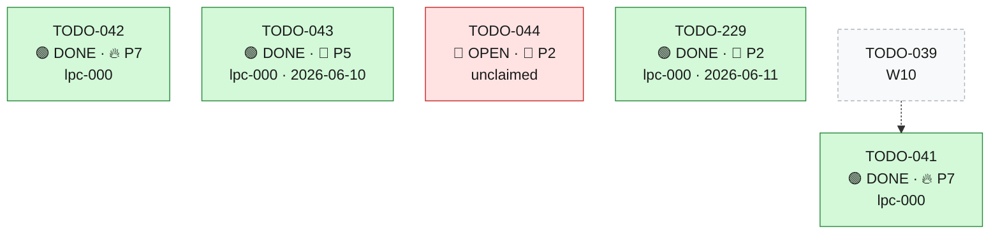

| ID | Title | Bucket | Stream | Prio | Status | Dependency | Reference | Agent-ID | Commit |
| --- | --- | --- | --- | --- | --- | --- | --- | --- | --- |
| **[TODO-041](tasks/TODO-041.md)** | Retire/rewrite `PHASE1_DAL_DUAL_WRITE_IMPLEMENTATION.md` (dual-write decommissioned) | Docs | **W11** | 🔥 P7 | 🟢 DONE | `~ TODO-039` | [AR §H11](../docs/findings/ARCH_REVIEW_WHOLE_REPO.md) · `[PHASE1_DAL_DUAL_WRITE_IMPLEMENTATION.md](../PHASE1_DAL_DUAL_WRITE_IMPLEMENTATION.md)` | lpc-000 | `a332c733` |
| **[TODO-042](tasks/TODO-042.md)** | Reconcile TODO-010/011 status (overview DONE vs detail OPEN vs live constants) | Docs | **W11** | 🔥 P7 | 🟢 DONE | — | [AR §H12](../docs/findings/ARCH_REVIEW_WHOLE_REPO.md) · `constants.py:17`, `calendar_sync_service.py:161` | lpc-000 | `424231a5` |
| **[TODO-043](tasks/TODO-043.md)** | Delete foreign `CONTRIBUTING.md`; reconcile Py 3.11/3.12; fix false `hil` shim docstring | Docs | **W11** | 📌 P5 | 🟢 DONE | — | [AR §M11](../docs/findings/ARCH_REVIEW_WHOLE_REPO.md) · `CONTRIBUTING.md`, `Dockerfile:1` | lpc-000 | `94025248` |
| **[TODO-044](tasks/TODO-044.md)** | Document env-var surface + API versioning; backfill the 8 suggested ADRs; de-sprawl root docs | Docs | **W11** | 🌿 P2 | 🔴 OPEN | — | [AR §M12 + Suggested ADRs](../docs/findings/ARCH_REVIEW_WHOLE_REPO.md) · `[config.py](../app/core/config.py)` | — | — |
| **[TODO-229](tasks/TODO-229.md)** | Backport orbit-fe Rule 5 additions: hive conflict source + post-rebase relevance re-check | Docs | **W11** | 🌿 P2 | 🟢 DONE | — | orbit-fe `AGENTS.md` §Rule 5 (rebase/conflict) · global `~/.claude/CLAUDE.md` (rebase + conflict discipline) | lpc-000 | `3ca9f931` |

### W13 - Sales-availability re-architecture: Orbit-owned sync into Supabase `orbit` schema

[stream file](streams/W13-sales-availability.md)

#### Status & dependency map

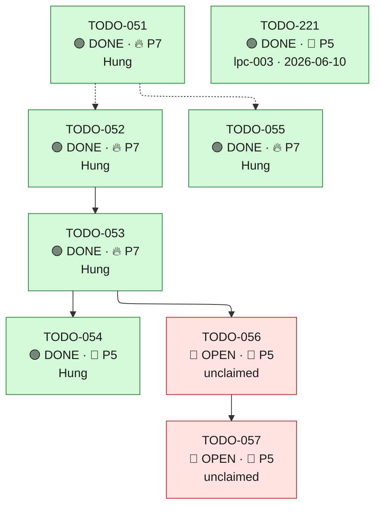

| ID | Title | Bucket | Stream | Prio | Status | Dependency | Reference | Agent-ID | Commit |
| --- | --- | --- | --- | --- | --- | --- | --- | --- | --- |
| **[TODO-051](tasks/TODO-051.md)** | ADR: invert system-of-record to Orbit — new Supabase `orbit` schema + on-demand API supersede the `public` live-sync | Docs | **W13** | 🔥 P7 | 🟢 DONE | — | [TODO-051 detail](#todo-051--adr-invert-system-of-record-to-orbit) · user directive 2026-06-01 + Notion «Neues Supabase-Schema orbit» · `[docs/decisions.md](../docs/decisions.md)` | Hung | `c90f7fcf` |
| **[TODO-052](tasks/TODO-052.md)** | Create isolated Supabase `orbit` schema with recurrence-capable availability tables (working hours, absences, location exceptions) | Migration | **W13** | 🔥 P7 | 🟢 DONE | `~ TODO-051` | [TODO-052 detail](#todo-052--create-isolated-supabase-orbit-schema-with-recurrence-capable-availability-tables) · mirrors `[dffd72aaada4](../migrations_orbit_green/versions/dffd72aaada4_add_sales_availability_tables.py)` + recurrence `[8a3f2b1c0d5e](../migrations_orbit_green/versions/8a3f2b1c0d5e_add_recurrence_to_sales_employee_absences.py)`, `[c4e8a1b2d3f5](../migrations_orbit_green/versions/c4e8a1b2d3f5_add_recurrence_to_sales_location_exceptions.py)` | Hung | `c90f7fcf` |
| **[TODO-053](tasks/TODO-053.md)** | Build the `orbit_green` → Supabase `orbit` batch sync service (idempotent upsert, bounded connection use) | Architecture | **W13** | 🔥 P7 | 🟢 DONE | `→ TODO-052` | [TODO-053 detail](#todo-053--build-the-orbit_green--supabase-orbit-batch-sync-service) · `[supabase_service.py](../app/services/v1/orbit/supabase_service.py)` · `[sales_availability_service.py](../app/services/v1/orbit/sales_availability_service.py)` | Hung | `c90f7fcf` |
| **[TODO-054](tasks/TODO-054.md)** | On-Demand sync-trigger endpoint (internal-auth) that runs the batch sync into Supabase `orbit` | Architecture | **W13** | 📌 P5 | 🟢 DONE | `→ TODO-053` | [TODO-054 detail](#todo-054--on-demand-sync-trigger-endpoint) · Notion «On-Demand Endpunkt» · internal-router auth (ADR-002 / TODO-019 class) | Hung | `c90f7fcf` |
| **[TODO-055](tasks/TODO-055.md)** | On-Demand pull endpoint for Sales OS: serve availability with server-side recurrence expansion over a date range | Architecture | **W13** | 🔥 P7 | 🟢 DONE | `~ TODO-051` | [TODO-055 detail](#todo-055--on-demand-pull-endpoint-for-sales-os) · extends `[sales_employee_absences.py](../app/api/v1/orbit/sales_employee_absences.py)` (GET `d55fa193`) · `recurrence_rule`/`recurrence_anchor` | Hung | `c90f7fcf` |
| **[TODO-056](tasks/TODO-056.md)** | Decommission the `public`-schema live-sync: remove 3 Edge Functions + 3 webhooks + 3 sync services | Cleanup | **W13** | 📌 P5 | 🔴 OPEN | `→ TODO-053` | [TODO-056 detail](#todo-056--decommission-the-public-schema-live-sync) · `[supabase/functions/](../supabase/functions)` · `app/api/v1/orbit/sales_*_webhook.py` | — | — |
| **[TODO-057](tasks/TODO-057.md)** | Deprecate/migrate the Supabase `public` availability tables (`verkaeufer_arbeitszeiten`/`_abwesenheiten`/`_standort_ausnahmen`) | Migration | **W13** | 📌 P5 | 🔴 OPEN | `→ TODO-056` | [TODO-057 detail](#todo-057--deprecatemigrate-the-supabase-public-availability-tables) · `[migration_supabase/](../migration_supabase)` | — | — |
| **[TODO-221](tasks/TODO-221.md)** | Expose first_travel_start / last_travel_end on the daily-availability response | Architecture | **W13** | 📌 P5 | 🟢 DONE | — | `app/api/v1/orbit/scheduling.py:139` · `app/services/v1/orbit/sales_availability_service.py:179` · `app/schemas/orbit/req_res.py:836` · [ADR-015](../docs/decisions.md#adr-015--recommendation-engine-window-anchoring-strategy-travel-time-vs-appointment) | lpc-003 | `b55af44` |

### W14 - Performance-dashboard auditability & trust

[stream file](streams/W14-dashboard-trust.md)

#### Status & dependency map

```mermaid
---
config:
  layout: elk
---
flowchart TD
    TODO_058["TODO-058<br/>🟢 DONE · 🔥 P7<br/>nhatminhtrieu · 2026-06-11"]:::done
    TODO_059["TODO-059<br/>⚪ DEFERRED / OBSOLETE · 🔥 P7<br/>nhatminhtrieu · 2026-06-12"]:::obsolete
    TODO_060["TODO-060<br/>🟢 DONE · 🔥 P7<br/>nhatminhtrieu"]:::done
    TODO_061["TODO-061<br/>🟢 DONE · 📌 P5<br/>nhatminhtrieu · 2026-06-11"]:::done
    TODO_062["TODO-062<br/>🟢 DONE · 🔥 P9<br/>nhatminhtrieu"]:::done
    TODO_063["TODO-063<br/>🟢 DONE · 🔥 P7<br/>nhatminhtrieu"]:::done
    TODO_064["TODO-064<br/>🟢 DONE · 📌 P5<br/>nhatminhtrieu"]:::done
    TODO_065["TODO-065<br/>🟢 DONE · 🔥 P7<br/>nhatminhtrieu"]:::done
    TODO_066["TODO-066<br/>🟢 DONE · 🔥 P7<br/>nhatminhtrieu · 2026-06-11"]:::done
    TODO_067["TODO-067<br/>⚪ DEFERRED / OBSOLETE · 📌 P5<br/>nhatminhtrieu · 2026-06-12"]:::obsolete
    TODO_068["TODO-068<br/>🟢 DONE · 🔥 P7<br/>nhatminhtrieu · 2026-06-11"]:::done
    TODO_069["TODO-069<br/>🟢 DONE · 📌 P5<br/>nhatminhtrieu · 2026-06-11"]:::done
    TODO_113["TODO-113<br/>🟢 DONE · 🔥 P7<br/>nhatminhtrieu · 2026-06-12"]:::done
    TODO_225["TODO-225<br/>🟢 DONE · 🔥 P7<br/>caphefalumi-831 · 2026-06-17"]:::done
    TODO_390["TODO-390<br/>🔴 OPEN · 📌 P4<br/>unclaimed"]:::open
    TODO_407["TODO-407<br/>🟢 DONE · 🔥 P7<br/>lpc-000 · 2026-06-20"]:::done
    TODO_408["TODO-408<br/>🟢 DONE · 🔥 P7<br/>lpc-000 · 2026-06-20"]:::done
    TODO_421["TODO-421<br/>🔴 OPEN · 🌿 P3<br/>unclaimed"]:::open
    TODO_058 --> TODO_059
    TODO_058 --> TODO_060
    TODO_058 --> TODO_061
    TODO_063 -.-> TODO_064
    TODO_065 --> TODO_066
    TODO_066 --> TODO_067
    TODO_062 -.-> TODO_068
    TODO_066 -.-> TODO_069
    TODO_066 --> TODO_113
    TODO_408 --> TODO_421
    click TODO_058 "tasks/TODO-058.md"
    click TODO_059 "tasks/TODO-059.md"
    click TODO_060 "tasks/TODO-060.md"
    click TODO_061 "tasks/TODO-061.md"
    click TODO_062 "tasks/TODO-062.md"
    click TODO_063 "tasks/TODO-063.md"
    click TODO_064 "tasks/TODO-064.md"
    click TODO_065 "tasks/TODO-065.md"
    click TODO_066 "tasks/TODO-066.md"
    click TODO_067 "tasks/TODO-067.md"
    click TODO_068 "tasks/TODO-068.md"
    click TODO_069 "tasks/TODO-069.md"
    click TODO_113 "tasks/TODO-113.md"
    click TODO_225 "tasks/TODO-225.md"
    click TODO_390 "tasks/TODO-390.md"
    click TODO_407 "tasks/TODO-407.md"
    click TODO_408 "tasks/TODO-408.md"
    click TODO_421 "tasks/TODO-421.md"
    classDef open fill:#ffe3e3,stroke:#c92a2a,color:#1a1a1a;
    classDef wip fill:#fff3bf,stroke:#e8590c,color:#1a1a1a;
    classDef done fill:#d3f9d8,stroke:#2b8a3e,color:#1a1a1a;
    classDef obsolete fill:#e9ecef,stroke:#868e96,color:#1a1a1a;
    classDef external fill:#f8f9fa,stroke:#adb5bd,color:#1a1a1a,stroke-dasharray:4 3;
```

| ID | Title | Bucket | Stream | Prio | Status | Dependency | Reference | Agent-ID | Commit |
| --- | --- | --- | --- | --- | --- | --- | --- | --- | --- |
| **[TODO-058](tasks/TODO-058.md)** | Add a shared, tested range-resolver (half-open `[start, end)`, month range, today-clamp) in `time_filters.py` | Architecture | **W14** | 🔥 P7 | 🟢 DONE | — | [TODO-058 detail](#todo-058--add-a-shared-tested-range-resolver-half-open-start-end-month-range-today-clamp-in-time_filterspy) · `[time_filters.py](../app/utils/time_filters.py)` | nhatminhtrieu | `00831ce` |
| **[TODO-059](tasks/TODO-059.md)** | Wire a calendar-MONTH range into the KPI endpoints + response Literals (fix the broken month date-picker) | Correctness | **W14** | 🔥 P7 | ⚪ DEFERRED / OBSOLETE | `→ TODO-058` | [TODO-059 detail](#todo-059--wire-a-calendar-month-range-into-the-kpi-endpoints--response-literals-fix-the-broken-month-date-picker) · user directive 2026-06-02 · `[kpi.py` schemas](../app/schemas/orbit/kpi.py) | nhatminhtrieu | `slop` |
| **[TODO-060](tasks/TODO-060.md)** | Fix the inclusive upper-bound off-by-one in the Python ORM KPI services (match the SQL half-open bound) | Correctness | **W14** | 🔥 P7 | 🟢 DONE | `→ TODO-058` | [TODO-060 detail](#todo-060--fix-the-inclusive-upper-bound-off-by-one-in-the-python-orm-kpi-services-match-the-sql-half-open-bound) · `[get_quality_funnel_metrics.sql](../supabase/functions/get_quality_funnel_metrics.sql)` | nhatminhtrieu | `68af0891` |
| **[TODO-061](tasks/TODO-061.md)** | Accept custom from/to (and the month range) on `GET /kpi/cost-per-termine` and `GET /kpi/lead-aging` | Correctness | **W14** | 📌 P5 | 🟢 DONE | `→ TODO-058` | [TODO-061 detail](#todo-061--accept-custom-fromto-and-the-month-range-on-get-kpicost-per-termine-and-get-kpilead-aging) · user directive 2026-06-02 · `[kpi.py:107](../app/api/v1/orbit/kpi.py#L107)` | nhatminhtrieu | `8a99e5b` |
| **[TODO-062](tasks/TODO-062.md)** | Fix the inflated "133 signed THC" count — canonical distinct-signed-lead grain across v1, v2 and the DB function | Correctness | **W14** | 🔥 P9 | 🟢 DONE | — | [TODO-062 detail](#todo-062--fix-the-inflated-133-signed-thc-count--canonical-distinct-signed-lead-grain-across-v1-v2-and-the-db-function) · user directive 2026-06-02 · `[kpi_performance_service.py:712](../app/services/v1/orbit/kpi_performance_service.py#L712)` | nhatminhtrieu | `dd813ca3` |
| **[TODO-063](tasks/TODO-063.md)** | Surface a real No-Show-Quote percentage with a reconciled denominator (stop shipping the anchor-indexed value as the rate) | Correctness | **W14** | 🔥 P7 | 🟢 DONE | — | [TODO-063 detail](#todo-063--surface-a-real-no-show-quote-percentage-with-a-reconciled-denominator-stop-shipping-the-anchor-indexed-value-as-the-rate) · user directive 2026-06-02 · `[kpi_trendlines_service.py:395](../app/services/v1/orbit/kpi_trendlines_service.py#L395)` | nhatminhtrieu | `42ec02b5` |
| **[TODO-064](tasks/TODO-064.md)** | Reconcile / remove the dead legacy no-show & funnel implementations to a single authoritative path | Cleanup | **W14** | 📌 P5 | 🟢 DONE | `~ TODO-063` | [TODO-064 detail](#todo-064--reconcile--remove-the-dead-legacy-no-show--funnel-implementations-to-a-single-authoritative-path) · `[kpi_trendlines_service.py`](../app/services/v1/orbit/kpi_trendlines_service.py) | nhatminhtrieu | `2d46d677` |
| **[TODO-065](tasks/TODO-065.md)** | Add appointment lineage fields (salesperson, `calendar_source`, `google_calendar_id`) to the breakdown record schema + query | Architecture | **W14** | 🔥 P7 | 🟢 DONE | — | [TODO-065 detail](#todo-065--add-appointment-lineage-fields-salesperson-calendar_source-google_calendar_id-to-the-breakdown-record-schema--query) · user directive 2026-06-02 · `[kpi.py` schema:251](../app/schemas/orbit/kpi.py) · `[cached_events.py:49](../app/models/orbit/cached_events.py#L49)` | nhatminhtrieu | `10fd5ee9` |
| **[TODO-066](tasks/TODO-066.md)** | Build a generic, all-salesperson breakdown/drill-down endpoint whose rows SUM to each KPI count (auditable), with pagination | Architecture | **W14** | 🔥 P7 | 🟢 DONE | `→ TODO-065` | [TODO-066 detail](#todo-066--build-a-generic-all-salesperson-breakdowndrill-down-endpoint-whose-rows-sum-to-each-kpi-count-auditable-with-pagination) · user directive 2026-06-02 · `[kpi.py:262](../app/api/v1/orbit/kpi.py#L262)` | nhatminhtrieu | `8429247` |
| **[TODO-067](tasks/TODO-067.md)** | Add a drill-down handle to every clickable KPI card payload (Nachvollziehbarkeit wiring) | Architecture | **W14** | 📌 P5 | ⚪ DEFERRED / OBSOLETE | `→ TODO-066` | [TODO-067 detail](#todo-067--add-a-drill-down-handle-to-every-clickable-kpi-card-payload-nachvollziehbarkeit-wiring) · user directive 2026-06-02 · `[kpi.py` v2:20](../app/api/v2/orbit/kpi.py#L20) | nhatminhtrieu | `slop` |
| **[TODO-068](tasks/TODO-068.md)** | Add a funnel-monotonicity invariant guard + auditability test (`thc_signed ≤ held ≤ planned`) | Prevention | **W14** | 🔥 P7 | 🟢 DONE | `~ TODO-062` | [TODO-068 detail](#todo-068--add-a-funnel-monotonicity-invariant-guard--auditability-test-thc_signed--held--planned) · `[utils.py` assert_funnel_monotonicity](../app/services/v1/orbit/kpi_performance/utils.py) | nhatminhtrieu | `54532d9` |
| **[TODO-069](tasks/TODO-069.md)** | ADR + dashboard docs: canonical KPI grain, half-open range convention, lineage contract, drill-down endpoint | Docs | **W14** | 📌 P5 | 🟢 DONE | `~ TODO-066` | [TODO-069 detail](#todo-069--adr--dashboard-docs-canonical-kpi-grain-half-open-range-convention-lineage-contract-drill-down-endpoint) · user directive 2026-06-02 · `[docs/decisions.md](../docs/decisions.md)` | nhatminhtrieu | `8439fc9` |
| **[TODO-113](tasks/TODO-113.md)** | Unify quality-funnel distinct-lead grain across breakdown (`total/items`) and v2 performance cards | Correctness | **W14** | 🔥 P7 | 🟢 DONE | `→ TODO-066` | [TODO-113 detail](#todo-113--unify-quality-funnel-distinct-lead-grain-across-breakdown-totalitems-and-v2-performance-cards) · user directive 2026-06-03 · `[get_quality_funnel_metrics.sql](../supabase/functions/get_quality_funnel_metrics.sql)` | nhatminhtrieu | `aed865e` |
| **[TODO-225](tasks/TODO-225.md)** | Booking: validate created_by_profile exists and is an active sales profile | Hardening | **W14** | 🔥 P7 | 🟢 DONE | — | `app/services/v1/orbit/calendar_sync_service.py` (`create_hil_booked_event`, writes `CachedEvent.created_by_profile = profile_id`) · `app/api/v2/simulation.py:334` + `app/api/orbit_simulation/simulation.py:1403` (`profile_id=request.profile_id` — from the request body, unchecked) · `docs/howto/howto-filter-setters-by-activity.md` (booking write path) | caphefalumi-831 | `b072f1a` |
| **[TODO-390](tasks/TODO-390.md)** | Remove dead v1 kpi setter-performance duplicate and close KPI contract-hygiene drifts | Cleanup | **W14** | 📌 P4 | 🔴 OPEN | — | gap analysis docs/refinement/20260619-performance-dashboard-be-fe-gap-analysis.md (G6) · v1 /kpi/setter-performance unused (FE calls v2) · v1 /kpi/lead-aging has no response_model · nullability drift: BE returns None where FE types non-null (CostMixData.delta_pct/insight, funnel drop_off_pct/conversion_pct) | — | — |
| **[TODO-407](tasks/TODO-407.md)** | Booking: allow authenticated setter profiles without a sales/mitarbeiter entry to create bookings (relax TODO-225 fail-closed check) | Correctness | **W14** | 🔥 P7 | 🟢 DONE | — | TODO-225 (added the fail-closed sales-directory check being relaxed) · `app/api/orbit_simulation/simulation.py:1319` (v1 — the endpoint the call-center FE hits via `/internal/api/v1/simulation/book`), `app/api/v2/simulation.py:251`, `app/api/v3/simulation.py:98` · `app/dal/orbit/repositories/sales_repository.py` (`get_salesperson_by_profile_id` / `_including_excluded`) · `docs/findings/20260619-commission-backfill-fk-migration-incident.md` (same `created_by_profile` ↔ `sales` orphan class) · `docs/howto/howto-filter-setters-by-activity.md` (booking write path / `created_by_profile`) · ORBIT-FE `src/hooks/callcenter/useCallCenterBooking.ts:110,148` + `src/hooks/callcenterDemo/useCallCenterBooking.ts:110,148` (FE sends `profile_id = logged-in user.id`) | lpc-000 | `94b7a11f` |
| **[TODO-408](tasks/TODO-408.md)** | Sales roster: let authenticated setters/operators without a mitarbeiter/sales entry list the roster (relax _can_list_all_sales gate) | Correctness | **W14** | 🔥 P7 | 🟢 DONE | — | TODO-407 (sibling — the /book booker-permission side of the same policy) · `app/api/v2/orbit/sales.py:49` (`_can_list_all_sales`), `:67` (`_resolve_own_salesperson_id` raises 403 'No salesperson linked to your profile'), `:27` (`_resolve_caller_taetigkeit` joins `profiles.mitarbeiter_id → mitarbeiter.taetigkeit`) · `app/core/constants.py:352` (`ORBIT_SALES_LIST_TAETIGKEITEN = {'setter'}`) · `app/schemas/orbit/sales_mitarbeiter_sync.py` (one-way `public.mitarbeiter → orbit_green.sales` maintenance sync — sales is a PROJECTION of mitarbeiter) · ORBIT-FE `src/hooks/useWhitelistedSales.ts` (silently swallows the 403 into an empty list → 'Keine gefunden'), `src/pages/CallCenterDemoView.tsx:115` | lpc-000 | `70959a7f9` |
| **[TODO-421](tasks/TODO-421.md)** | Operator with a stray/manual sales row must still get the full roster from GET /v2/orbit/sales (fix operator↔rep misclassification) | Correctness | **W14** | 🌿 P3 | 🔴 OPEN | `→ TODO-408` | `[sales.py:152 get_all_sales](../app/api/v2/orbit/sales.py#L152)` · `[sales.py:67 _resolve_own_salesperson_id](../app/api/v2/orbit/sales.py#L67)` · `[sales_repository.py:280 get_sales_with_addresses_by_salesperson_id](../app/dal/orbit/repositories/sales_repository.py#L280)` | — | — |

### W21 - Termine prod ↔ Supabase reconciliation

[stream file](streams/W21-termine-reconciliation.md)

#### Status & dependency map

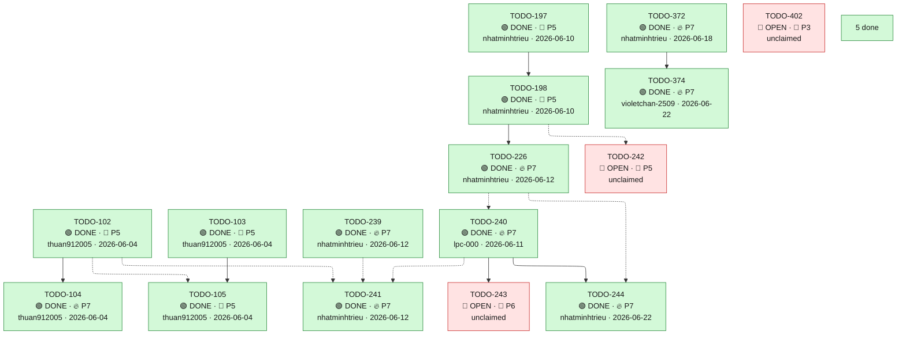

| ID | Title | Bucket | Stream | Prio | Status | Dependency | Reference | Agent-ID | Commit |
| --- | --- | --- | --- | --- | --- | --- | --- | --- | --- |
| **[TODO-101](tasks/TODO-101.md)** | Maintenance endpoint: reconcile Supabase `public.termine` from `orbit_green.cached_events` (full upsert sync + fingerprint consistency check) | Architecture | **W21** | 📌 P5 | 🟢 DONE | — | [TODO-101 detail](#todo-101--maintenance-endpoint-reconcile-supabase-publictermine-from-cached_events--fingerprint-consistency-check) · `[termine.py](../app/api/v1/orbit/termine.py)` · `[supabase_termine_sync_service.py](../app/services/v1/orbit/supabase_termine_sync_service.py)` · `[orbit_schema_sync.py](../app/api/v1/orbit/orbit_schema_sync.py)` · [docs/findings/BJORN_TERMINE_SYNC_GAP.md](../docs/findings/BJORN_TERMINE_SYNC_GAP.md) · orbit-fe: ORBIT-FE-025 (ClickUp 86ca5ky43) | lpc-000 | `0288f0a7` |
| **[TODO-102](tasks/TODO-102.md)** | Daily scheduled CI job running the reconcile endpoint 1×/day with `verify_only=false` (nightly auto-heal) | Architecture | **W21** | 📌 P5 | 🟢 DONE | — | [TODO-102 detail](#todo-102--daily-scheduled-reconcile-job-nightly-full-auto-heal-of-supabase-termine) · `[.gitlab-ci.yml](../.gitlab-ci.yml)` · `[termine_reconcile.py](../app/api/v1/orbit/termine_reconcile.py)` · orbit-fe: ORBIT-FE-025 (ClickUp 86ca5ky43) | thuan912005 | `b41be882` |
| **[TODO-103](tasks/TODO-103.md)** | Enrich the reconcile endpoint/service with OpenTelemetry metrics + span (drift, duration, upserted/errors) | Prevention | **W21** | 📌 P5 | 🟢 DONE | — | [TODO-103 detail](#todo-103--enrich-the-reconcile-endpoint-with-opentelemetry-metrics-and-a-span) · `[supabase_termine_reconcile_service.py](../app/services/v1/orbit/supabase_termine_reconcile_service.py)` · `[otel_events.py](../app/core/otel_events.py)` · orbit-fe: ORBIT-FE-025 (ClickUp 86ca5ky43) | thuan912005 | `b41be882` |
| **[TODO-104](tasks/TODO-104.md)** | Daily drift e-mail alert sent by the CI job when nightly reconcile leaves `rows_missing_after > 0` | Prevention | **W21** | 🔥 P7 | 🟢 DONE | `→ TODO-102` | [TODO-104 detail](#todo-104--daily-drift-email-alert-when-nightly-reconcile-fails-to-converge) · `[termine_reconcile schema](../app/schemas/orbit/termine_reconcile.py)` · `[.gitlab-ci.yml](../.gitlab-ci.yml)` · orbit-fe: ORBIT-FE-025 (ClickUp 86ca5ky43) | thuan912005 | `b41be882` |
| **[TODO-105](tasks/TODO-105.md)** | Grafana drift dashboard (view-only) for the reconcile metrics — JSON-as-code under `docs/` | Prevention | **W21** | 📌 P5 | 🟢 DONE | `→ TODO-103` · `~ TODO-102` | [TODO-105 detail](#todo-105--grafana-drift-dashboard-view-only-for-termine-reconciliation) · `[orbit_proposal_latency_grafana_dashboard.json](../docs/CI/orbit_proposal_latency_grafana_dashboard.json)` · orbit-fe: ORBIT-FE-025 (ClickUp 86ca5ky43) | thuan912005 | `b41be882` |
| **[TODO-197](tasks/TODO-197.md)** | sync-diff monitoring: optional date-range + whitelisted-salesperson default (replace Björn hardcode) | Performance | **W21** | 📌 P5 | 🟢 DONE | — | `[maintenance.py](../app/api/v2/orbit/maintenance.py)` · `[termine_sync_diff_service.py](../app/services/v2/orbit/termine_sync_diff_service.py)` · `[whitelist_service.py](../app/services/v1/orbit/whitelist_service.py)` · `[howto-reconcile-supabase-termine.md](../docs/howto/howto-reconcile-supabase-termine.md)` · ADR-001 | nhatminhtrieu | `8df07ba` |
| **[TODO-198](tasks/TODO-198.md)** | /sync-diff/rows: unified single-salesperson bucket view (replace view=drift\|all) | Architecture | **W21** | 📌 P5 | 🟢 DONE | `→ TODO-197` | `[maintenance.py](../app/api/v2/orbit/maintenance.py)` · `[termine_sync_diff_service.py](../app/services/v2/orbit/termine_sync_diff_service.py)` · `[termine_row_diff_logic.py](../app/services/v2/orbit/termine_row_diff_logic.py)` · `[termine_row_diff.py](../app/schemas/orbit/termine_row_diff.py)` · `[howto-reconcile-supabase-termine.md](../docs/howto/howto-reconcile-supabase-termine.md)` · ADR-001 · ADR-022 | nhatminhtrieu | `94a0735b` |
| **[TODO-226](tasks/TODO-226.md)** | /sync-diff/rows: rds_only/unreconcilable count uses RDS keyset as 'supa_keyset' (mirrored keyset JSON required) | Correctness | **W21** | 🔥 P7 | 🟢 DONE | `→ TODO-198` | `[termine_sync_diff_service.py](../app/services/v2/orbit/termine_sync_diff_service.py)` (`_RDS_BUCKET_ITEMS_SQL` L330, `_RDS_KEYSET_AND_RDS_COUNTS_SQL` L441, `_BUCKET_COUNT_SQL` L689, `_SUPA_BUCKET_ITEMS_SQL` L600, `_SUPA_BUCKET_COUNT_SQL` L539, `get_rows` L1082, `_fetch_rds_keyset_and_rds_counts` L1200) · `[maintenance.py](../app/api/v2/orbit/maintenance.py)` (`get_termine_rows` L265) · `[test_termine_row_diff_pushdown_integration.py](../tests/integration/orbit/test_termine_row_diff_pushdown_integration.py)` · `[howto-reconcile-supabase-termine.md](../docs/howto/howto-reconcile-supabase-termine.md)` · ADR-001 · ADR-022 | nhatminhtrieu | `2f7db1b` |
| **[TODO-239](tasks/TODO-239.md)** | Whitelisted reconcile script: retry with backoff + opt-in adaptive pacing | Prevention | **W21** | 🔥 P7 | 🟢 DONE | — | `[scripts/reconcile_whitelisted_termine_lambda.sh](../scripts/reconcile_whitelisted_termine_lambda.sh)` · `[scripts/lib/reconcile_retry.sh](../scripts/lib/reconcile_retry.sh)` (new) | nhatminhtrieu | `7f5fc8293` |
| **[TODO-240](tasks/TODO-240.md)** | RCA: 292 CUSTOMER_VISIT appointments missing in Supabase vs RDS prod (by sales, case-by-case) | Correctness | **W21** | 🔥 P7 | 🟢 DONE | `~ TODO-226` | sync-diff prod response 2026-06-11 (RDS 1387 vs Supabase 1095, delta 292, CUSTOMER_VISIT, all months out_of_sync) · [maintenance.py sync-diff](../app/api/v2/orbit/maintenance.py) · [W21 mission](../streams/W21-termine-reconciliation.md) | lpc-000 | `30f6248d` |
| **[TODO-241](tasks/TODO-241.md)** | Scheduled prod sync as AWS Lambda — automated cron windows (prod auto, alpha/beta on-demand) | Stability | **W21** | 🔥 P7 | 🟢 DONE | `~ TODO-240` · `~ TODO-102` · `~ TODO-239` | user directive 2026-06-11 (scheduled prod sync windows) · [W21 mission](../streams/W21-termine-reconciliation.md) | nhatminhtrieu | `da78931` |
| **[TODO-242](tasks/TODO-242.md)** | sync-diff: aggregate-all-whitelisted view + total when no salesperson selected | Architecture | **W21** | 📌 P5 | 🔴 OPEN | `~ TODO-198` | user directive 2026-06-11 (sync-diff view: no-sales-selected → aggregate all whitelisted) · [maintenance.py sync-diff](../app/api/v2/orbit/maintenance.py) | — | — |
| **[TODO-243](tasks/TODO-243.md)** | Exclude ORBIT-PROD-MIGRATION + NULL-gid orphans from CUSTOMER_VISIT reconcile/monitor scope | Correctness | **W21** | 📌 P6 | 🔴 OPEN | `→ TODO-240` | TODO-240 RCA (2026-06-11): 202 rds_only rows all ORBIT-PROD-MIGRATION + google_event_id NULL + appointment_type NULL · [supabase_termine_sync_service.py:327](../app/services/v1/orbit/supabase_termine_sync_service.py) | — | — |
| **[TODO-244](tasks/TODO-244.md)** | Fix sync-diff count-vs-row inconsistency: align monthly-count and keyset-bucket populations (NULL-gid) | Correctness | **W21** | 🔥 P7 | 🟢 DONE | `~ TODO-226` · `→ TODO-240` | TODO-240 RCA (2026-06-11): cnt_delta ≠ rds_only_total every month · [termine_sync_diff_service.py:374-420](../app/services/v2/orbit/termine_sync_diff_service.py) | nhatminhtrieu | `0d7ab20` |
| **[TODO-372](tasks/TODO-372.md)** | Add `booked_at` column to orbit_green.cached_events (timestamps the moment a Termin is booked) | Hardening | **W21** | 🔥 P7 | 🟢 DONE | — | — | nhatminhtrieu | `1a85c63` |
| **[TODO-374](tasks/TODO-374.md)** | Delete & sync-event endpoints preserve `profile_id` AND `booked_at` on `cached_event` soft-deletes / resyncs | Correctness | **W21** | 🔥 P7 | 🟢 DONE | `→ TODO-372` | — | violetchan-2509 | `21f8eb5d` |
| **[TODO-396](tasks/TODO-396.md)** | Strip RDS-only termin_zugesagt and hangout_link from Supabase termine sync payload | Correctness | **W21** | 🔥 P7 | 🟢 DONE | — | [RCA 2026-06-19](../docs/findings/20260619-supabase-termine-termin-zugesagt-column-missing-rca.md) · prod error log 2026-06-19 01:33:51 UTC · `ee321d0f6` (TODO-176) · `migrations_orbit_green/versions/c241032c6498_add_termin_zugesagt_and_hangout_link.py` · [supabase_termine_sync_service.py:487-489](../app/services/v1/orbit/supabase_termine_sync_service.py) · [supabase_termine.py](../app/models/orbit_green/supabase_termine.py) · [termine_repository.py:53](../app/services/v1/orbit/termine_repository.py) | nhatminhtrieu | `a2d94b8` |
| **[TODO-402](tasks/TODO-402.md)** | Dedup recurring internal/private cross-source blocks (HIL_V3 gid-link + sentinel-lead == NULL-lead) | Correctness | **W21** | 🌿 P3 | 🔴 OPEN | — | Analysis `.local/decisions/20260619-todo402-dedup-implementation-decision.md` (verified scope correction) · `app/services/simulation/hil_proposal_service_v3.py:267-330` (HIL_V3 book; gid not linked back, lead=sentinel) · `app/services/v1/orbit/calendar_sync_service.py:~3329` (write_cached_event_to_google_calendar flush-not-commit) · ADR-010 (calendar_source SoT), ADR-026 (no-notify), `calendar_mutation_params` helper (a39ae257a, W34) | — | — |
| **[TODO-403](tasks/TODO-403.md)** | Pin & fix wrongful re-plan/cancel that clears a day's customer visits (Nicola 25-Jun, user-attributed) | Correctness | **W21** | 🌿 P2 | ⚪ DEFERRED / OBSOLETE | — | Analysis `.local/decisions/20260619-nicola-2506-calendar-churn-analysis.md` · TODO-309 (audit sync-driven deletions — the actual fix) + TODO-406 (empty-day detection — done) · `app/services/v1/orbit/calendar_sync_service.py:1099-1109` (trash-bin stub sets is_deleted+is_cancelled, no audit GUC) | — | — |
| **[TODO-404](tasks/TODO-404.md)** | Assess & correct KPI/commission double-counting caused by cross-source event duplication | Correctness | **W21** | 🌿 P3 | ⚪ DEFERRED / OBSOLETE | — | Analysis `.local/decisions/20260619-todo402-dedup-implementation-decision.md` (verification: 0 CUSTOMER_VISIT dups) · TODO-402 (re-scoped to internal/private clutter only) · `app/dal/orbit/repositories/cached_event_repository.py` (per-setter booking counts) · ADR-026 / commissions / kpi_daily_aggregates | — | — |
| **[TODO-413](tasks/TODO-413.md)** | migrate_specific_termine KeyError on commented-out ORBIT_TABLE_CONFIGS['termine'] | Correctness | **W21** | 📌 P5 | 🟢 DONE | — | [import_german_sql_data consistency 2026-06-20](../.local/decisions/20260620-import-german-sql-data-consistency.md) · `app/services/supabase_sync_service.py:360` (ORBIT_TABLE_CONFIGS['termine'].copy()) · `scripts/import_german_sql_data.py:315` (termine config commented out) · ADR-022 (termine is outbound RDS→Supabase reconcile) | lpc-000 | `a44e8c69` |

### W23 - Agent Memory (cross-project read)

[stream file](streams/W23-agent-memory.md)

#### Status & dependency map

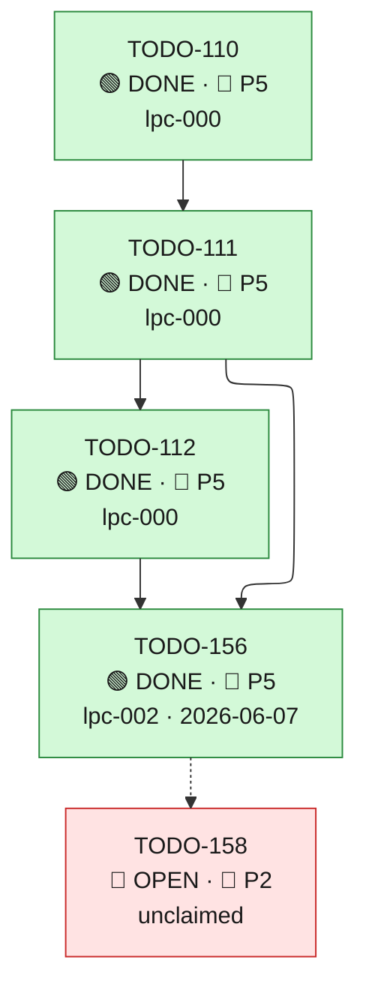

| ID | Title | Bucket | Stream | Prio | Status | Dependency | Reference | Agent-ID | Commit |
| --- | --- | --- | --- | --- | --- | --- | --- | --- | --- |
| **[TODO-110](tasks/TODO-110.md)** | Read-only cross-project agent-memory: read `asol-transcript`'s Mem0 collection from the shared `asol-postgres` (canonical-collection sanitization, allowlist-gated, off by default) | Architecture | **W23** | 📌 P5 | 🟢 DONE | — | [TODO-110 detail](#todo-110--read-only-cross-project-agent-memory-read-asol-transcript-from-the-shared-pgvector) · `[app/core/agent_memory.py](../app/core/agent_memory.py)` · `[app/core/config.py](../app/core/config.py)` · port source `asol-transcript/src/asol_transcript/pipeline/memory.py` | lpc-000 | `df55294` |
| **[TODO-111](tasks/TODO-111.md)** | Read-only agent-memory MCP server (`agent-memory-mcp`) exposing `memory_search(query, scope)` over `recall_foreign` — lets an agent working in this repo read foreign collections via MCP | Architecture | **W23** | 📌 P5 | 🟢 DONE | `→ TODO-110` | [TODO-111 detail](#todo-111--read-only-agent-memory-mcp-server-wrapping-recall_foreign) · `[app/core/agent_memory_mcp.py](../app/core/agent_memory_mcp.py)` · model `asol-transcript/src/asol_transcript/memory_mcp.py` | lpc-000 | `6331912b` |
| **[TODO-112](tasks/TODO-112.md)** | Read-only `list_collections` library fn + MCP tool: enumerate the Mem0 (pgvector) collections in the shared `asol-postgres` (name, scope, row count) — metadata only, no content | Architecture | **W23** | 📌 P5 | 🟢 DONE | `→ TODO-111` | [TODO-112 detail](#todo-112--read-only-list_collections-tool-enumerate-mem0-collections-in-the-shared-pgvector) · `[app/core/agent_memory.py](../app/core/agent_memory.py)` · `[app/core/agent_memory_mcp.py](../app/core/agent_memory_mcp.py)` | lpc-000 | `0d08259d` |
| **[TODO-156](tasks/TODO-156.md)** | Consolidate onto the single `asol-memory` MCP — retire `agent-memory-mcp` + the read-only facade, repoint `.mcp.json` (`MEMORY_MODE` per intent), ops-tune the shared backend (per asol-transcript ADR-023) | Architecture | **W23** | 📌 P5 | 🟢 DONE | `→ TODO-111` · `→ TODO-112` | [ADR-019](../docs/decisions.md) · asol-transcript ADR-023 — single agent-memory MCP · `[.mcp.json](../.mcp.json)` | lpc-002 | `5457956c` |
| **[TODO-158](tasks/TODO-158.md)** | Ops-tune the shared asol-memory backend: per-project `~/.mem0/history.db`, mem0 pgvector pool `max_size`, asol-postgres `max_connections` headroom | Performance | **W23** | 🌿 P2 | 🔴 OPEN | `~ TODO-156` | [ADR-019](../docs/decisions.md) · asol-transcript ADR-023 | — | — |

### W27 - General bugfix

[stream file](streams/W27-general-bugfix.md)

#### Status & dependency map

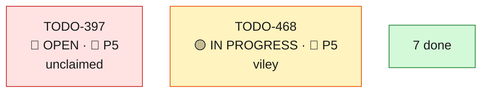

| ID | Title | Bucket | Stream | Prio | Status | Dependency | Reference | Agent-ID | Commit |
| --- | --- | --- | --- | --- | --- | --- | --- | --- | --- |
| **[TODO-129](tasks/TODO-129.md)** | Fix `book_proposal` PendingRollbackError — `public.termine` ON CONFLICT target vs. 3-col unique constraint mismatch (trigger deploy-lag + stale Python upserts + swallowed-exception session poisoning) | Correctness | **W27** | 🔥 P9 | 🟢 DONE | — | [detail](#todo-129--book_proposal-pendingrollbackerror-from-termine-on-conflict-vs-3-col-unique-constraint) · `[app/services/simulation/hil_proposal_service.py](../app/services/simulation/hil_proposal_service.py)` (1351-1357) · `[app/services/v1/orbit/termine_repository.py](../app/services/v1/orbit/termine_repository.py)` (383, 416) · `[app/models/orbit_green/supabase_termine.py](../app/models/orbit_green/supabase_termine.py)` (20-31) · migrations `6de3d397cecb` / `03e676141162` · prod error log 2026-06-05 10:16:15 · user directive 2026-06-05 | lpc-002 | `35263449` |
| **[TODO-130](tasks/TODO-130.md)** | Complete the termine-sync trigger realignment — residual 2-col ON CONFLICT at `03e676141162:134` (IF FOUND / meta-version branch) breaks every cached_events write on a classified event, **even at head** | Correctness | **W27** | 🔥 P9 | 🟢 DONE | — | [detail](#todo-130--trigger-found-branch-still-2-col-on-conflict-breaks-all-cached_events-writes) · `[migrations_orbit_green/versions/03e676141162_align_termine_trigger_with_new_.py](../migrations_orbit_green/versions/03e676141162_align_termine_trigger_with_new_.py)` (134 vs 188) · `[app/api/v1/orbit/termine.py](../app/api/v1/orbit/termine.py)` (430) · `[app/dal/orbit/repositories/cached_event_repository.py](../app/dal/orbit/repositories/cached_event_repository.py)` (1015, 1034) · prod error log 2026-06-05 11:00:46 · user directive 2026-06-05 | lpc-002 | `3a99db0a` |
| **[TODO-246](tasks/TODO-246.md)** | Recommendation engine ignores telesales when finding slots: optimizer pads travel for telesales reps instead of 15min pre + visit + 15min post | Correctness | **W27** | 🔥 P7 | 🟢 DONE | — | `app/core/simulation/optimizer.py:202` (SalesOptimizer.__init__ has no sales_role) · `app/core/simulation/optimizer.py:1843-1875` (_create_appointment_proposal pads visit with prev/next travel_time_hours) · `app/services/simulation/proposal_blocker_strategy.py` (telesales 15min pre/post — labeling only) · `app/services/simulation/hil_proposal_service.py` (get_salesperson_activity → normalize_activity → SalesRole.TELE_SALES) · orbit-fe `orbit-galvanek/src/utils/callcenter/proposalWrapBlocks.ts` (FE compensates client-side) · User bug report 2026-06-11 | lpc-003 | `472c454b` |
| **[TODO-281](tasks/TODO-281.md)** | Proposals endpoint: trigger telesales/online slot geometry on place_type (online\|phone), replace the redundant is_online flag | Architecture | **W27** | 🌿 P2 | 🟢 DONE | — | TODO-246 (introduced the is_online flag) · `app/core/simulation/optimizer.py:1359-1371` (is_offsite = place_type ONLINE\|PHONE — existing no-travel definition) · `app/models/orbit/cached_events.py:33` (PlaceType enum) · `app/services/v1/orbit/calendar_sync_service.py:7365` (booking is_tele_sales — online only) · User directive 2026-06-12 | lpc-003 | `61821417` |
| **[TODO-371](tasks/TODO-371.md)** | Fix MissingGreenlet in clean-and-consolidate: classification hybrid lazy-loads the meta-version classification relationship in sync/async context | Correctness | **W27** | 🔥 P7 | 🟢 DONE | — | — | lpc-001 | `b18d3fbd6` |
| **[TODO-397](tasks/TODO-397.md)** | Enrich /salespeople/calendar/week response with salesperson name and activity from sales table | Architecture | **W27** | 📌 P5 | 🔴 OPEN | — | — | — | — |
| **[TODO-398](tasks/TODO-398.md)** | Enrich created_by_profile from event descriptions | Architecture | **W27** | 📌 P5 | 🟢 DONE | — | — | hazhaz-672 | `7151653` |
| **[TODO-399](tasks/TODO-399.md)** | Enrich /salespeople/calendar/week `created_by_profile` with `profile_id` and `sales.name` (booker lineage denormalised) | Architecture | **W27** | 📌 P5 | 🟢 DONE | — | — | nhatminhtrieu | `701bcf3` |
| **[TODO-468](tasks/TODO-468.md)** | Add PUT /internal/api/v1/orbit/termine/description endpoint | Architecture | **W27** | 📌 P5 | 🟡 IN PROGRESS | — | [Existing PUT endpoints](app/api/v1/orbit/termine.py): place-type (L362), status (L432) | viley | WIP |

### W29 - Telli x Orbit Terminbuchung — 6 AI-voice appointment tools on the live Orbit public API

[stream file](streams/W29-telli-terminbuchung.md)

#### Status & dependency map

```mermaid
---
config:
  layout: elk
---
flowchart TD
    TODO_140["TODO-140<br/>🟢 DONE · 🔥 P9<br/>thuan-742 · 2026-06-08"]:::done
    TODO_141["TODO-141<br/>🟢 DONE · 🔥 P9<br/>thuan-742 · 2026-06-08"]:::done
    TODO_142["TODO-142<br/>🟢 DONE · 🔥 P9<br/>thuan-742 · 2026-06-08"]:::done
    TODO_143["TODO-143<br/>🟢 DONE · 🔥 P9<br/>unclaimed · 2026-06-08"]:::done
    TODO_144["TODO-144<br/>🟢 DONE · 🔥 P7<br/>thuan-742 · 2026-06-08"]:::done
    TODO_145["TODO-145<br/>🟢 DONE · 🔥 P7<br/>thuan-742 · 2026-06-08"]:::done
    TODO_146["TODO-146<br/>🟢 DONE · 📌 P5<br/>thuan-742 · 2026-06-08"]:::done
    TODO_147["TODO-147<br/>🟢 DONE · 🔥 P7<br/>thuan-742 · 2026-06-08"]:::done
    TODO_148["TODO-148<br/>🟢 DONE · 🔥 P7<br/>thuan-742 · 2026-06-08"]:::done
    TODO_149["TODO-149<br/>🟢 DONE · 🔥 P7<br/>nhatminhtrieu · 2026-06-08"]:::done
    TODO_150["TODO-150<br/>🟢 DONE · 🔥 P7<br/>nhatminhtrieu · 2026-06-08"]:::done
    TODO_151["TODO-151<br/>🟢 DONE · 🔥 P7<br/>unclaimed · 2026-06-11"]:::done
    TODO_373["TODO-373<br/>🟢 DONE · 🔥 P7<br/>nhatminhtrieu · 2026-06-19"]:::done
    TODO_469["TODO-469<br/>🟢 DONE · 🌿 P1<br/>lpc-001"]:::done
    TODO_484["TODO-484<br/>🔴 OPEN · 🌿 P1<br/>unclaimed"]:::open
    TODO_485["TODO-485<br/>🔴 OPEN · 🌿 P2<br/>unclaimed"]:::open
    TODO_486["TODO-486<br/>🟢 DONE · 🌿 P2<br/>lpc-001"]:::done
    TODO_372["TODO-372<br/>W21"]:::external
    TODO_380["TODO-380<br/>W45"]:::external
    TODO_458["TODO-458<br/>W49"]:::external
    TODO_140 -.-> TODO_143
    TODO_141 --> TODO_144
    TODO_140 --> TODO_145
    TODO_141 --> TODO_145
    TODO_140 --> TODO_147
    TODO_140 -.-> TODO_148
    TODO_144 -.-> TODO_148
    TODO_143 --> TODO_149
    TODO_141 --> TODO_150
    TODO_143 --> TODO_150
    TODO_149 --> TODO_150
    TODO_372 --> TODO_373
    TODO_380 -.-> TODO_469
    TODO_469 --> TODO_484
    TODO_458 --> TODO_484
    TODO_484 -.-> TODO_485
    TODO_469 -.-> TODO_486
    click TODO_140 "tasks/TODO-140.md"
    click TODO_141 "tasks/TODO-141.md"
    click TODO_142 "tasks/TODO-142.md"
    click TODO_143 "tasks/TODO-143.md"
    click TODO_144 "tasks/TODO-144.md"
    click TODO_145 "tasks/TODO-145.md"
    click TODO_146 "tasks/TODO-146.md"
    click TODO_147 "tasks/TODO-147.md"
    click TODO_148 "tasks/TODO-148.md"
    click TODO_149 "tasks/TODO-149.md"
    click TODO_150 "tasks/TODO-150.md"
    click TODO_151 "tasks/TODO-151.md"
    click TODO_373 "tasks/TODO-373.md"
    click TODO_469 "tasks/TODO-469.md"
    click TODO_484 "tasks/TODO-484.md"
    click TODO_485 "tasks/TODO-485.md"
    click TODO_486 "tasks/TODO-486.md"
    click TODO_372 "tasks/TODO-372.md"
    click TODO_380 "tasks/TODO-380.md"
    click TODO_458 "tasks/TODO-458.md"
    classDef open fill:#ffe3e3,stroke:#c92a2a,color:#1a1a1a;
    classDef wip fill:#fff3bf,stroke:#e8590c,color:#1a1a1a;
    classDef done fill:#d3f9d8,stroke:#2b8a3e,color:#1a1a1a;
    classDef obsolete fill:#e9ecef,stroke:#868e96,color:#1a1a1a;
    classDef external fill:#f8f9fa,stroke:#adb5bd,color:#1a1a1a,stroke-dasharray:4 3;
```

| ID | Title | Bucket | Stream | Prio | Status | Dependency | Reference | Agent-ID | Commit |
| --- | --- | --- | --- | --- | --- | --- | --- | --- | --- |
| **[TODO-140](tasks/TODO-140.md)** | Make sales_id optional on agent endpoints — derive it from lead_id server-side | Architecture | **W29** | 🔥 P9 | 🟢 DONE | — | `appointments_service.py:517` (uuid.UUID(lead_id) guard, live 400) · `schemas/public/v1/appointments.py:347` (GenerateProposalsRequest.sales_id required) · `dal/orbit/repositories/lead_repository.py:296` (find_lead_by_id -> mitarbeiter_id) | thuan-742 | `a2b5a97` |
| **[TODO-141](tasks/TODO-141.md)** | Fix check-and-book HTTP 500 — place_type hybrid passed to CachedEvent() constructor | Correctness | **W29** | 🔥 P9 | 🟢 DONE | — | `calendar_sync_service.py:2624` (CachedEvent ctor), `:2636` place_type=, `:2635` classification= · `models/orbit_green/cached_events.py:464` (place_type hybrid), `:396` (classification setter raises on None) | thuan-742 | `a2b5a97` |
| **[TODO-142](tasks/TODO-142.md)** | Fix GET /blockers HTTP 500 — raw date in json.dumps SQS/Lambda payload | Correctness | **W29** | 🔥 P9 | 🟢 DONE | — | `appointments_service.py:132` ("dates": [date] raw), `:155` (json.dumps SQS), `:167` (Lambda fallback) | thuan-742 | `a2b5a97` |
| **[TODO-143](tasks/TODO-143.md)** | Lead-based appointment lookup endpoint returning event_id + status (US-6) | Architecture | **W29** | 🔥 P9 | 🟢 DONE | `~ TODO-140` | `calendar_sync_service.py:7836` (get_booked_event_by_lead -> cached_event_id, start/end, termin_status, salesperson) | — | `6fa15d23` |
| **[TODO-144](tasks/TODO-144.md)** | classification required + server default CUSTOMER_VISIT on book | Correctness | **W29** | 🔥 P7 | 🟢 DONE | `→ TODO-141` | `models/orbit_green/cached_events.py:396` (setter rejects None) · `schemas/orbit/constant.py:61` (AppointmentType enum) | thuan-742 | `f9d0b00` |
| **[TODO-145](tasks/TODO-145.md)** | Server-side title/location defaults from lead on book | Correctness | **W29** | 🔥 P7 | 🟢 DONE | `→ TODO-140` · `→ TODO-141` | `calendar_sync_service.py:2533` (create_blocker_event title/location params) | thuan-742 | `2c666927` |
| **[TODO-146](tasks/TODO-146.md)** | conflict_working_time on proposals — filter server-side vs keep flagged (decision B-3) | Correctness | **W29** | 📌 P5 | 🟢 DONE | — | `appointments_service.py` generate_proposals (conflict_working_time per proposal) | thuan-742 | `aa41163` |
| **[TODO-147](tasks/TODO-147.md)** | Lead-based availability variant availability-by-lead (US-1) | Architecture | **W29** | 🔥 P7 | 🟢 DONE | `→ TODO-140` | `appointments_service.py:1383` (_check_sales_availability_core(sales_id, start, end)) · `api/public/v1/appointments.py:319` (existing path-keyed availability endpoint) | thuan-742 | `2400d45` |
| **[TODO-148](tasks/TODO-148.md)** | Foundational ai-doc registration contract + OpenAPI alignment for the Telli agent endpoints | Architecture | **W29** | 🔥 P7 | 🟢 DONE | `~ TODO-140` · `~ TODO-144` | `schemas/ai_docs.py:11` (AI_DOCS_ALLOWLIST) · `main.py:308` (build_ai_openapi_schema, filters /public-prefixed routes) · `tests/unit/test_ai_openapi_docs.py` (currently-disabled /openapi-ai.json assertion = the aggregate guard to re-enable) | thuan-742 | `4553a3c` |
| **[TODO-149](tasks/TODO-149.md)** | Verify cancel PATCH /blocker + idempotency + IDOR guard | Hardening | **W29** | 🔥 P7 | 🟢 DONE | `→ TODO-143` | `appointments_service.py:330` (patch_blocker), `:379` (remote_reject_calendar_event) · `schemas/orbit/constant.py:112` (TerminStatus.ABGESAGT = 'Abgesagt') · commit 6b625e8f (travel-blocker orphan cleanup, merged) | nhatminhtrieu | `4459d7a` |
| **[TODO-150](tasks/TODO-150.md)** | Change appointment = book-then-cancel saga (US-5) | Correctness | **W29** | 🔥 P7 | 🟢 DONE | `→ TODO-141` · `→ TODO-143` · `→ TODO-149` | composition of TODO-141 (book), TODO-143 (lookup), TODO-149 (cancel) · `POST /public/v1/appointments/appointments/change` · `appointments_service.py:1721` (change_appointment) · `tests/unit/orbit/test_change_saga.py` | nhatminhtrieu | `b87bfe7` |
| **[TODO-151](tasks/TODO-151.md)** | Config-prerequisite audit + go-live checks (home location, working hours, lead address) | Stability | **W29** | 🔥 P7 | 🟢 DONE | — | SalesWorkingHour / sales.addresses config; `GET /internal/api/v2/orbit/sales` (active reps) | — | `e348451` |
| **[TODO-373](tasks/TODO-373.md)** | Book endpoint writes `cached_event.booked_at = now()` at the moment the Termin is booked | Correctness | **W29** | 🔥 P7 | 🟢 DONE | `→ TODO-372` | — | nhatminhtrieu | `006f306` |
| **[TODO-469](tasks/TODO-469.md)** | Fix public check-and-book HTTP 500 — coerce created_by_profile (UUID→str) at the CachedEvent model boundary | Correctness | **W29** | 🌿 P1 | 🟢 DONE | `~ TODO-380` | RCA docs/findings/20260624-check-and-book-500-created-by-profile-uuid-rca.md (+_de) — prod Loki ground truth · Partner report PHI-REPORT-check-and-book-500.md (Zenflow/Telli, 2026-06-23) · Introduced by TODO-380 (e927c25c, populate created_by_profile on booking/sync) · create_blocker_event app/services/v1/orbit/calendar_sync_service.py:2756; CachedEvent.created_by_profile app/models/orbit_green/cached_events.py:304 (String(255)) | lpc-001 | `614ead1d3` |
| **[TODO-484](tasks/TODO-484.md)** | Deploy to prod — ship the check-and-book + availability-by-lead fixes (prod is ~83 commits stale on v1.5.323) | Stability | **W29** | 🌿 P1 | 🔴 OPEN | `→ TODO-469` · `→ TODO-458` | TODO-469 (created_by_profile UUID→str, fixes the check-and-book 500) merged 614ead1d3 · TODO-458 (availability-by-lead + check_and_book working-hours filter) merged 400ad2727 — also only on main, not prod · Prod ran v1.5.323 (build 2026-06-23T11:58Z); main is ~83 commits ahead · Deploy mechanism: .gitlab-ci.yml ec2_deploy_script (EC2 docker compose -f compose.prod.yml); production release tag is an explicit user-triggered action (Rule 11) | — | — |
| **[TODO-485](tasks/TODO-485.md)** | Ops orphan-sweep — delete Google calendar events left by failed check-and-book bookings (since ~2026-06-19) | Correctness | **W29** | 🌿 P2 | 🔴 OPEN | `~ TODO-484` | RCA docs/findings/20260624-check-and-book-500-created-by-profile-uuid-rca.md — Google event created before the failing INSERT → orphan per failed booking · create_blocker_event app/services/v1/orbit/calendar_sync_service.py (push_event_to_google precedes the cached_events INSERT) · Cleanup tooling precedent: scripts/cleanup/ (SA events.delete, sendUpdates=none) | — | — |
| **[TODO-486](tasks/TODO-486.md)** | Emit X-Request-ID response header on all responses (request_id correlation; body already carries it for 5xx) | Hardening | **W29** | 🌿 P2 | 🟢 DONE | `~ TODO-469` | ObservabilityMiddleware computes request_id (x-request-id header or auto-<ts>) app/middleware/observability.py:195 → request_context ContextVar · _generic_error_body already injects request_id into 5xx bodies (main.py:202, W07/TODO-020) · Partner report PHI-REPORT-check-and-book-500.md: response headers carried only Date, no request id — asked for X-Request-ID to ease diagnosis | lpc-001 | `a6896c932` |

### W31 - Transactional email pipeline (Postmark) in orbit-be

[stream file](streams/W31-transactional-email.md)

#### Status & dependency map

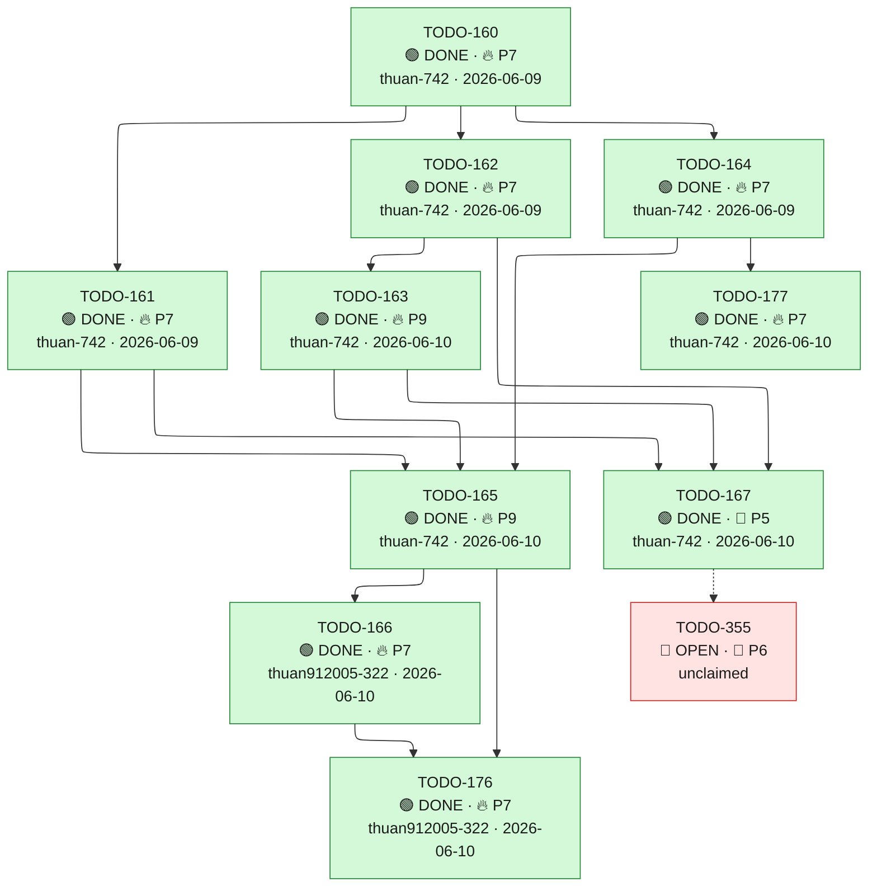

| ID | Title | Bucket | Stream | Prio | Status | Dependency | Reference | Agent-ID | Commit |
| --- | --- | --- | --- | --- | --- | --- | --- | --- | --- |
| **[TODO-160](tasks/TODO-160.md)** | ADR-021 + Postmark provider client (transactional email in orbit-be, Supabase = IDM) | Architecture | **W31** | 🔥 P7 | 🟢 DONE | — | [Postmark setup research](../docs/orbit/postmark-info-research.md) · [Postmark analysis](../../orbit-galvanek/docs/postmark-tutorial-analysis.md) · `app/utils/mail_utils.py` · `app/core/config.py` | thuan-742 | `6c36783` |
| **[TODO-161](tasks/TODO-161.md)** | email_send_log table (orbit_green) + repository | Architecture | **W31** | 🔥 P7 | 🟢 DONE | `→ TODO-160` | `app/dal/orbit/repositories/` · [FE SendLogEntry](../../orbit-galvanek/src/data/mockEmailLogs.ts) | thuan-742 | `6c36783` |
| **[TODO-162](tasks/TODO-162.md)** | suppressed_emails (orbit_green) + Postmark webhook ingest endpoint (retires the Edge Function) | Architecture | **W31** | 🔥 P7 | 🟢 DONE | `→ TODO-160` | `app/api/v1/orbit/commissions.py` · [FE suppressed_emails migration](../../orbit-galvanek/supabase/migrations/20260603165118_b130191e-8936-4e0e-8c82-7d96753e7af1.sql) | thuan-742 | `6c36783` |
| **[TODO-163](tasks/TODO-163.md)** | Pre-send suppression gate | Correctness | **W31** | 🔥 P9 | 🟢 DONE | `→ TODO-162` | — | thuan-742 | `be4f1ae8` |
| **[TODO-164](tasks/TODO-164.md)** | Appointment to email payload resolver + endpoint | Architecture | **W31** | 🔥 P7 | 🟢 DONE | `→ TODO-160` | `app/models/orbit_green/cached_events.py` · `app/models/orbit_green/sales.py` | thuan-742 | `6c36783` |
| **[TODO-165](tasks/TODO-165.md)** | send-transactional-email service + Celery task | Architecture | **W31** | 🔥 P9 | 🟢 DONE | `→ TODO-161` · `→ TODO-163` · `→ TODO-164` | — | thuan-742 | `b35f6595` |
| **[TODO-166](tasks/TODO-166.md)** | Appointment-lifecycle email triggers (event-driven + scheduled) | Architecture | **W31** | 🔥 P7 | 🟢 DONE | `→ TODO-165` | `app/api/v1/orbit/termine.py` · `app/core/celery_app.py` | thuan912005-322 | `ee321d0f` |
| **[TODO-167](tasks/TODO-167.md)** | Email-admin read endpoints for the FE | Architecture | **W31** | 📌 P5 | 🟢 DONE | `→ TODO-161` · `→ TODO-162` · `→ TODO-163` | [FE mock shapes](../../orbit-galvanek/src/data/mockEmailLogs.ts) | thuan-742 | `19afb01d` |
| **[TODO-176](tasks/TODO-176.md)** | Postmark conditional template rendering + event mapping + 'Termin zugesagt' field; delete two templates | Architecture | **W31** | 🔥 P7 | 🟢 DONE | `→ TODO-165` · `→ TODO-166` | Besprechung 2026-06-09 (Phi × Bastian) — Sprint-Braindump · extends W31: TODO-164/165/166 · orbit-fe W07 email pipeline (ORBIT-FE-020..024) | thuan912005-322 | `ee321d0f` |
| **[TODO-177](tasks/TODO-177.md)** | Dynamic Postmark sender display-name = salesperson owning the appointment's calendar | Correctness | **W31** | 🔥 P7 | 🟢 DONE | `→ TODO-164` | Besprechung 2026-06-09 (Phi × Bastian) — Sprint-Braindump · extends TODO-164 (payload resolver) | thuan-742 | `2958ee57` |
| **[TODO-355](tasks/TODO-355.md)** | Restructure email_send_log: idempotent envelope + append-only event log (status lifecycle / G6) | Architecture | **W31** | 📌 P6 | 🔴 OPEN | `~ TODO-167` | ADR-023 (`docs/decisions.md:1284-1315`, esp. :1311 'webhook-driven status updates') · G6 — `docs/gesys_sync/gesys_email/REPORT-2026-06-15-email-fe-be-gap.md:92,161` · jl-cc analysis (`docs/refinement/20260617-email-send-log-upsert-vs-log-analysis.md`) · `app/dal/orbit/repositories/email_send_log_repository.py:46-80` · `app/api/v1/orbit/email_admin.py:206-207` | — | — |

### W34 - Google Workspace sync integrity & endpoint consolidation

[stream file](streams/W34-gworkspace-sync-integrity.md)

#### Status & dependency map

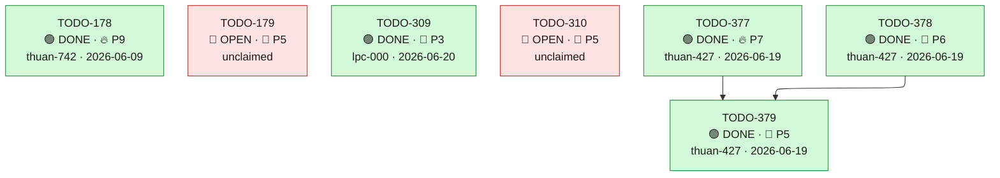

| ID | Title | Bucket | Stream | Prio | Status | Dependency | Reference | Agent-ID | Commit |
| --- | --- | --- | --- | --- | --- | --- | --- | --- | --- |
| **[TODO-178](tasks/TODO-178.md)** | Fix Google-calendar carry-over on offboarding via S3 snapshot + live-sync cutoff | Correctness | **W34** | 🔥 P9 | 🟢 DONE | — | Besprechung 2026-06-09 (Phi × Bastian) — Sprint-Braindump · Deadline: next Wednesday (2026-06-17) | thuan-742 | `c615856` |
| **[TODO-179](tasks/TODO-179.md)** | Consolidate and review the new (Timo) endpoints; verify Telli cascade endpoints intact | Architecture | **W34** | 📌 P5 | 🔴 OPEN | — | Besprechung 2026-06-09 (Phi × Bastian) — Sprint-Braindump · Telli stream W29 cascade endpoints (TODO-140..151) | — | — |
| **[TODO-309](tasks/TODO-309.md)** | Audit the calendar-sync deletion path: emit an audit record when sync sets is_deleted/is_cancelled | Prevention | **W34** | 🌿 P3 | 🟢 DONE | — | [Incident 2026-06-15 — t.uglar missing calendar items §4/§5.1/§6.2](../docs/incident/2026-06-15-1902-t-uglar-missing-calendar-items.md) · 2nd incidence 2026-06-19 (Nicola Jantowski 25-Jun CUSTOMER_VISITs) — see TODO-403 (obsoleted into this) + `.local/decisions/20260619-nicola-2506-calendar-churn-analysis.md` · `app/services/v1/orbit/calendar_sync_service.py:1099-1109` (trash-bin stub) + `:999-1022` (_delete_cached_event) — sync deletion paths that set is_deleted/is_cancelled with no audit GUC | lpc-000 | `ef90612` |
| **[TODO-310](tasks/TODO-310.md)** | Rename bulk_clear_classification_by_range to reflect it hard-deletes, and persist range/count/ids in its audit metadata | Correctness | **W34** | 📌 P5 | 🔴 OPEN | — | [Incident 2026-06-15 — t.uglar missing calendar items §3.5/§5.2/§5.3/§6.3](../docs/incident/2026-06-15-1902-t-uglar-missing-calendar-items.md) · `app/services/v1/orbit/calendar_sync_service.py:9172` (bulk_clear_classification_by_range) · `app/api/v1/orbit/calendar.py:837` (route DELETE /cached-events/bulk) | — | — |
| **[TODO-377](tasks/TODO-377.md)** | URGENT: set sendUpdates=none on the no-show/reject attendee PUT (stop notifying organizers) | Correctness | **W34** | 🔥 P7 | 🟢 DONE | — | `app/services/v1/orbit/calendar_sync_service.py:9770` `remote_reject_calendar_event` · audit: .local/decisions/20260618-google-calendar-sendupdates-audit.md · ADR-026 (no-notify-delete policy) | thuan-427 | WIP |
| **[TODO-378](tasks/TODO-378.md)** | Set sendUpdates=none on all remaining Google Calendar create/update mutations | Correctness | **W34** | 📌 P6 | 🟢 DONE | — | `app/services/v1/orbit/calendar_sync_service.py` push_event_to_google :2343/:2378/:2386 · `app/services/v1/orbit/calendar_remote_ops.py` :208/:378/:391 · `app/services/v1/orbit/place_type_change_service.py` _apply_calendar_patch · audit: .local/decisions/20260618-google-calendar-sendupdates-audit.md | thuan-427 | WIP |
| **[TODO-379](tasks/TODO-379.md)** | Central Google Calendar request enforcer (default sendUpdates=none) + CI guard test + ADR | Architecture | **W34** | 📌 P5 | 🟢 DONE | `→ TODO-377` · `→ TODO-378` | `app/services/v1/orbit/calendar_remote_ops.py` · `app/utils/google_http_retry.py` · ADR-026 (extend to all mutations) · audit: .local/decisions/20260618-google-calendar-sendupdates-audit.md | thuan-427 | WIP |

### W35 - Supabase Orbit V2 schema, RBAC & onboarding defaults

[stream file](streams/W35-supabase-v2-rbac-onboarding.md)

#### Status & dependency map

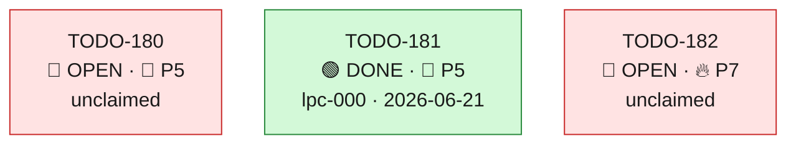

| ID | Title | Bucket | Stream | Prio | Status | Dependency | Reference | Agent-ID | Commit |
| --- | --- | --- | --- | --- | --- | --- | --- | --- | --- |
| **[TODO-180](tasks/TODO-180.md)** | Supabase 'Orbit V2' clean schema migration with stable V2 endpoints | Migration | **W35** | 📌 P5 | 🔴 OPEN | — | Besprechung 2026-06-09 (Phi × Bastian) — Sprint-Braindump · related: W13 Supabase orbit schema (TODO-051..055) | — | — |
| **[TODO-181](tasks/TODO-181.md)** | Auto-insert default working hours when an employee is created | Stability | **W35** | 📌 P5 | 🟢 DONE | — | Besprechung 2026-06-09 (Phi × Bastian) — Sprint-Braindump · related: W22 onboarding (TODO-106..109) | lpc-000 | `7c1a4557` |
| **[TODO-182](tasks/TODO-182.md)** | Server-side RBAC: only admins may administer other salespeople | Security | **W35** | 🔥 P7 | 🔴 OPEN | — | Besprechung 2026-06-09 (Phi × Bastian) — Sprint-Braindump · ORBIT-FE-037 — admin-only dropdown (FE) · builds on TODO-071, TODO-169 (canonical role resolver) | — | — |

### W37 - Infrastructure, tooling & administrative tasks

[stream file](streams/W37-infra-tooling-admin.md)

#### Status & dependency map

```mermaid
---
config:
  layout: elk
---
flowchart TD
    TODO_187["TODO-187<br/>🟢 DONE · 🔥 P7<br/>lpc-000 · 2026-06-17"]:::done
    TODO_188["TODO-188<br/>🔴 OPEN · 🌿 P3<br/>unclaimed"]:::open
    TODO_189["TODO-189<br/>🔴 OPEN · 🌿 P1<br/>unclaimed"]:::open
    TODO_194["TODO-194<br/>🟢 DONE · 📌 P5<br/>lpc-000 · 2026-06-10"]:::done
    TODO_195["TODO-195<br/>🔴 OPEN · 📌 P4<br/>unclaimed"]:::open
    TODO_196["TODO-196<br/>🔴 OPEN · 🌿 P3<br/>unclaimed"]:::open
    TODO_245["TODO-245<br/>🔴 OPEN · 🔥 P7<br/>unclaimed"]:::open
    TODO_247["TODO-247<br/>🟢 DONE · 🌿 P2<br/>lpc-002 · 2026-06-11"]:::done
    TODO_362["TODO-362<br/>🟢 DONE · 📌 P4<br/>codex · 2026-06-18"]:::done
    TODO_368["TODO-368<br/>🔴 OPEN · 📌 P4<br/>unclaimed"]:::open
    TODO_392["TODO-392<br/>🟢 DONE · 📌 P6<br/>thuan-427 · 2026-06-24"]:::done
    TODO_393["TODO-393<br/>🔴 OPEN · 📌 P6<br/>unclaimed"]:::open
    TODO_394["TODO-394<br/>🔴 OPEN · 📌 P5<br/>unclaimed"]:::open
    TODO_395["TODO-395<br/>🔴 OPEN · 📌 P6<br/>unclaimed"]:::open
    TODO_187 -.-> TODO_392
    TODO_187 -.-> TODO_393
    TODO_187 -.-> TODO_394
    TODO_187 -.-> TODO_395
    click TODO_187 "tasks/TODO-187.md"
    click TODO_188 "tasks/TODO-188.md"
    click TODO_189 "tasks/TODO-189.md"
    click TODO_194 "tasks/TODO-194.md"
    click TODO_195 "tasks/TODO-195.md"
    click TODO_196 "tasks/TODO-196.md"
    click TODO_245 "tasks/TODO-245.md"
    click TODO_247 "tasks/TODO-247.md"
    click TODO_362 "tasks/TODO-362.md"
    click TODO_368 "tasks/TODO-368.md"
    click TODO_392 "tasks/TODO-392.md"
    click TODO_393 "tasks/TODO-393.md"
    click TODO_394 "tasks/TODO-394.md"
    click TODO_395 "tasks/TODO-395.md"
    classDef open fill:#ffe3e3,stroke:#c92a2a,color:#1a1a1a;
    classDef wip fill:#fff3bf,stroke:#e8590c,color:#1a1a1a;
    classDef done fill:#d3f9d8,stroke:#2b8a3e,color:#1a1a1a;
    classDef obsolete fill:#e9ecef,stroke:#868e96,color:#1a1a1a;
    classDef external fill:#f8f9fa,stroke:#adb5bd,color:#1a1a1a,stroke-dasharray:4 3;
```

| ID | Title | Bucket | Stream | Prio | Status | Dependency | Reference | Agent-ID | Commit |
| --- | --- | --- | --- | --- | --- | --- | --- | --- | --- |
| **[TODO-187](tasks/TODO-187.md)** | AWS cost analysis + on-premise amortization scenario | Architecture | **W37** | 🔥 P7 | 🟢 DONE | — | Besprechung 2026-06-09 (Phi x Bastian) — Sprint-Braindump (Infrastructure & administrative tasks) · Deadline: next Wednesday (2026-06-17) | lpc-000 | `d094528` |
| **[TODO-188](tasks/TODO-188.md)** | ClickUp auto-sync connector (GitLab commits/epics -> ClickUp) | Architecture | **W37** | 🌿 P3 | 🔴 OPEN | — | Besprechung 2026-06-09 (Phi x Bastian) — Sprint-Braindump (Infrastructure & administrative tasks) · Blocked: needs ClickUp admin token from Bastian | — | — |
| **[TODO-189](tasks/TODO-189.md)** | Submit outstanding invoices + allocate worked hours to features | Docs | **W37** | 🌿 P1 | 🔴 OPEN | — | Besprechung 2026-06-09 (Phi x Bastian) — Sprint-Braindump (Infrastructure & administrative tasks) | — | — |
| **[TODO-194](tasks/TODO-194.md)** | Remove ruff `fix = true` from pyproject (no implicit repo-wide auto-fix) | Prevention | **W37** | 📌 P5 | 🟢 DONE | — | `pyproject.toml:91` (`[tool.ruff] fix = true`) · Global engineering rule + AGENTS.md Rule 9: never enable `fix = true`; scope linters to the staged/working set · JL session 2026-06-09: a bare `ruff check` auto-mutated `app/services/v1/orbit/kpi_lead_aging_service.py` with no `--fix` flag | lpc-000 | `f17d1929` |
| **[TODO-195](tasks/TODO-195.md)** | Reconcile monitoring doc↔code drift: Prometheus middleware wiring and /metrics | Docs | **W37** | 📌 P4 | 🔴 OPEN | — | `MONITORING_DEPLOYMENT_GUIDE.md` (steps to add `prometheus-client` and wire the middleware) · `app/middleware/prometheus.py` exists; `add_prometheus_middleware` is never imported in `app/main.py` · `pyproject.toml` has no `prometheus-client` dependency · JL documentation audit 2026-06-09, finding #7 | — | — |
| **[TODO-196](tasks/TODO-196.md)** | Align Dockerfile default base image to Python 3.12 (match requires-python) | Correctness | **W37** | 🌿 P3 | 🔴 OPEN | — | `Dockerfile:1` (`ARG BACKEND_BASE_IMAGE=python:3.11-slim`) · `pyproject.toml:4` requires-python pins 3.12.* · `README.md` advertises Python 3.12 · JL documentation audit 2026-06-09, finding #7 | — | — |
| **[TODO-245](tasks/TODO-245.md)** | Harden CI dependency provisioning: stop random PyPI-timeout pipeline failures | Stability | **W37** | 🔥 P7 | 🔴 OPEN | — | RCA 2026-06-11 (MR !2163 / pipeline #50177): uv install timed out fetching https://pypi.org/simple/httpcore/ — 4 of 4 failures across two runs, all pre-pytest · `.gitlab-ci.yml` test_stage_1/test_stage_2 jobs (alpha_unit_test, alpha_integration_test) | — | — |
| **[TODO-247](tasks/TODO-247.md)** | Rule 4: allow merged-branch branch_meta charter removal as a direct-to-main carve-out | Docs | **W37** | 🌿 P2 | 🟢 DONE | — | AGENTS.md Rule 4 §Allowed direct-to-main (line ~392) · AGENTS.md Rule 13 §cleanup (line ~842) · Session 40 finding: branch_meta cleanups are pushed direct-to-main (e.g. `cd4cc44b4`, `030e95021`) but Rule 4's exception names only the roadmap fileset | lpc-002 | `7e8cca4` |
| **[TODO-362](tasks/TODO-362.md)** | Auto-prune stale branch_meta charters (self-healing) + clear the current ~50-charter backlog | Prevention | **W37** | 📌 P4 | 🟢 DONE | — | — | codex | WIP |
| **[TODO-368](tasks/TODO-368.md)** | Renderer: auto-generate a top-down global stream overview (replace the retired hand-authored _graph.md include) | Architecture | **W37** | 📌 P4 | 🔴 OPEN | — | — | — | — |
| **[TODO-392](tasks/TODO-392.md)** | Right-size the Orbit backend EC2 boxes (m5.large → t3.medium) + beta RDS | Architecture | **W37** | 📌 P6 | 🟢 DONE | `~ TODO-187` | Report `docs/infrastructure/AWS/ORBIT_RIGHTSIZING_2026-06.md` · jl-cc analysis `.local/decisions/20260619-orbit-aws-rightsizing-analysis.md` · Verified CloudWatch 2026-06-19 (gesys profile): 3 m5.large backends ~3% avg CPU / ~1.0–1.3GB of 8GB RAM; orbit db.t4g.large ~6–7% CPU, ~3.2GB RAM resident; no RIs/SPs active · ~TODO-187 (AWS cost analysis) | thuan-427 | `user-confirmed-2026-06-24` |
| **[TODO-393](tasks/TODO-393.md)** | Schedule Orbit alpha/beta instances off out-of-hours (stop nights + weekends) | Architecture | **W37** | 📌 P6 | 🔴 OPEN | `~ TODO-187` | Report `docs/infrastructure/AWS/ORBIT_RIGHTSIZING_2026-06.md` · `docs/infrastructure/AWS/AWS_COST_ANALYSIS_2026-06.md` §2 (quick wins) · ~TODO-187 (AWS cost analysis) | — | — |
| **[TODO-394](tasks/TODO-394.md)** | Consolidate Orbit-alpha's three RDS databases into one | Architecture | **W37** | 📌 P5 | 🔴 OPEN | `~ TODO-187` | Report `docs/infrastructure/AWS/ORBIT_RIGHTSIZING_2026-06.md` · `docs/infrastructure/AWS/AWS_COST_ANALYSIS_2026-06.md` §0,§2 (Orbit-alpha > prod) · `docs/infrastructure/AWS/data-messaging.md` (RDS inventory) · ~TODO-187 (AWS cost analysis) | — | — |
| **[TODO-395](tasks/TODO-395.md)** | Activate AWS cost-allocation tags + resource-level Cost Explorer | Architecture | **W37** | 📌 P6 | 🔴 OPEN | `~ TODO-187` | Report `docs/infrastructure/AWS/ORBIT_RIGHTSIZING_2026-06.md` · `docs/infrastructure/AWS/AWS_COST_ANALYSIS_2026-06.md` §1.4 + Appendix (no tags active, resource-level CE off) · ~TODO-187 (AWS cost analysis) | — | — |

### W39 - orbit_green schema hardening (alpha audit 2026-06-10)

[stream file](streams/W39-orbit-green-schema-hardening.md)

#### Status & dependency map

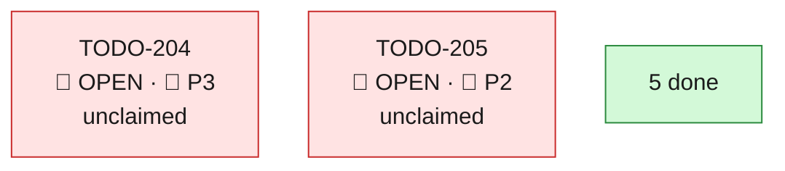

| ID | Title | Bucket | Stream | Prio | Status | Dependency | Reference | Agent-ID | Commit |
| --- | --- | --- | --- | --- | --- | --- | --- | --- | --- |
| **[TODO-200](tasks/TODO-200.md)** | Add missing indexes on unindexed orbit_green FK columns | Performance | **W39** | 🔥 P7 | 🟢 DONE | — | `[migrations_orbit_green/orbit_green_schema.md](../migrations_orbit_green/orbit_green_schema.md)` · W39 alpha schema audit 2026-06-10 | caphefalumi-831 | `0d99f752ca7fbf8f40771e03a148c2c4bce5b7c2` |
| **[TODO-201](tasks/TODO-201.md)** | Drop redundant PK-duplicate and useless btree-on-geometry indexes (orbit_green) | Performance | **W39** | 📌 P4 | 🟢 DONE | — | `[migrations_orbit_green/orbit_green_schema.md](../migrations_orbit_green/orbit_green_schema.md)` · W39 alpha schema audit 2026-06-10 | caphefalumi-831 | `a6a6bca3` |
| **[TODO-202](tasks/TODO-202.md)** | Align internal id columns varchar->uuid in orbit_green (salesperson_id/profile_id) | Migration | **W39** | 📌 P6 | 🟢 DONE | — | `[migrations_orbit_green/orbit_green_schema.md](../migrations_orbit_green/orbit_green_schema.md)` · W39 alpha schema audit 2026-06-10 | caphefalumi-831 | `11f51c3f47d3e73567baf64b5b382f298981944a` |
| **[TODO-203](tasks/TODO-203.md)** | Add UNIQUE constraints on orbit_green natural keys (suppressed_emails.email, sales.email) | Correctness | **W39** | 🔥 P7 | 🟢 DONE | — | `[migrations_orbit_green/orbit_green_schema.md](../migrations_orbit_green/orbit_green_schema.md)` · W39 alpha schema audit 2026-06-10 | hazhaz-672 | `2f4e4fd` |
| **[TODO-204](tasks/TODO-204.md)** | Convert orbit_green proposals.proposal_json text->jsonb (review commission_logs.body) | Hardening | **W39** | 🌿 P3 | 🔴 OPEN | — | `[migrations_orbit_green/orbit_green_schema.md](../migrations_orbit_green/orbit_green_schema.md)` · W39 alpha schema audit 2026-06-10 | — | — |
| **[TODO-205](tasks/TODO-205.md)** | Resolve orbit_green structural smells: v_cemv, benchmarks_v2 FK, benchmarks _1/_2 naming | Cleanup | **W39** | 🌿 P2 | 🔴 OPEN | — | `[migrations_orbit_green/orbit_green_schema.md](../migrations_orbit_green/orbit_green_schema.md)` · W39 alpha schema audit 2026-06-10 | — | — |
| **[TODO-411](tasks/TODO-411.md)** | Fix cached_event_meta_versions.raw_structure JSONB none_as_null (failed rows wrongly kept by .isnot(None) readers) | Correctness | **W39** | 🔥 P7 | 🟢 DONE | — | [JSONB none_as_null task set 2026-06-20](../.local/decisions/20260620-jsonb-none-as-null-task-set.md) · `app/models/orbit_green/cached_event_meta_version.py:84` · `app/services/v1/orbit/embeddings/implementations/v2.py:643` (raw_structure=None on failure) · heatmap_service / benchmark_service / meta_embedding_service `.isnot(None)` readers | lpc-000 | `8d159fbf` |

### W40 - Supabase public schema optimization (live audit 2026-06-10)

[stream file](streams/W40-supabase-public-optimization.md)

#### Status & dependency map

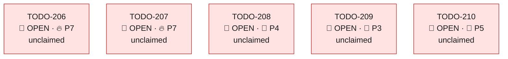

| ID | Title | Bucket | Stream | Prio | Status | Dependency | Reference | Agent-ID | Commit |
| --- | --- | --- | --- | --- | --- | --- | --- | --- | --- |
| **[TODO-206](tasks/TODO-206.md)** | Index the 97 unindexed FK columns in Supabase public (hot tables first) | Performance | **W40** | 🔥 P7 | 🔴 OPEN | — | `[migration_supabase/supabase_public_schema.md](../migration_supabase/supabase_public_schema.md)` · W40 Supabase public audit 2026-06-10 | — | — |
| **[TODO-207](tasks/TODO-207.md)** | Refresh planner statistics on 49 never-ANALYZEd Supabase public tables | Performance | **W40** | 🔥 P7 | 🔴 OPEN | — | `[migration_supabase/supabase_public_schema.md](../migration_supabase/supabase_public_schema.md)` · W40 Supabase public audit 2026-06-10 | — | — |
| **[TODO-208](tasks/TODO-208.md)** | Archive/drop backup & temp cruft tables in Supabase public (10, incl. 3 PK-less) | Cleanup | **W40** | 📌 P4 | 🔴 OPEN | — | `[migration_supabase/supabase_public_schema.md](../migration_supabase/supabase_public_schema.md)` · W40 Supabase public audit 2026-06-10 | — | — |
| **[TODO-209](tasks/TODO-209.md)** | Drop redundant indexes in Supabase public (27) | Performance | **W40** | 🌿 P3 | 🔴 OPEN | — | `[migration_supabase/supabase_public_schema.md](../migration_supabase/supabase_public_schema.md)` · W40 Supabase public audit 2026-06-10 | — | — |
| **[TODO-210](tasks/TODO-210.md)** | Add UNIQUE on Supabase public natural keys + review type/width smells | Correctness | **W40** | 📌 P5 | 🔴 OPEN | — | `[migration_supabase/supabase_public_schema.md](../migration_supabase/supabase_public_schema.md)` · W40 Supabase public audit 2026-06-10 | — | — |

### W49 - Public/internal proposals parity & salesperson working-hours completeness (Telli 0-proposals RCA)

[stream file](streams/W49-proposals-working-hours-correctness.md)

#### Status & dependency map

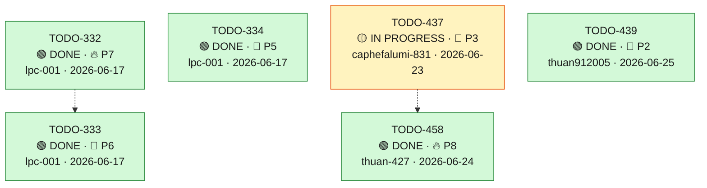

| ID | Title | Bucket | Stream | Prio | Status | Dependency | Reference | Agent-ID | Commit |
| --- | --- | --- | --- | --- | --- | --- | --- | --- | --- |
| **[TODO-332](tasks/TODO-332.md)** | Default salesperson working hours (Mon–Fri 08:30–19:30) persisted when absent — unblock empty proposals | Stability | **W49** | 🔥 P7 | 🟢 DONE | — | `.local/decisions/20260616-telli-public-vs-internal-proposals-analysis.md` (RCA) · `docs/gesys_sync/findings/260616_telli_gärtner_public_vs_internal_api.md` · [TODO-151](TODO-151.md) (data/ops config audit — this is its code complement) · `app/models/orbit_green/sales_working_hour.py`; `app/services/v1/orbit/sales_availability_service.py:201-256` | lpc-001 | `45eceef` |
| **[TODO-333](tasks/TODO-333.md)** | Optimizer respects per-weekday is_working_day (no phantom proposals on unmaintained days) + ADR-032 | Correctness | **W49** | 📌 P6 | 🟢 DONE | `~ TODO-332` | `.local/decisions/20260616-telli-public-vs-internal-proposals-analysis.md` (RCA) · `app/services/simulation/hil_proposal_service.py:571-580` (Mon–Fri hardcode) · `app/core/simulation/optimizer.py:1643-1673`; `app/core/simulation/strategies.py:695-704` (None-window default fallback) · [TODO-146](TODO-146.md) (B-3 server-side filter) | lpc-001 | `97b54b2` |
| **[TODO-334](tasks/TODO-334.md)** | Observability: silent-zero signal when engine produced N>0 proposals but the public filter dropped all | Prevention | **W49** | 📌 P5 | 🟢 DONE | — | `.local/decisions/20260616-telli-public-vs-internal-proposals-analysis.md` (RCA) · `app/services/public/v1/appointments_service.py:705-716` (the drop loop) · AGENTS.md Rule 2 (OTel in-memory-exporter test pattern) | lpc-001 | `be38f42` |
| **[TODO-437](tasks/TODO-437.md)** | Backfill default working hours for existing sales lacking them: standalone script -> maintenance endpoint/service -> wire into sales/mitarbeiter sync | Correctness | **W49** | 🌿 P3 | 🟡 IN PROGRESS | — | `app/services/v1/orbit/working_hours_default_seeder.py` (`seed_default_working_hours` @ :147 — whitelisted backfill, **0 production callers**; `seed_default_working_hours_for` @ :173 — on-create, TODO-181) · `app/services/v2/orbit/sales_mitarbeiter_sync_service.py` (`sync_from_mitarbeiter` @ :202; `_apply_upserts` seeds NEW rows only @ :387) · `app/api/v2/orbit/maintenance.py` (POST `/internal/api/v2/orbit/maintenance/sales/sync-from-mitarbeiter` @ :65) · `app/models/orbit_green/sales_working_hour.py` · TODO-181 (on-create seed, done) · TODO-332 (one-time whitelisted migration backfill, done) · `docs/orbit/sales_mitarbeiter_sync.md` · `docs/orbit/howto-seed-default-working-hours.md` | caphefalumi-831 | WIP |
| **[TODO-439](tasks/TODO-439.md)** | Seed a default Berlin home address (with lat/lon) for sales lacking any address: standalone script -> maintenance endpoint/service -> wire into sales/mitarbeiter sync | Correctness | **W49** | 🌿 P2 | 🟢 DONE | — | `app/models/orbit_green/address.py` (`Address` @ :17 — `latitude`/`longitude` `Numeric(10,7)` nullable + PostGIS `location`; `SalesHasAddress` link, 1 home/sales) · `app/services/simulation/employee_service.py` (`get_home_location` @ :73 — **raises `ValueError` when no coords**, uncaught -> aborts proposals) · `app/services/mitarbeiter_sync_service.py` + `app/dal/orbit/repositories/sales_address_repository.py` (`upsert_sales_address` — single-home link enforcement = automatic supersede) · `app/services/v1/orbit/here_geocode_service.py` (`get_coordinates_from_address` @ :302) · `app/api/v1/orbit/mitarbeiter_webhook.py:16-17` (existing Berlin default 52.52 / 13.405) · `app/models/orbit_green/gesys_zipcode_to_coordinate.py` · `app/services/v1/orbit/working_hours_default_seeder.py` (seeder pattern to mirror) · `app/services/v2/orbit/sales_mitarbeiter_sync_service.py` (`sync_from_mitarbeiter` @ :202; `_apply_upserts` seeds new rows @ :387) · `app/api/v2/orbit/maintenance.py:65` (sync endpoint) · TODO-437 (working-hours backfill — the sibling pattern) · TODO-151 (config-prerequisite audit incl. home location, done) | thuan912005 | WIP |
| **[TODO-458](tasks/TODO-458.md)** | availability-by-lead + check_and_book must apply the rep working-hours/working-day filter (clamp slots + reject out-of-window bookings) | Correctness | **W49** | 🔥 P8 | 🟢 DONE | `~ TODO-437` | `docs/findings/20260623-availability-by-lead-ignores-working-hours.md` (reporter finding — Timo Quast / Zenflow AI, 2026-06-23) · `docs/refinement/20260624-telli-availability-by-lead-ignores-working-hours-analysis.md` (jl-cc verification, 2026-06-24) · defective shared core: `app/services/public/v1/appointments_service.py:1636` `_check_sales_availability_core` + `_compute_free_slots` :1707 (busy-subtraction only, no working-hours filter) · 3 callers of the core: `check_availability_by_lead` :1630, `check_sales_availability` :1613, `check_and_book` :1534/:1579 · `check_and_book` books unconditionally: `create_blocker_event` :1564 runs before availability is computed · reusable correct filter: `app/services/v1/orbit/sales_availability_service.py:181-291` `get_daily_first_last_slots` (is_working_day + first/last_appointment_time); data `orbit_green.sales_working_hours` · happy-path test mocks the core away: `tests/unit/orbit/test_availability_by_lead.py:31` · W49 RCA: `.local/decisions/20260616-telli-public-vs-internal-proposals-analysis.md` | thuan-427 | `912fafa38` |

### W50 - Customer feedback — field-reported UX gaps

[stream file](streams/W50-customer-feedback.md)

#### Status & dependency map

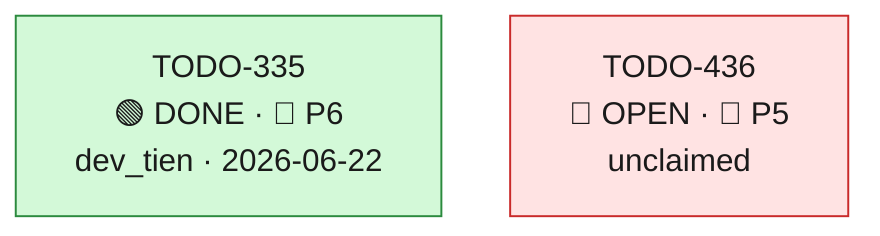

| ID | Title | Bucket | Stream | Prio | Status | Dependency | Reference | Agent-ID | Commit |
| --- | --- | --- | --- | --- | --- | --- | --- | --- | --- |
| **[TODO-335](tasks/TODO-335.md)** | Show customer phone + setter notes in the Google Calendar event on booking | Architecture | **W50** | 📌 P6 | 🟢 DONE | — | `docs/gesys_sync/findings/260617_termine_details_in_google_übernehmen.md` (David/Basti field feedback) · `app/services/v1/orbit/calendar_sync_service.py:2421` `create_blocker_event` (Google event payload :2472) · `app/services/public/v1/appointments_service.py:357/1523/1834` (booking callers) · `app/models/orbit_green/lead.py:72` `kunde_telefon` / `:99` `notizen` | dev_tien | `40cd6db` |
| **[TODO-436](tasks/TODO-436.md)** | Add `force_delete` to the interactive remote-delete endpoint to override the protected-salesperson guard (human-in-the-UI only, audited) | Correctness | **W50** | 📌 P5 | 🔴 OPEN | — | jl-cc analysis `.local/decisions/20260622-force-delete-bypass-protected-guard-analysis.md` (lpc-000, 2026-06-22, code-verified) · Field report (2026-06-22): FE conflict-resolution dialog "Überlappende Kundentermine auflösen" → `DELETE /internal/api/v1/orbit/cached-events/675025/remote` returns 403, intended user delete blocked · Endpoint: app/api/v1/orbit/calendar.py:1136 delete_cached_event_with_remote (recurring branch → delete_recurring_series_with_remote :1170-1177) · Existing lever already implemented: app/services/v1/orbit/calendar_sync_service.py:9078 bypass_protection + guard :9124-9149 + bypass log_info :9150-9167 · Audit already captures profile_id: app/services/v1/orbit/calendar_sync_service.py:9107-9111 set_orbit_audit_context(actor_label=profile_id); trigger migrations_orbit_green/sql/audit_log_row_change.sql:98-196 · Protection origin (do NOT weaken): ADR-033 + W52 (TODO-361/384/386/433); _is_salesperson_protected_from_deletion · FE counterpart (cross-repo follow-up): orbit-galvanek src/components/modals/ConflictResolutionModal.tsx:1136 remoteDeleteCachedEvent — add "trotzdem löschen" affordance (ORBIT-FE task to be filed) | — | — |

### W51 - Analysis-pass & gap reports — track jl-cc / asol-gap-analysis findings as actionable checklists that link to the implementation tasks

[stream file](streams/W51-analysis-pass-reports.md)

#### Status & dependency map

```mermaid
---
config:
  layout: elk
---
flowchart TD
    TODO_370["TODO-370<br/>🔴 OPEN · 📌 P5<br/>unclaimed"]:::open
    TODO_391["TODO-391<br/>🔴 OPEN · 📌 P5<br/>unclaimed"]:::open
    click TODO_370 "tasks/TODO-370.md"
    click TODO_391 "tasks/TODO-391.md"
    classDef open fill:#ffe3e3,stroke:#c92a2a,color:#1a1a1a;
    classDef wip fill:#fff3bf,stroke:#e8590c,color:#1a1a1a;
    classDef done fill:#d3f9d8,stroke:#2b8a3e,color:#1a1a1a;
    classDef obsolete fill:#e9ecef,stroke:#868e96,color:#1a1a1a;
    classDef external fill:#f8f9fa,stroke:#adb5bd,color:#1a1a1a,stroke-dasharray:4 3;
```

| ID | Title | Bucket | Stream | Prio | Status | Dependency | Reference | Agent-ID | Commit |
| --- | --- | --- | --- | --- | --- | --- | --- | --- | --- |
| **[TODO-370](tasks/TODO-370.md)** | Commission/Provision BE↔FE gap-analysis tracker (2026-06-18 refresh) | Docs | **W51** | 📌 P5 | 🔴 OPEN | — | analysis: .local/decisions/20260618-commission-be-fe-gap-refresh-analysis.md · BE stream W45 · FE stream ORBIT-FE W14 | — | — |
| **[TODO-391](tasks/TODO-391.md)** | Performance Dashboard BE-FE gap-analysis tracker (2026-06-19) | Docs | **W51** | 📌 P5 | 🔴 OPEN | — | analysis: docs/refinement/20260619-performance-dashboard-be-fe-gap-analysis.md · BE streams W14/W15/W36 (closed) · FE streams ORBIT-FE W06/W12 (closed) | — | — |

### W52 - Clean-and-Consolidate over-deletion incident (18 Jun) — recover Jan's wrongly deleted appointments, fix the root-cause over-deletion, and prevent recurrence

[stream file](streams/W52-clean-consolidate-overdelete-incident.md)

#### Status & dependency map

```mermaid
---
config:
  layout: elk
---
flowchart TD
    TODO_422["TODO-422<br/>🔴 OPEN · 🔥 P7<br/>unclaimed"]:::open
    TODO_433["TODO-433<br/>🟢 DONE · 🌿 P1<br/>lpc-000 · 2026-06-22"]:::done
    TODO_434["TODO-434<br/>🟡 IN PROGRESS · 🌿 P1<br/>lpc-001"]:::wip
    TODO_435["TODO-435<br/>🟡 IN PROGRESS · 🌿 P1<br/>violetchan-2509"]:::wip
    TODO_443["TODO-443<br/>🔴 OPEN · 🌿 P1<br/>unclaimed"]:::open
    aggdone_W52["9 done"]:::done
    TODO_433 -.-> TODO_434
    TODO_435 -.-> TODO_443
    click TODO_422 "tasks/TODO-422.md"
    click TODO_433 "tasks/TODO-433.md"
    click TODO_434 "tasks/TODO-434.md"
    click TODO_435 "tasks/TODO-435.md"
    click TODO_443 "tasks/TODO-443.md"
    classDef open fill:#ffe3e3,stroke:#c92a2a,color:#1a1a1a;
    classDef wip fill:#fff3bf,stroke:#e8590c,color:#1a1a1a;
    classDef done fill:#d3f9d8,stroke:#2b8a3e,color:#1a1a1a;
    classDef obsolete fill:#e9ecef,stroke:#868e96,color:#1a1a1a;
    classDef external fill:#f8f9fa,stroke:#adb5bd,color:#1a1a1a,stroke-dasharray:4 3;
```

| ID | Title | Bucket | Stream | Prio | Status | Dependency | Reference | Agent-ID | Commit |
| --- | --- | --- | --- | --- | --- | --- | --- | --- | --- |
| **[TODO-381](tasks/TODO-381.md)** | Recover Jan's 9 wrongly soft-deleted 18-Jun events in Orbit (read-only restore plan → reviewed un-delete) | Correctness | **W52** | 🌿 P1 | 🟢 DONE | — | Finding `docs/findings/20260618-clean-consolidate-overdelete-incident/README.md` · cached_event_ids: 687543, 687544, 687545, 677232, 677237, 677245, 687745, 688600, 688605 · `orbit_green.cached_events` (is_deleted, deleted_at) · point (a) of the incident follow-up | — | — |
| **[TODO-382](tasks/TODO-382.md)** | Export the 9 events' google_event_id + full payload for Google Calendar re-creation | Correctness | **W52** | 🌿 P1 | 🟢 DONE | — | Finding `docs/findings/20260618-clean-consolidate-overdelete-incident/README.md` · cached_event_ids: 687543, 687544, 687545, 677232, 677237, 677245, 687745, 688600, 688605 · `app/services/v1/orbit/google_calendar.py` (calendar write path, scope `auth/calendar`) · point (c) of the incident follow-up | — | — |
| **[TODO-383](tasks/TODO-383.md)** | Blast-radius scan — detect Clean-and-Consolidate over-deletions across all salespeople and dates | Stability | **W52** | 🌿 P2 | 🟢 DONE | — | Finding `docs/findings/20260618-clean-consolidate-overdelete-incident/README.md` · `orbit_green.audit_logs` (actor_kind='cleanup_job', before/after_snapshot is_deleted) · point (b) of the incident follow-up | — | — |
| **[TODO-384](tasks/TODO-384.md)** | Root-cause fix — Clean-and-Consolidate must never soft-delete non-TRAVEL_TIME or booked appointments | Correctness | **W52** | 🌿 P1 | 🟢 DONE | — | Finding `docs/findings/20260618-clean-consolidate-overdelete-incident/README.md` · `app/services/v1/orbit/cleanup_service.py:3018` (run_clean_and_consolidate_flow), `:938` (delete_google_events) · `app/services/v1/orbit/calendar_sync_service.py:8533` (bulk_soft_delete_cached_events_by_range) · `app/api/v1/orbit/travel_blocker.py:20` (/clean-and-consolidate endpoint) | — | — |
| **[TODO-385](tasks/TODO-385.md)** | Prevention — record the triggering identity on cleanup_job actions + identify the human caller of the 18-Jun run | Prevention | **W52** | 🌿 P2 | 🟢 DONE | — | Finding `docs/findings/20260618-clean-consolidate-overdelete-incident/README.md` · `migrations_orbit_green/sql/audit_log_row_change.sql:94-101` (actor_label created_by_profile fallback) · `app/api/v1/orbit/travel_blocker.py:20` (endpoint records no caller) · `app/core/audit.py` (set_orbit_audit_context) | — | — |
| **[TODO-386](tasks/TODO-386.md)** | Pin & fix the batch-2 over-deletion path (7 non-travel events) via runtime instrumentation | Correctness | **W52** | 🌿 P2 | 🟢 DONE | — | Finding `docs/findings/20260618-clean-consolidate-overdelete-incident/README.md` · TODO-384 (batch-1 guard, done) · TODO-385 (cleanup_job caller/operation attribution — the tool that pins this) · `orbit_green.audit_logs` 15:53:17 batch (entity_ids 677232/237/245, 687543/745, 688600/605) | lpc-000 | `19481745` |
| **[TODO-387](tasks/TODO-387.md)** | Team-wide recovery of ~1,469 Clean-and-Consolidate over-deleted events (15 salespeople) | Correctness | **W52** | 🌿 P1 | 🟢 DONE | — | Sign-off `.local/recovery/387-customer-visits-recovered.md` + `.local/recovery/387-recovery-signoff.md` · Blast-radius `docs/findings/20260618-clean-consolidate-overdelete-incident/blast-radius-todo383.md` · TODO-381/382 (Jan-scoped recovery pattern: Google PATCH status=confirmed + Orbit sync auto-reconcile) · TODO-384 (guard — landed first to stop new over-deletions) | — | — |
| **[TODO-415](tasks/TODO-415.md)** | Fix the customer-visit delete-path over-deletion + trash-bin attribution-leak (Nicola 25-Jun root cause) | Correctness | **W52** | 🌿 P1 | 🟢 DONE | — | Full audit forensic: `.local/decisions/20260620-nicola-2506-FULL-audit-forensic.md` · Trace workflow (verified): `.local/workflows/20260620_101231_workflow_TODO-415_hil-replan-overdelete.md` · Supersedes the wrong TODO-403 conclusion; distinct from TODO-384 (cleanup_job) and TODO-309 (google_sync) | lpc-000 | `e2089ee5` |
| **[TODO-416](tasks/TODO-416.md)** | Blast-radius verify: Marc-Philipp Christel — affected by the FE day-wipe over-deletion? | Correctness | **W52** | 🌿 P2 | 🟢 DONE | — | Blast-radius scan: `.local/workflows/20260620_101231_workflow_TODO-415_hil-replan-overdelete.md` · Nicola root-cause forensic: `.local/decisions/20260620-nicola-2506-FULL-audit-forensic.md` | lpc-000 | `8174e52d7` |
| **[TODO-422](tasks/TODO-422.md)** | Delete-online-appointment must cascade its PREP_TASK/WRAP_TASK blocks (guarded against over-deletion, Nicola-style) | Correctness | **W52** | 🔥 P7 | 🔴 OPEN | — | Guard pattern to mirror: TODO-415 (Nicola 25-Jun cascade scoping — only blocks bound to THAT appointment) · FE counterpart (UI test): ORBIT-FE-094 · Prep/Wrap creation: app/services/v1/orbit/calendar_sync_service.py:7285 (prep_blocker), :7313 (wrap_blocker) — AppointmentType.TASK, PlaceType.ONLINE, no TRAVEL (see :6766) · Delete paths: soft_delete_cached_event :8659, delete_cached_event_with_remote :9069; current cascade only TRAVEL via _find_dependent_travel_blocks :8457 | — | — |
| **[TODO-433](tasks/TODO-433.md)** | C&C Step-1b Google-side over-deletion: add source=='orbit' guard (twin of TODO-384, DB side only) | Correctness | **W52** | 🌿 P1 | 🟢 DONE | — | Finding `docs/findings/20260622-cnc-google-side-overdeletion-incident.md` (+ `_de`) + `.local/decisions/20260622-cnc-google-side-overdeletion-residual-analysis.md` · jl-cc verification (lpc-001, 2026-06-22, code-verified HEAD) · `app/services/v1/orbit/cleanup_service.py:1071-1093` Step-1b Google selection (the hole) · `app/services/v1/orbit/cleanup_service.py:691-716` DB delete (guarded, for contrast) · `app/services/v1/orbit/calendar_sync_service.py:11035-11050` Step-7 Google orphan OR match · `app/schemas/orbit/req_res.py:1103` no_booking defaults False · TODO-384 / TODO-386 (DB-side fixes) | lpc-000 | `4adabbb9` |
| **[TODO-434](tasks/TODO-434.md)** | Forensic analysis + recovery of non-Orbit Google events remote-deleted by the C&C Step-1b hole | Stability | **W52** | 🌿 P1 | 🟡 IN PROGRESS | `~ TODO-433` | Finding `docs/findings/20260622-cnc-google-side-overdeletion-incident.md` · Prior W52 recovery tooling `.local/recover_calendar_events.py` (Google PATCH status=confirmed sendUpdates=none) · `app/services/v1/orbit/cleanup_service.py:1080-1093` Step-1b selection (the deletion criteria to invert) · Detect leg precedent: TODO-406 deletion-anomaly monitor `app/services/v2/orbit/deletion_anomaly_monitor_service.py` · Prior recovery RCA `docs/findings/20260619_CALENDAR_DATA_INTEGRITY_INCIDENT.md` | lpc-001 | WIP |
| **[TODO-435](tasks/TODO-435.md)** | C&C no longer deletes travel + Vor-/Nachbereitung blockers → orphan accumulation (prep-dedup debt); root-cause + guarded cleanup | Correctness | **W52** | 🌿 P1 | 🟡 IN PROGRESS | — | Forensic (lpc-001, 2026-06-22): Arsen Klotz (a.klotz@galvanek-bau.de, 19b4bad1-90ea-4788-87e7-4b75d5811f29) week 06-14..06-20 had 1,490 active travel/prep blockers (1,476 prep TASK 'Vorbereitung/Nachbereitung' = HIL_V3 778 / HIL 430 / google 268 + 14 orbit TRAVEL_TIME) vs only 17 real CUSTOMER_VISIT · Manual symptom cleanup `.local/recovery/20260622_arsen_delete_travel_prep.csv` (1,490 soft-deleted + 14 Google cancelled, 0 customer visits touched) · Related: prior C&C finding 2026-06-21 'deletes travel blockers but recreates none' (Step2 strict_onsite, cleanup_service.py:3924) · Related: TODO-402 (cross-source dedup-on-write, W21) — the HIL_V3/google prep re-import duplication · C&C flow `app/services/v1/orbit/cleanup_service.py` run_clean_and_consolidate_flow | violetchan-2509 | WIP |
| **[TODO-443](tasks/TODO-443.md)** | Prod prep-blocker cleanup + backfill sweep (orbit_green over-accumulation) — ops execution via scripts/cleanup/ | Correctness | **W52** | 🌿 P1 | 🔴 OPEN | `~ TODO-435` | Tracked tool `scripts/cleanup/delete_prep_blockers.py` (+ `scripts/cleanup/README.md`/`_de`) — MR !2500, generalized --env beta\|prod, dry-run default, prod requires --yes-prod, --max-rows cap, --google cancel (sendUpdates=none) · RCA `.local/decisions/20260622-cnc-prep-not-cleaned-rca-676632.md` (non-idempotent prep recreation; system-wide 13:40 burst) · Beta precedent (lpc-001, 2026-06-23): 9 reps, 2,701 prep blockers soft-deleted + 34 Google events cancelled for week 2026-06-22..28, 0 active remaining · Code fix that makes the cleanup durable: TODO-435 (Fix A — recreate prep source='orbit') · C&C flow `app/services/v1/orbit/cleanup_service.py` run_clean_and_consolidate_flow | — | — |

### W53 - Termine Reconciliation

[stream file](streams/W53-termine-sync-annotation.md)

#### Status & dependency map

```mermaid
---
config:
  layout: elk
---
flowchart TD
    TODO_424["TODO-424<br/>🟢 DONE · 🔥 P7<br/>nhatminhtrieu · 2026-06-22"]:::done
    TODO_425["TODO-425<br/>🟢 DONE · 🔥 P7<br/>nhatminhtrieu · 2026-06-22"]:::done
    TODO_426["TODO-426<br/>🟢 DONE · 📌 P6<br/>nhatminhtrieu · 2026-06-22"]:::done
    TODO_427["TODO-427<br/>🟢 DONE · 📌 P6<br/>nhatminhtrieu · 2026-06-22"]:::done
    TODO_428["TODO-428<br/>🟢 DONE · 📌 P6<br/>nhatminhtrieu · 2026-06-22"]:::done
    TODO_429["TODO-429<br/>🔴 OPEN · 📌 P6<br/>unclaimed"]:::open
    TODO_430["TODO-430<br/>🔴 OPEN · 📌 P5<br/>unclaimed"]:::open
    TODO_431["TODO-431<br/>🔴 OPEN · 📌 P5<br/>unclaimed"]:::open
    TODO_432["TODO-432<br/>🟢 DONE · 🔥 P7<br/>nhatminhtrieu · 2026-06-23"]:::done
    TODO_438["TODO-438<br/>🟢 DONE · 📌 P5<br/>nhatminhtrieu · 2026-06-23"]:::done
    TODO_441["TODO-441<br/>🟢 DONE · 📌 P5<br/>nhatminhtrieu · 2026-06-23"]:::done
    TODO_442["TODO-442<br/>🟢 DONE · 📌 P5<br/>nhatminhtrieu · 2026-06-24"]:::done
    TODO_444["TODO-444<br/>🟢 DONE · 📌 P5<br/>nhatminhtrieu · 2026-06-23"]:::done
    TODO_424 --> TODO_425
    TODO_425 --> TODO_426
    TODO_426 --> TODO_427
    TODO_427 --> TODO_428
    TODO_428 --> TODO_429
    TODO_428 --> TODO_430
    TODO_429 --> TODO_431
    TODO_430 -.-> TODO_431
    TODO_429 --> TODO_432
    TODO_430 -.-> TODO_432
    TODO_442 -.-> TODO_444
    click TODO_424 "tasks/TODO-424.md"
    click TODO_425 "tasks/TODO-425.md"
    click TODO_426 "tasks/TODO-426.md"
    click TODO_427 "tasks/TODO-427.md"
    click TODO_428 "tasks/TODO-428.md"
    click TODO_429 "tasks/TODO-429.md"
    click TODO_430 "tasks/TODO-430.md"
    click TODO_431 "tasks/TODO-431.md"
    click TODO_432 "tasks/TODO-432.md"
    click TODO_438 "tasks/TODO-438.md"
    click TODO_441 "tasks/TODO-441.md"
    click TODO_442 "tasks/TODO-442.md"
    click TODO_444 "tasks/TODO-444.md"
    classDef open fill:#ffe3e3,stroke:#c92a2a,color:#1a1a1a;
    classDef wip fill:#fff3bf,stroke:#e8590c,color:#1a1a1a;
    classDef done fill:#d3f9d8,stroke:#2b8a3e,color:#1a1a1a;
    classDef obsolete fill:#e9ecef,stroke:#868e96,color:#1a1a1a;
    classDef external fill:#f8f9fa,stroke:#adb5bd,color:#1a1a1a,stroke-dasharray:4 3;
```

| ID | Title | Bucket | Stream | Prio | Status | Dependency | Reference | Agent-ID | Commit |
| --- | --- | --- | --- | --- | --- | --- | --- | --- | --- |
| **[TODO-424](tasks/TODO-424.md)** | Add annotation_types + termine_annotations tables | Architecture | **W53** | 🔥 P7 | 🟢 DONE | — | [W53-termine-sync-annotation](../streams/W53-termine-sync-annotation.md) | nhatminhtrieu | `c2b11456a` |
| **[TODO-425](tasks/TODO-425.md)** | Add AnnotationType + TermineAnnotation models | Architecture | **W53** | 🔥 P7 | 🟢 DONE | `→ TODO-424` | [app/models/orbit_green/classification.py](../app/models/orbit_green/classification.py) — existing Classification model for reference | nhatminhtrieu | `c2b11456a` |
| **[TODO-426](tasks/TODO-426.md)** | Add TermineAnnotation Pydantic schemas | Architecture | **W53** | 📌 P6 | 🟢 DONE | `→ TODO-425` | [app/schemas/orbit/termine_row_diff.py](../app/schemas/orbit/termine_row_diff.py) — TermineRowDiffBucket Literal for reference | nhatminhtrieu | `c36744d2c` |
| **[TODO-427](tasks/TODO-427.md)** | Add TermineAnnotationRepository | Architecture | **W53** | 📌 P6 | 🟢 DONE | `→ TODO-426` | [app/dal/orbit/repositories/classification_repository.py](../app/dal/orbit/repositories/classification_repository.py) — existing OrbitClassificationRepository for reference | nhatminhtrieu | `25dfd4e` |
| **[TODO-428](tasks/TODO-428.md)** | Add TermineAnnotationService with upsert logic | Architecture | **W53** | 📌 P6 | 🟢 DONE | `→ TODO-427` | [app/services/v2/orbit/termine_sync_diff_service.py:1-80](../app/services/v2/orbit/termine_sync_diff_service.py) — TermineSyncDiffService for @Injectable pattern reference | nhatminhtrieu | `760642d` |
| **[TODO-429](tasks/TODO-429.md)** | Add POST/GET/DELETE /internal/api/v2/orbit/maintenance/termine/annotations endpoints | Architecture | **W53** | 📌 P6 | 🔴 OPEN | `→ TODO-428` | [app/api/v2/orbit/maintenance.py:242-403](../app/api/v2/orbit/maintenance.py) — existing sync-diff/rows endpoint for pattern reference | — | — |
| **[TODO-430](tasks/TODO-430.md)** | Add annotation fields to TermineRowDiffItem response | Correctness | **W53** | 📌 P5 | 🔴 OPEN | `→ TODO-428` | [app/schemas/orbit/termine_row_diff.py:13-32](../app/schemas/orbit/termine_row_diff.py) — TermineRowDiffItem schema · [app/services/v2/orbit/termine_sync_diff_service.py:600+](../app/services/v2/orbit/termine_sync_diff_service.py) — _run_rds_rows_arm / _run_supa_rows_arm methods | — | — |
| **[TODO-431](tasks/TODO-431.md)** | Add integration tests for annotation CRUD and alert-on-new-type | Correctness | **W53** | 📌 P5 | 🔴 OPEN | `→ TODO-429` · `~ TODO-430` | [tests/integration/orbit/test_termine_row_diff_pushdown_integration.py](../tests/integration/orbit/test_termine_row_diff_pushdown_integration.py) — existing integration test pattern | — | — |
| **[TODO-432](tasks/TODO-432.md)** | Fix sync-diff/rows bucket=rds_only to return only delta rows | Correctness | **W53** | 🔥 P7 | 🟢 DONE | `→ TODO-429` · `~ TODO-430` | [ADR-022](../docs/decisions.md) — delete-loser / null_gid logic | nhatminhtrieu | `4103356` |
| **[TODO-438](tasks/TODO-438.md)** | Sync HIL bookings (NULL google_event_id) to Supabase public.termine | Correctness | **W53** | 📌 P5 | 🟢 DONE | — | Code: app/services/v1/orbit/supabase_termine_sync_service.py:328 (SupabaseTermineSyncService) + :792 (ReferralPublicTermineSyncService) — google_event_id.isnot(None) filter excludes HIL rows · Code: app/services/v1/orbit/termine_repository.py:376 upsert_termine — ON CONFLICT (google_event_id, mitarbeiter_id, calendar_source) cannot target NULL google_event_id rows · Model: app/models/orbit_green/cached_events.py:110-112 google_event_id nullable=True for HIL bookings · Trigger: migration_supabase/supabase_public_constraints.sql:202 — termine_google_event_mitarbeiter_source_unique does not prevent multiple NULL-google_event_id rows per (mitarbeiter_id, calendar_source) but the validate_no_duplicate_termin trigger's 4-col dedup key does | nhatminhtrieu | `ae874c7` |
| **[TODO-441](tasks/TODO-441.md)** | Delete Supabase-only terminate (reduce sync-diff supabase_only bucket) | Correctness | **W53** | 📌 P5 | 🟢 DONE | — | app/api/v2/orbit/maintenance.py (DELETE /termine/supabase-only endpoint) · app/services/v2/orbit/termine_sync_diff_service.py:876 (supabase_only SQL logic — NOT EXISTS pattern) · app/services/v1/orbit/termine_repository.py:253 (existing delete methods) · app/services/v1/orbit/supabase_termine_sync_service.py:93 (existing delete_orbit_termine) | nhatminhtrieu | `96cf885` |
| **[TODO-442](tasks/TODO-442.md)** | Preserve migration calendar_source for null-gid termine sync | Correctness | **W53** | 📌 P5 | 🟢 DONE | — | app/services/v1/orbit/supabase_termine_sync_service.py (_map_event_to_supabase_termine) · tests/unit/orbit/test_supabase_termine_sync_service.py (HIL/null-gid sync coverage) · .log sample 2026-06-23 (ORBIT-ALPHA-MIGRATION rows with google_event_id null) | nhatminhtrieu | `aa2f01a` |
| **[TODO-444](tasks/TODO-444.md)** | Exclude migration null-gid rows from actionable sync-diff buckets | Correctness | **W53** | 📌 P5 | 🟢 DONE | `~ TODO-442` | app/services/v2/orbit/termine_sync_diff_service.py (row bucket SQL + stats SQL) · app/api/v2/orbit/maintenance.py (GET /internal/api/v2/orbit/maintenance/termine/sync-diff/rows semantics) · tests/unit/orbit/test_termine_sync_diff_service.py · tests/integration/orbit/test_termine_row_diff_pushdown_integration.py · .log sample 2026-06-23 (alpha row 353b54ee-2311-4919-aba5-85a289d2ad8e classified as null_gid) | nhatminhtrieu | `892bcde` |

### W54 - Clean & Consolidate refactor — net-first, correctness-then-structure decomposition of the 4527-line cleanup_service god-flow

[stream file](streams/W54-clean-consolidate-refactor.md)

#### Status & dependency map

```mermaid
---
config:
  layout: elk
---
flowchart TD
    TODO_445["TODO-445<br/>🟢 DONE · 🔥 P7<br/>violetchan-2509 · 2026-06-24"]:::done
    TODO_446["TODO-446<br/>🟢 DONE · 📌 P6<br/>violetchan-2509 · 2026-06-24"]:::done
    TODO_447["TODO-447<br/>🟢 DONE · 🔥 P7<br/>violetchan-2509 · 2026-06-24"]:::done
    TODO_448["TODO-448<br/>🟡 IN PROGRESS · 📌 P4<br/>violetchan-2509 · 2026-06-24"]:::wip
    TODO_449["TODO-449<br/>🔴 OPEN · 📌 P4<br/>unclaimed"]:::open
    TODO_450["TODO-450<br/>🔴 OPEN · 📌 P4<br/>unclaimed"]:::open
    TODO_451["TODO-451<br/>🔴 OPEN · 📌 P4<br/>unclaimed"]:::open
    TODO_459["TODO-459<br/>🟢 DONE · 🔥 P7<br/>nhatminhtrieu · 2026-06-24"]:::done
    TODO_460["TODO-460<br/>🟡 IN PROGRESS · 📌 P6<br/>hazhaz-672"]:::wip
    TODO_445 --> TODO_446
    TODO_445 --> TODO_447
    TODO_446 -.-> TODO_447
    TODO_445 --> TODO_448
    TODO_448 --> TODO_449
    TODO_445 --> TODO_450
    TODO_446 --> TODO_451
    TODO_459 -.-> TODO_460
    click TODO_445 "tasks/TODO-445.md"
    click TODO_446 "tasks/TODO-446.md"
    click TODO_447 "tasks/TODO-447.md"
    click TODO_448 "tasks/TODO-448.md"
    click TODO_449 "tasks/TODO-449.md"
    click TODO_450 "tasks/TODO-450.md"
    click TODO_451 "tasks/TODO-451.md"
    click TODO_459 "tasks/TODO-459.md"
    click TODO_460 "tasks/TODO-460.md"
    classDef open fill:#ffe3e3,stroke:#c92a2a,color:#1a1a1a;
    classDef wip fill:#fff3bf,stroke:#e8590c,color:#1a1a1a;
    classDef done fill:#d3f9d8,stroke:#2b8a3e,color:#1a1a1a;
    classDef obsolete fill:#e9ecef,stroke:#868e96,color:#1a1a1a;
    classDef external fill:#f8f9fa,stroke:#adb5bd,color:#1a1a1a,stroke-dasharray:4 3;
```

| ID | Title | Bucket | Stream | Prio | Status | Dependency | Reference | Agent-ID | Commit |
| --- | --- | --- | --- | --- | --- | --- | --- | --- | --- |
| **[TODO-445](tasks/TODO-445.md)** | C&C refactor Ph0: real-Postgres characterization net for Step 2 + the full clean-and-consolidate pipeline | Correctness | **W54** | 🔥 P7 | 🟢 DONE | — | strategy analysis `docs/refinement/20260623-clean-and-consolidate-refactor-strategy-analysis.md` · blind spot: place_type is a @hybrid_property (no SQL expr); run_step2_load_events_with_location:1583 + _is_strictly_onsite:404 are mocked-only (test_travel_blocker_cleanup.py SimpleNamespace) · TODO-435 (the regression a real-PG Step2 net would have caught) | violetchan-2509 | `51e44643` |
| **[TODO-446](tasks/TODO-446.md)** | C&C refactor Ph1.1: centralize delete-authorization into one choke-point predicate | Correctness | **W54** | 📌 P6 | 🟢 DONE | `→ TODO-445` | strategy analysis `docs/refinement/20260623-clean-and-consolidate-refactor-strategy-analysis.md` · scattered guards: stmt1/stmt2 `cleanup_service.py:688-710`, run_step1 SELECT `:1072`, _remote_cleanup_orphan_travel_blocks `:1359` · incident guards to consolidate: TODO-433 source-allowlist, TODO-386 cleanup_job GUC trigger, TODO-415 lead-scope, TODO-384 | violetchan-2509 | `f3ce83641` |
| **[TODO-447](tasks/TODO-447.md)** | C&C refactor Ph1.2: compute-then-mutate (delete-last) atomicity restructure | Correctness | **W54** | 🔥 P7 | 🟢 DONE | `→ TODO-445` · `~ TODO-446` | strategy analysis `docs/refinement/20260623-clean-and-consolidate-refactor-strategy-analysis.md` · commit boundaries: delete commits `cleanup_service.py:716`, Step1b `:1322`, Step5-7 batch `:4313`, rollback `:4345` · TODO-435 (deletes-but-recreates-none is the failure mode this fixes) | violetchan-2509 | `8c7c5f564` |
| **[TODO-448](tasks/TODO-448.md)** | C&C refactor Ph2.1: extract geocoding/routing + HERE travel-time (Step 3/4) into a sibling module (ADR-029) | Architecture | **W54** | 📌 P4 | 🟡 IN PROGRESS | `→ TODO-445` | strategy analysis `docs/refinement/20260623-clean-and-consolidate-refactor-strategy-analysis.md` · seam: run_step3_identify_valid_travel_slots `cleanup_service.py:1813` (~500 L) + run_step4_calculate_travel_time_via_here `:2410` (~220 L) + _enrich_events_with_here_geocode `:1683` + _parse_lat_lng/_normalize_location_for_routing_key/_route_data_to_blocker_result helpers · pattern ADR-029 (sibling modules behind delegating shims); prior example calendar_rbac.py (TODO-303) | violetchan-2509 | WIP |
| **[TODO-449](tasks/TODO-449.md)** | C&C refactor Ph2.2: extract blocker-creation (Step 5 create_travel_blocker_events) into a sibling module (ADR-029) | Architecture | **W54** | 📌 P4 | 🔴 OPEN | `→ TODO-448` | strategy analysis `docs/refinement/20260623-clean-and-consolidate-refactor-strategy-analysis.md` · seam: create_travel_blocker_events `cleanup_service.py:2632` (~380 L) + _address_repo persistence + _route_data_to_blocker_result · pattern ADR-029; consumes the travel_routing sibling (TODO-448) | — | — |
| **[TODO-450](tasks/TODO-450.md)** | C&C refactor Ph2.3: extract prep/wrap recreate (Step 1b) + converge the recalculated-travel preview path | Architecture | **W54** | 📌 P4 | 🔴 OPEN | `→ TODO-445` | strategy analysis `docs/refinement/20260623-clean-and-consolidate-refactor-strategy-analysis.md` · seam: _recreate_online_visit_prep_wrap_blockers `cleanup_service.py:1172` (Step 1b, place_type-keyed) + run_recalculated_travel_preview `:3346` (re-implements slot logic — converge, do not fork) · pattern ADR-029; place_type coupling (TODO-417/419/435) | — | — |
| **[TODO-451](tasks/TODO-451.md)** | C&C refactor Ph2.4: extract the delete-surface (DB soft-delete + Google remote delete) behind the choke-point into a sibling module (ADR-029) | Architecture | **W54** | 📌 P4 | 🔴 OPEN | `→ TODO-446` | strategy analysis `docs/refinement/20260623-clean-and-consolidate-refactor-strategy-analysis.md` · seam: _cleanup_travel_blockers_for_model `cleanup_service.py:608`, cleanup_orbit_green_events `:752`, delete_google_events `:948` + _delete_google_event_individual `:832`, _remote_cleanup_orphan_travel_blocks `:1340`, run_step1 `:1008` · consumes the TODO-446 choke-point predicate; guards TODO-433/386/415/384 | — | — |
| **[TODO-459](tasks/TODO-459.md)** | Maintenance endpoint clean-duplicate-appointment: resolve duplicate-termin conflicts via Google API attendee count | Correctness | **W54** | 🔥 P7 | 🟢 DONE | — | ADR-022 (6-tuple dedupe + loser soft-delete) · ADR-017 (Supabase = downstream read-model) | nhatminhtrieu | `b841a80` |
| **[TODO-460](tasks/TODO-460.md)** | Switch clean-duplicate-appointment to use has_attendee_table instead of Google API | Correctness | **W54** | 📌 P6 | 🟡 IN PROGRESS | `~ TODO-459` | TODO-459 (Step 1: Google API approach) | hazhaz-672 | WIP |

### W57 - Consolidate the fragmented booking endpoints behind one booking service + populate/expose event attendees

[stream file](streams/W57-booking-consolidation-attendees.md)

#### Status & dependency map

```mermaid
---
config:
  layout: elk
---
flowchart TD
    TODO_462["TODO-462<br/>🔴 OPEN · 📌 P5<br/>unclaimed"]:::open
    TODO_463["TODO-463<br/>🔴 OPEN · 📌 P5<br/>unclaimed"]:::open
    TODO_464["TODO-464<br/>🟡 IN PROGRESS · 📌 P6<br/>nhatminhtrieu"]:::wip
    TODO_465["TODO-465<br/>🔴 OPEN · 📌 P5<br/>unclaimed"]:::open
    TODO_466["TODO-466<br/>⚪ DEFERRED / OBSOLETE · 🌿 P2<br/>unclaimed"]:::obsolete
    TODO_467["TODO-467<br/>🟡 IN PROGRESS · 📌 P6<br/>cc-999 · 2026-06-24"]:::wip
    TODO_458["TODO-458<br/>W49"]:::external
    TODO_467 --> TODO_462
    TODO_467 --> TODO_463
    TODO_463 --> TODO_466
    TODO_458 -.-> TODO_467
    click TODO_462 "tasks/TODO-462.md"
    click TODO_463 "tasks/TODO-463.md"
    click TODO_464 "tasks/TODO-464.md"
    click TODO_465 "tasks/TODO-465.md"
    click TODO_466 "tasks/TODO-466.md"
    click TODO_467 "tasks/TODO-467.md"
    click TODO_458 "tasks/TODO-458.md"
    classDef open fill:#ffe3e3,stroke:#c92a2a,color:#1a1a1a;
    classDef wip fill:#fff3bf,stroke:#e8590c,color:#1a1a1a;
    classDef done fill:#d3f9d8,stroke:#2b8a3e,color:#1a1a1a;
    classDef obsolete fill:#e9ecef,stroke:#868e96,color:#1a1a1a;
    classDef external fill:#f8f9fa,stroke:#adb5bd,color:#1a1a1a,stroke-dasharray:4 3;
```

| ID | Title | Bucket | Stream | Prio | Status | Dependency | Reference | Agent-ID | Commit |
| --- | --- | --- | --- | --- | --- | --- | --- | --- | --- |
| **[TODO-462](tasks/TODO-462.md)** | Route public booking endpoints (check-and-book/blocker/change) through the canonical booking service | Architecture | **W57** | 📌 P5 | 🔴 OPEN | `→ TODO-467` | `docs/refinement/20260624-booking-consolidation-attendees-draft-validation.md` · facades: `app/services/public/v1/appointments_service.py` (`check_and_book`, `create_blocker`, `change_appointment`) → `create_blocker_event` `app/services/v1/orbit/calendar_sync_service.py:2616` · ADR-020 public Telli contract (routes/shapes must stay byte-stable); ADR-025 idempotency | — | — |
| **[TODO-463](tasks/TODO-463.md)** | Route simulation booking endpoints (v1/v2/v3) through the canonical booking service | Architecture | **W57** | 📌 P5 | 🔴 OPEN | `→ TODO-467` | `docs/refinement/20260624-booking-consolidation-attendees-draft-validation.md` · sim v1 `app/api/orbit_simulation/simulation.py:1304` book_proposal; sim v2 `app/api/v2/simulation.py:221` book_proposal_v2 → `create_hil_booked_event` :6819 · sim v3 `app/api/v3/simulation.py:63` → `HILProposalServiceV3.book_event_v3` `app/services/simulation/hil_proposal_service_v3.py:86` · FE uses sim-v1 + sim-v3 (orbit-galvanek callcenter.ts:85 / simulationBook.ts:59); v2 not FE-used | — | — |
| **[TODO-464](tasks/TODO-464.md)** | Booking writes/refreshes cached_event_has_attendees at booking time (every booking path) | Correctness | **W57** | 📌 P6 | 🟡 IN PROGRESS | — | `docs/refinement/20260624-booking-consolidation-attendees-draft-validation.md` · table+sync exist: `app/models/orbit_green/cached_event_has_attendees.py:28`, `app/services/v1/orbit/attendee_sync_service.py` (sync_attendees) · gap: V3-book adds Google attendees (commit dcd6af23d) but does NOT call AttendeeSyncService at booking time → DB rows appear only on next calendar sync · backfill precedent: `app/services/v2/orbit/customer_visit_attendee_backfill_service.py` | nhatminhtrieu | WIP |
| **[TODO-465](tasks/TODO-465.md)** | Week endpoint returns the attendee list per cached_event (+ eager-load perf guard) | Performance | **W57** | 📌 P5 | 🔴 OPEN | — | `docs/refinement/20260624-booking-consolidation-attendees-draft-validation.md` · week endpoint: `app/api/v1/orbit/calendar.py:385` fetch_calendar_week (+ `with-checksum` :717) → `BackendCalendarEventSchema` `app/schemas/orbit/req_res.py:302` (no attendee list, only has_attendee_declined :318) · DAL: `fetch_calendar_week` does NOT selectinload(.attendees); reusable schema `CachedEventAttendeeResponse` app/schemas/orbit/attendee.py:27 (unused) · FE already renders attendees: orbit-galvanek WeekCalendarView.tsx:598-600 · perf risk: hive note GET .../leads/{id}/booking ~30s under selectin cascade | — | — |
| **[TODO-466](tasks/TODO-466.md)** | DEFERRED — ADR + collapse the v1/v2/v3 booking routes into one (Step 2, gated on ADR-006 + FE) | Architecture | **W57** | 🌿 P2 | ⚪ DEFERRED / OBSOLETE | `→ TODO-463` | `docs/refinement/20260624-booking-consolidation-attendees-draft-validation.md` · ADR-006 (docs/decisions.md) — rejected 'one versioned tree'; this task would revisit that decision · ADR-020 — public Telli surface is a hard external contract · FE uses sim-v1 AND sim-v3 (orbit-galvanek) → route collapse needs FE coordination | — | — |
| **[TODO-467](tasks/TODO-467.md)** | Define one canonical booking service + real-PG characterization tests for the 3 booking paths (the net before consolidation) | Architecture | **W57** | 📌 P6 | 🟡 IN PROGRESS | `~ TODO-458` | `docs/refinement/20260624-booking-consolidation-attendees-draft-validation.md` (jl-cc validation) · impl 1: `app/services/v1/orbit/calendar_sync_service.py:2616` `create_blocker_event` (single event; public) · impl 2: `app/services/v1/orbit/calendar_sync_service.py:6819` `create_hil_booked_event` (TRAVEL+VISIT pair; sim v1/v2) · impl 3: `app/services/simulation/hil_proposal_service_v3.py:86` `book_event_v3` (single/recurrence; sim v3) · ADR-025 natural-key idempotency (docs/decisions.md) must be preserved | cc-999 | WIP |

### W58 - Close the integration-test coverage gaps on the critical money/data/correctness paths (real-PG nets where mocked = false green)

[stream file](streams/W58-integration-test-hardening.md)

#### Status & dependency map

```mermaid
---
config:
  layout: elk
---
flowchart TD
    TODO_470["TODO-470<br/>🟡 IN PROGRESS · 🔥 P8<br/>codex · 2026-06-25"]:::wip
    TODO_471["TODO-471<br/>🟡 IN PROGRESS · 🔥 P8<br/>codex · 2026-06-25"]:::wip
    TODO_472["TODO-472<br/>🟡 IN PROGRESS · 🔥 P7<br/>codex · 2026-06-25"]:::wip
    TODO_473["TODO-473<br/>🟡 IN PROGRESS · 📌 P6<br/>codex · 2026-06-25"]:::wip
    TODO_474["TODO-474<br/>🔴 OPEN · 📌 P6<br/>unclaimed"]:::open
    TODO_475["TODO-475<br/>🔴 OPEN · 📌 P5<br/>unclaimed"]:::open
    TODO_476["TODO-476<br/>🔴 OPEN · 📌 P5<br/>unclaimed"]:::open
    TODO_477["TODO-477<br/>🔴 OPEN · 📌 P5<br/>unclaimed"]:::open
    TODO_478["TODO-478<br/>🔴 OPEN · 📌 P5<br/>unclaimed"]:::open
    TODO_479["TODO-479<br/>🔴 OPEN · 📌 P5<br/>unclaimed"]:::open
    TODO_480["TODO-480<br/>🔴 OPEN · 📌 P4<br/>unclaimed"]:::open
    TODO_481["TODO-481<br/>🔴 OPEN · 📌 P4<br/>unclaimed"]:::open
    TODO_482["TODO-482<br/>🔴 OPEN · 📌 P4<br/>unclaimed"]:::open
    TODO_483["TODO-483<br/>🔴 OPEN · 🌿 P3<br/>unclaimed"]:::open
    TODO_464["TODO-464<br/>W57"]:::external
    TODO_464 -.-> TODO_481
    TODO_482 -.-> TODO_483
    click TODO_470 "tasks/TODO-470.md"
    click TODO_471 "tasks/TODO-471.md"
    click TODO_472 "tasks/TODO-472.md"
    click TODO_473 "tasks/TODO-473.md"
    click TODO_474 "tasks/TODO-474.md"
    click TODO_475 "tasks/TODO-475.md"
    click TODO_476 "tasks/TODO-476.md"
    click TODO_477 "tasks/TODO-477.md"
    click TODO_478 "tasks/TODO-478.md"
    click TODO_479 "tasks/TODO-479.md"
    click TODO_480 "tasks/TODO-480.md"
    click TODO_481 "tasks/TODO-481.md"
    click TODO_482 "tasks/TODO-482.md"
    click TODO_483 "tasks/TODO-483.md"
    click TODO_464 "tasks/TODO-464.md"
    classDef open fill:#ffe3e3,stroke:#c92a2a,color:#1a1a1a;
    classDef wip fill:#fff3bf,stroke:#e8590c,color:#1a1a1a;
    classDef done fill:#d3f9d8,stroke:#2b8a3e,color:#1a1a1a;
    classDef obsolete fill:#e9ecef,stroke:#868e96,color:#1a1a1a;
    classDef external fill:#f8f9fa,stroke:#adb5bd,color:#1a1a1a,stroke-dasharray:4 3;
```

| ID | Title | Bucket | Stream | Prio | Status | Dependency | Reference | Agent-ID | Commit |
| --- | --- | --- | --- | --- | --- | --- | --- | --- | --- |
| **[TODO-470](tasks/TODO-470.md)** | Integration test: commission get_statistical_overview() real-PG aggregation (status counts + cancelled-window edge) | Prevention | **W58** | 🔥 P8 | 🟡 IN PROGRESS | — | `docs/refinement/20260624-integration-test-coverage-audit.md` (gap #1) · `app/dal/orbit/repositories/commission_repository.py` get_statistical_overview (COUNT(*) FILTER + GROUP BY profile_id) · endpoint `GET /internal/api/v1/orbit/commissions/overview/{year_month}`; today only unit-mocked (test_commissions_endpoints.py) · money-bug class — cf. docs/findings/20260619-commission-backfill-fk-migration-incident.md | codex | WIP |
| **[TODO-471](tasks/TODO-471.md)** | Integration test: lead dedup → lead_duplicates writes + FK re-points + leads_search_mv visibility (real-PG) | Prevention | **W58** | 🔥 P8 | 🟡 IN PROGRESS | — | `docs/refinement/20260624-integration-test-coverage-audit.md` (gap #2) · migration `migrations_orbit_green/versions/38885c10a042_refactor_lead_deduplication_info_to_.py` (duplication_info → lead_duplicates cutover) · the 21k-leads-hidden prod bug class (hive RCA 2026-06-20); lead dedup logic app/services/.../lead_cleanup_service.py + resolve_lead_context | codex | WIP |
| **[TODO-472](tasks/TODO-472.md)** | Integration test: recommendation optimizer/proposals against real DB (working-hours + blockers + merit + diversity) | Prevention | **W58** | 🔥 P7 | 🟡 IN PROGRESS | — | `docs/refinement/20260624-integration-test-coverage-audit.md` (gap #3) · `app/services/simulation/hil_proposal_service.py` get_proposals_for_lead; `app/core/simulation/optimizer.py` SalesOptimizer.generate; strategies.py (merit/diversity) · today: zero real-DB tests; all mocked. W49 RCA surface (working-hours asymmetry). | codex | WIP |
| **[TODO-473](tasks/TODO-473.md)** | Integration test: classification full-pipeline host run → meta_versions write + place_type sync (real-PG) | Prevention | **W58** | 📌 P6 | 🟡 IN PROGRESS | — | `docs/refinement/20260624-integration-test-coverage-audit.md` (gap #4) · `app/services/v1/orbit/classification/service.py` (the classify→write cycle); rule_classifier.py / hybrid_classifier (embedding) tiers · today real-PG only for W41 selection/exclude query; the actual classifier chain → cached_event_meta_versions.classification_id + place_type is uncovered | codex | WIP |
| **[TODO-474](tasks/TODO-474.md)** | Integration test: C&C full 7-stage pipeline with mixed sources (HIL+orbit+google) asserts no cross-source over-deletion | Prevention | **W58** | 📌 P6 | 🔴 OPEN | — | `docs/refinement/20260624-integration-test-coverage-audit.md` (gap #5) · `app/services/v1/orbit/cleanup_service.py` run_clean_and_consolidate_flow (7-stage); existing char test test_cnc_real_postgres_characterization_todo445.py seeds only source='orbit' · over-deletion incidents: docs/findings/20260618-clean-consolidate-overdelete-incident, 20260622-cnc-google-side-overdeletion-incident; guards TODO-384/433/386 | — | — |
| **[TODO-475](tasks/TODO-475.md)** | Test: real travel-time math + proximity/buffer blocker-start calculation (realistic HERE mock, not hardcoded) | Prevention | **W58** | 📌 P5 | 🔴 OPEN | — | `docs/refinement/20260624-integration-test-coverage-audit.md` (gap #6) · cleanup_service.py run_step4_calculate_travel_time_via_here + Step 5 blocker-start mapping; TravelCalculationService · TODO-445 char test mocks travel source with hardcoded distance_m=12000/duration_s=900 → real math untested | — | — |
| **[TODO-476](tasks/TODO-476.md)** | Integration test: title-based propagation multi-event transaction (real-PG; update N, rollback, skip customer-visit) | Prevention | **W58** | 📌 P5 | 🔴 OPEN | — | `docs/refinement/20260624-integration-test-coverage-audit.md` (gap #7) · `app/services/v1/orbit/title_propagation_service.py` propagate_field_by_title (ILIKE match + UPDATE across rows) · today unit-mocked only (test_title_propagation_*.py); no real multi-row transaction / rollback test | — | — |
| **[TODO-477](tasks/TODO-477.md)** | Integration test: KPI _compute_cost_mix real-SQL aggregation (seed cost rows, assert SUM/JOIN) | Prevention | **W58** | 📌 P5 | 🔴 OPEN | — | `docs/refinement/20260624-integration-test-coverage-audit.md` (gap #8) · `app/services/v2/orbit/kpi_performance_service.py` _compute_cost_mix (+ KpiPerformanceServiceV2 aggregations); today mocked in test_kpi_executive_summary_integration.py · quality-funnel SQL is well-covered (test_get_quality_funnel_metrics_grain.py / test_thc_signed_parity.py) — cost-mix is the gap | — | — |
| **[TODO-478](tasks/TODO-478.md)** | Integration test: public AI-agent token auth through the gate on the 6 public appointment endpoints | Security | **W58** | 📌 P5 | 🔴 OPEN | — | `docs/refinement/20260624-integration-test-coverage-audit.md` (what-else #2) · `app/api/dependencies.py` verify_ai_agent_token; `app/api/public/v1/appointments.py:166-530` (6 endpoints) · today unit-only (test_ai_agent_token.py); no integration test exercises the public endpoints through the token gate | — | — |
| **[TODO-479](tasks/TODO-479.md)** | Integration test: calendar recovery/restore flow asserts sendUpdates=none (no customer notification) | Prevention | **W58** | 📌 P5 | 🔴 OPEN | — | `docs/refinement/20260624-integration-test-coverage-audit.md` (what-else #1) · calendar recovery/restore in app/api/v1/orbit/calendar.py + app/api/v2/orbit/maintenance.py; PATCH status:confirmed recovery playbook (hive 2026-06-18) · today sendUpdates=none guarded only at unit level (test_visit_dedup_no_notify_guard.py etc.) · global rule: every recovery/restore uses sendUpdates=none (never notify customers) | — | — |
| **[TODO-480](tasks/TODO-480.md)** | Integration test: inbound webhook ingest end-to-end (lead/calendar) against real-PG | Prevention | **W58** | 📌 P4 | 🔴 OPEN | — | `docs/refinement/20260624-integration-test-coverage-audit.md` (what-else #3) · 8 inbound webhook handlers app/api/v1/orbit/*webhook*.py (supabase, mitarbeiter, working-hours, absences, location-exceptions, postmark, calendar) · today unit-heavy (16 unit files), no real-PG ingest integration test | — | — |
| **[TODO-481](tasks/TODO-481.md)** | Integration test: attendee sync_attendees ON-CONFLICT real-PG (incl. attendees-absent ≠ empty branch) | Prevention | **W58** | 📌 P4 | 🔴 OPEN | `~ TODO-464` | `docs/refinement/20260624-integration-test-coverage-audit.md` (attendee gap) · `app/services/v1/orbit/attendee_sync_service.py` sync_attendees (INSERT ... ON CONFLICT [cached_event_id, email]) · today mocked even in the one integ test that touches it; coordinate with W57 TODO-464 (attendee write at booking) | — | — |
| **[TODO-482](tasks/TODO-482.md)** | Meta: add a measurable integration coverage report (drop --no-cov on a dedicated nightly job) | Prevention | **W58** | 📌 P4 | 🔴 OPEN | — | `docs/refinement/20260624-integration-test-coverage-audit.md` (meta M1) · `.gitlab-ci.yml:1004` integration runs with --no-cov (coverage unmeasurable today) · .coveragerc + pyproject.toml [tool.pytest.ini_options] (unit-only --cov=app) | — | — |
| **[TODO-483](tasks/TODO-483.md)** | Meta: scheduled/nightly full integration run (currently schedule: never) | Prevention | **W58** | 🌿 P3 | 🔴 OPEN | `~ TODO-482` | `docs/refinement/20260624-integration-test-coverage-audit.md` (meta M2) · `.gitlab-ci.yml:1018-1027` integration job: `when: never` on schedule; only MR-with-code + tags | — | — |

## Status Update — 2026-06-10

### W36 — Closer/Setter dashboard reconciliation (new task + narrow)
- 🔴 [TODO-218](tasks/TODO-218.md) created (P1, deps `→TODO-199`) — expose lead `source` + booker lineage on the dashboard KPI breakdown endpoint (`QualityFunnelBreakdownRecord`, `GET /kpi/performance/breakdown`); unblocks **ORBIT-FE-039** B2 (No-Show by lead source). [TODO-183](tasks/TODO-183.md) **narrowed** — the per-setter/per-closer leaderboard & count endpoints it originally scoped are already delivered (W15/W18/W19: `closer-performance`, `setter-performance`, `closer-capacity`), so it is narrowed to the residual drill-down audit-log lineage surface (who booked, which source calendar) with hard dep `→TODO-218`. JL roadmap-vs-code audit (2026-06-10); FE counterpart is ORBIT-FE-047 (Closer Kapazität live wiring) + ORBIT-FE-039 refresh.

### W15 — Dashboard endpoints (extended: Executive Overview)
- 🔴 [TODO-214](tasks/TODO-214.md) · [TODO-215](tasks/TODO-215.md) · [TODO-216](tasks/TODO-216.md) · [TODO-217](tasks/TODO-217.md) — OPEN. Extends existing stream **W15 — Dashboard endpoints** with the backend endpoints the new frontend Executive Overview stream (**ORBIT-FE W12**) consumes, WITHOUT duplicating the headline-aggregation task TODO-075 (wip): period-over-period + year-ago comparison (214 → ORBIT-FE-041/045), company 8-stage conversion funnel (215 · P1 → ORBIT-FE-042), BE-owned weighted-pipeline value (216 → ORBIT-FE-043), per-day appointments by booking-source (217 → ORBIT-FE-044). All on v2, reusing `resolve_range`, `WhitelistService`, `kpi_daily_aggregates` and the Supabase quality-funnel function at company grain. Counts: +4 tasks (214–217); P1 open +1 (215), P2 open +3 (214, 216, 217); Bucket Architecture +4. (Originally drafted as 211–214; renumbered to 214–217 to resolve a push-race id collision with origin's unrelated TODO-211–213.) W15 stays 🔴 Open.

## Status Update — 2026-06-06

### W28 — Issue-tracking v2 / roadmap-as-data (new stream)
- 🔴 [TODO-131](tasks/TODO-131.md) · [TODO-132](tasks/TODO-132.md) · [TODO-133](tasks/TODO-133.md) · [TODO-134](tasks/TODO-134.md) · [TODO-135](tasks/TODO-135.md) · [TODO-136](tasks/TODO-136.md) — OPEN. New stream **W28 — Issue-tracking v2 (roadmap-as-data)**, from a user directive (2026-06-06) after a research + design session (root-cause + 4-agent web/local sweep, approved plan `roadmap-as-data`, Option A). Replaces the hand-edited roadmap with **one file per task** (`tasks/TODO-NNN.md`, TOML frontmatter) as the single source of truth and a **generated** `TODO.md`/`TODO_de.md`; claims edit exactly one file, and a custom git merge driver re-renders the dashboard on conflict — killing the conflict class that produced 41 reconcile/repair commits and the W24→W25 push-race renumber. Ships: `roadmap_lib` parser (131), `render_roadmap` generator (132), `check_roadmap` + CI/pre-commit/Make wiring (133), the merge driver + `install-hooks.sh` (134), the one-shot migration with round-trip verification (135), and the AGENTS.md rule rewrite + ADR + docs cutover (136). All Rule-6 machinery preserved. Counts: Total 130→136, OPEN 68→74; P1 open 30→36 (131..136); Buckets Architecture 35→37 (131, 132), Prevention 17→19 (133, 134), Migration 4→5 (135), Docs 15→16 (136). W28 → 🔴 Open (0/6).

## Status Update — 2026-06-05

### W24 — SQL Injection Hardening (new stream)
- 🔴 [TODO-114](tasks/TODO-114.md) · [TODO-115](tasks/TODO-115.md) · [TODO-116](tasks/TODO-116.md) · [TODO-117](tasks/TODO-117.md) — OPEN. New stream **W24 — SQL Injection Hardening**, derived from a 2026-06-05 read-only SQLi audit (3-agent sweep over ~66 `text()` sites + direct file:line verification). The codebase is ORM-first and largely safe, but the safety is **undocumented** (no ADR), **unguarded** (no linter), **untested** (zero SQLi regression tests), and several raw-`text()` sites are safe only by FastAPI int-coercion or by an interpolated value being a constant-by-habit. W24 ships: strategy + ADR-014 (114), the sweep + fixes of the fragile interpolations incl. the untracked `[location_service.py:181](app/services/v4/orbit/location_service.py#L181)` LIMIT/OFFSET sink (115), a `check_no_raw_sql_interpolation` pre-commit/CI guard (116), and a real-Postgres SQLi regression suite (117). Orthogonal to **W7** (whose TODO-024 fixes the one *known* `sales.py:77` sink — W24 cross-links, does not duplicate). Counts: Total 113→117, OPEN 63→67, Security bucket 10→12, Prevention bucket 14→16, P1 open 29→31, P2 open 26→28.

### W25 — Customer-visit duplication detection (new stream)
- 🔴 [TODO-118](tasks/TODO-118.md) · [TODO-119](tasks/TODO-119.md) · [TODO-120](tasks/TODO-120.md) · [TODO-121](tasks/TODO-121.md) · [TODO-122](tasks/TODO-122.md) — OPEN. New stream from a user directive (2026-06-05), **renumbered W24 → W25 / TODO-114..118 → TODO-118..122** after a push-race collision with the SQL-injection-hardening W24 that landed first. Detect duplicate `CUSTOMER_VISIT` `cached_events` by **fuzzy `customer_name` match** + **hard indicators** (same address AND/OR same start+end time) → 0–100 **confidence**; at **≥ 90 %** auto **soft-delete** the duplicate (`is_deleted=True, deleted_at=now()`) and **delete the Google-calendar blocker** via the quiet, idempotent dedup path (`sendUpdates=none`) so the **attendee is NOT notified** (avoids a false-positive cancellation). Grounds on: overlap-only conflict endpoint (`ai_optimize_service.py:392`, `termine.py:500`), `cleanup_service` soft-delete + `_is_same_logical_meeting`, travel-blocker dedup quiet-delete (`google_calendar_dedup_batch_delete.py:53`), latent notifying-delete bug (`calendar_sync_service.py:9469/9820`). Counts: Total 117→122, OPEN 67→72; P1 31→34 (118, 120, 121), P2 28→30 (119, 122); Buckets Correctness 19→21, Architecture 31→32, Stability 7→8, Docs 12→13. W25 → 🔴 Open (0/5).

### W26 — Recommendation-engine window-anchoring strategy (new stream)
- 🔴 [TODO-123](tasks/TODO-123.md) · [TODO-124](tasks/TODO-124.md) · [TODO-125](tasks/TODO-125.md) · [TODO-126](tasks/TODO-126.md) · [TODO-127](tasks/TODO-127.md) · [TODO-128](tasks/TODO-128.md) — OPEN. New stream **W26 — Recommendation-engine window-anchoring strategy**, from a user directive (2026-06-05), source-verified by a 4-agent read-only sweep. The recommendation engine (`SalesOptimizer`/`HILProposalService`) anchors each day's proposable window to the rep's first-appointment-start / last-appointment-end (`optimizer.py:1621-1639`, fed from `SalesWorkingHour.first_appointment_time`/`.last_appointment_time` via `hil_proposal_service.py:386-409`). Sales also need a **travel-time** anchor (leave-home / arrive-home) to plan get-up + drive time; the columns already exist but are **dormant** — `orbit_green.sales_working_hours.first_travel_start` ("erste-fahrt-start") / `.last_travel_end` ("ankunft-zu-hause") (TIME, nullable; migration `de03c50d8250`; ORM `sales_working_hour.py:71-81`) — read only by the working-hours CRUD path, never by the optimizer. W26 introduces a **flag `ORBIT_RECOMMENDATION_WINDOW_ANCHOR` (appointment | travel, default `appointment`) to switch between the two logics without breaking the current one**, via a **Strategy pattern** mirroring the existing `MeritStrategy` (`strategies.py`) and the flag-selected-implementation precedent `ORBIT_TRAVEL_TIME_SOURCE`/`TravelTimeEstimationService` (`config.py:964-973`, `travel_time_estimation_service.py:37-53`). Decision recorded in **ADR-015** (TODO-123; ADR-014 is reserved by the open W24). NULL travel columns fall back per weekday to the appointment window. Counts: Total 122→128, OPEN 72→78, P1 open 34→39 (123,124,125,126,127), P2 open 30→31 (128); Buckets Architecture 32→35 (124,125,126), Docs 13→15 (123,128), Prevention 16→17 (127). W26 → 🔴 Open (0/6).

### W27 — General bugfix (new stream)
- 🔴 [TODO-129](tasks/TODO-129.md) — OPEN. New **catch-all bugfix stream W27** from the production error log `2026-06-05 10:16:15 - ERROR - Failed to book proposal` + user directive (2026-06-05), root-caused by a verified 4-agent read-only sweep. The booking flow's `cached_events` UPDATE (Google-sync step) **fires the AFTER-trigger** `orbit_green.sync_cached_event_to_termine_after_upsert()`, whose `INSERT INTO public.termine … ON CONFLICT (google_event_id, mitarbeiter_id)` no longer matches a constraint after migration `6de3d397cecb` (2026-06-04) swapped the 2-col unique for the **3-col** `termine_google_event_mitarbeiter_source_unique (…, calendar_source)` → `asyncpg.InvalidColumnReferenceError` → session poisoned → `PendingRollbackError` at `commit()` (`hil_proposal_service.py:1357`). Acute cause = **deploy-lag** (trigger-realign fix `03e676141162` is already on `main`, ancestor of head `f1c2d3e4b5a6`, but was unapplied on the failing env). Residual code bugs at HEAD: stale 2-col raw-SQL upserts `termine_repository.py:383,416` and the swallowed-exception session poisoning in `hil_proposal_service.py:1351-1355`. Notion epic **[EPIC · W27]** (subtask TODO-129). Counts: Total 128→129, OPEN 74→75; P0 open 3→4 (129); Bucket Correctness 21→22. W27 → 🔴 Open (0/1).
- 🔴 [TODO-130](tasks/TODO-130.md) — OPEN. Added from a **second** production error `2026-06-05 11:00:46 - ERROR - Failed to update status` (`update_event_status` → `cached_event_repository.update_status` → `dual_write` → flush of `UPDATE cached_events SET termin_status='Stattgefunden'`). Same trigger as TODO-129, but root-caused (3-agent read-only sweep + direct read of `03e676141162:74-199`) to an **incomplete fix migration**: `03e676141162` corrected only the no-meta fallback branch (`:188`, 3-col) and left the `IF FOUND` / meta-version branch (`:134`) at 2-col `ON CONFLICT (google_event_id, mitarbeiter_id)`, so any **classified** event (which has a `cached_event_meta_versions` row) breaks **even at head** — this **corrects TODO-129's deploy-lag-only framing**. Blast radius: every cached_events write (status/place-type/classification/lead-remap/soft-delete/booking) on a meta-versioned event → effective outage of cached_events mutation. Fix = a new forward migration realigning all trigger `ON CONFLICT` branches to the 3-col target. Notion subtask under [EPIC · W27]. Counts: Total 129→130, OPEN 75→76; P0 open 4→5 (130); Bucket Correctness 22→23. W27 → 🔴 Open (0/2).

## Status Update — 2026-06-04

### W23 — Agent memory (cross-project read, new stream)
- ✅ [TODO-110](tasks/TODO-110.md) — DONE (`df55294`, merged via MR !1957, 2026-06-05). Read-only cross-project agent-memory: `app/core/agent_memory.py` reads `asol-transcript`'s Mem0 collection from the shared `asol-postgres` (`sanitize(scope)_{flavor}` collection + raw `user_id` filter); read-only by construction, off by default (`MEMORY_BACKEND=off`), allowlist-gated, ADR-013. Counts: DONE 45→46, OPEN 64→63, W23 0/1→1/1 closed, P2 open 28→27.

### W22 — Salesperson onboarding readiness (new stream)
- ✅ [TODO-106](tasks/TODO-106.md) — DONE. RCA + operator runbook for the 2026-06-04 onboarding incident: new Galvanek rep `i.bollmann@galvanek-bau.de` had a SalesOS account, IAM `orbit_verkaeufer` role, and an `Aktiv` `public.mitarbeiter` row (all **confirmed live** against prod Supabase), yet his profile/leads/calendar didn't sync. Single root cause: the Orbit-side `orbit_green.sales.is_whitelisted` gate — deliberately manual per ADR-001, not set by profile sync — was never flipped, which simultaneously hides leads (`lead_repository.py:1002,1167`) and blocks the calendar webhook (`orbit_webhook_startup.py:147`). He is the first rep onboarded after the whitelist moved from a code constant (`c2892c29`) to the DB column (`8d2e231a`, TODO-006), and no runbook captured the new manual step. Shipped: `docs/findings/BOLLMANN_GALVANEK_ONBOARDING_RCA.md` + `onboarding/salesperson_onboarding_checklist.md` (+ `_de` twins).
- 🔴 [TODO-107](tasks/TODO-107.md) · [TODO-108](tasks/TODO-108.md) · [TODO-109](tasks/TODO-109.md) — OPEN (independent, fan-out): a read-only onboarding-readiness check tool (one-shot SalesOS→Orbit activation status for an email); making KPI aggregation read `is_whitelisted` instead of the hardcoded pg_cron list (closes the new-hire KPI gap; soft-links TODO-016); and startup observability flagging an `Aktiv` mitarbeiter with no whitelisted `sales` row. W22 → 🔴 Open (1/4).

### W21 — Termine prod ↔ Supabase reconciliation (new stream)
- ✅ [TODO-101](tasks/TODO-101.md) — DONE (`0288f0a7`, merged via MR !1941). New stream W21: internal-auth maintenance endpoint reconciling Supabase `public.termine` from `orbit_green.cached_events` (upsert-only, monthly-chunked) + fingerprint consistency check, born from the 2026-06-04 RCA (Supabase missing ~72k `ORBIT-PROD*` rows vs the RDS). Reuses `SupabaseTermineSyncService` + the W13 internal-auth sync-trigger pattern. Tests: 15 unit + 3 testcontainers integration (skip without Docker).

### W14 — Performance Dashboard Auditability & Trust
- ✅ [TODO-069](tasks/TODO-069.md) — ADR-011 documented four W14 decisions (half-open [start, end) range, no-show denominator, lineage dual-source, breakdown/auditability contract) + howto for `/kpi/performance/breakdown` endpoint (`4536568`)
- ✅ [TODO-068](tasks/TODO-068.md) — Reusable `assert_funnel_monotonicity` guard in `utils.py`, wired into `validate_quality_funnel`; `TestMonotonicityGuard` regression tests (`cf01d76`)

### W19 — Closer Performance · capacity endpoint
- ✅ [TODO-094](tasks/TODO-094.md) · [TODO-095](tasks/TODO-095.md) · [TODO-096](tasks/TODO-096.md) — W19 stream closed (`0e9ae40`, merged via `thuan_Dev` → main). `KpiCloserCapacityService` + `GET /internal/api/v2/orbit/kpi/closer-capacity` with absence/workday proration and `week_offset` (−1/0/1).

### W21 — Reconciliation observability & automation (4 new tasks)
- 🔴 [TODO-102](tasks/TODO-102.md) · [TODO-103](tasks/TODO-103.md) · [TODO-104](tasks/TODO-104.md) · [TODO-105](tasks/TODO-105.md) — OPEN. Operationalise + observe TODO-101: a daily `stage: schedule` CI job running the reconcile endpoint with `verify_only=false` (nightly **auto-heal**, decision 2026-06-04); **OTel** metrics + span on the reconcile service for a Grafana view; a CI-job drift **e-mail** alert when `rows_missing_after > 0` (delivered by the job, not Grafana/Alertmanager — decision 2026-06-04); and a view-only **Grafana** drift dashboard. Drift signal = the endpoint's fingerprint consistency check (the ported `compare_termine_orbit_prod_prod_vs_supabase.sql`). W21 → 🔴 Open (1/5).

## Status Update — 2026-06-03

### W12 — Classification Workflow
- ✅ [TODO-045](tasks/TODO-045.md) — Fixed LLM batch parser bug (`dcefddbf`)

### W13 — Sales Availability Re-Architecture
- ✅ [TODO-051](tasks/TODO-051.md) — ADR completed (`c90f7fcf`)

### W14 — Performance Dashboard Auditability & Trust
- ✅ [TODO-062](tasks/TODO-062.md) — Fixed inflated "133 signed THC" count by switching to distinct-lead grain in Python and SQL (`dd813ca3`)
- ✅ [TODO-063](tasks/TODO-063.md) — Fixed No-Show percentage calculation (`42ec02b5`)
- ✅ [TODO-065](tasks/TODO-065.md) — Added KPI lineage fields (`10fd5ee9`)

### W15 — Performance Dashboard Endpoint Coverage
- ✅ [TODO-071](tasks/TODO-071.md) — ADR-009 role/team model completed (`806b49b5`)
- ✅ [TODO-072](tasks/TODO-072.md) — Setter aggregation service completed (`806b49b5`)
- 🟡 [TODO-073](tasks/TODO-073.md) — Setter leaderboard endpoint
  - Endpoint implemented
  - Missing totals row
  - Missing drill-down handle
- 🟡 [TODO-074](tasks/TODO-074.md) — Closer leaderboard endpoint
  - Endpoint implemented
  - Missing totals row
  - Missing drill-down handle
- ✅ [TODO-077](tasks/TODO-077.md) — Pipeline tab endpoint completed (`50ddcfa7`)
- ✅ [TODO-100](tasks/TODO-100.md) — Closer demand endpoint completed (`WIP`)

### W16 — PartnerService Lead-Duplication Shutdown & Deduplication
- ✅ [TODO-084](tasks/TODO-084.md) — Completed (`06b5fcfa`)
  - Note: OTel warning literal still references legacy ID `TODO-072`

### W17–W20 — Closer Performance Dashboard Backend (merged 2026-06-03)
- 🔀 Merged the standalone roadmap `orbit-galvanek/docs/closer-performance-backend-roadmap.md` (source S1–S4 / 11 tasks) into this roadmap as four new streams, renumbered to our IDs and verified against the live backend code + `orbit_green` schema (3-agent sweep):
  - [W17](streams/W17-closer-schema.md) — schema foundations: 🟡 [TODO-089](tasks/TODO-089.md) (self-booking lineage), 🔴 [TODO-090](tasks/TODO-090.md) (queryable funnel)
  - [W18](streams/W18-closer-leaderboard.md) — leaderboard endpoint: 🔴 [TODO-091](tasks/TODO-091.md) (extend closer row — **depends on W15 TODO-074**), 🔴 [TODO-092](tasks/TODO-092.md) (Netto-Umsatz semantics — blocking decision), 🔴 [TODO-093](tasks/TODO-093.md) (response envelope)
  - [W19](streams/W19-closer-capacity.md) — capacity endpoint: ✅ TODO-094, 095, 096 (DONE `0e9ae40`)
  - [W20](streams/W20-closer-tests-contract.md) — tests & FE contract: 🔴 TODO-097, 🔴 TODO-098, 🔴 TODO-099
- Reference line-drift corrected on import: closer-performance endpoint `app/api/v2/orbit/kpi.py:130-216` (source said `:194-282`); `CloserPerformanceRow` at `app/schemas/orbit/kpi.py:408-419` (source said `:353`). Verified at import: **no AG-leg funnel columns**; v2 `closer-capacity` landed with W19 (`0e9ae40`).

### Corrections & Reconciliation
- Corrected invalid/stale commit hashes:
  - [TODO-060](tasks/TODO-060.md): `c2a50bf` → `68af0891`
  - [TODO-064](tasks/TODO-064.md): `520906ec` → `2d46d677`
  - [TODO-084](tasks/TODO-084.md): `WIP` → `06b5fcfa`

### Open Verification Findings
- 🟡 [TODO-070](tasks/TODO-070.md) remains in progress
  - Commit `f3d31b7d` contains documentation changes only
  - IDOR-like `salesperson_id` filter remains active
  - 404-instead-of-403 behavior remains active
  - Affected files:
    - `cached_event_repository.py`
    - `termine.py`

### Current Counts
| Status | Count |
|----------|---------|
| ✅ Done | 33 |
| ⏳ Not Done | 66 |
| 🔴 P0 | 4 |

### Known Remaining Caveats
- [TODO-063](tasks/TODO-063.md): denominator remains `termin_count` (accepted within current scope)
- [TODO-072](tasks/TODO-072.md): missing double-count reconciliation test against [TODO-066](tasks/TODO-066.md)
- [TODO-051](tasks/TODO-051.md): ADR placeholder `ADR-[NUMBER]` **resolved** — numbered ADR-017 in the 2026-06-06 ADR-numbering audit
- [TODO-084](tasks/TODO-084.md): OTel warning literal still references pre-renumbered ID `TODO-072`

---

## 🌊 Task streams — independent work strands

Each stream `WNN` is an independent work strand (its own `streams/WNN-*.md` file with goal, status &
a live top-down dependency map). The authoritative, **always-current** views are generated above and
per stream — this section no longer carries a hand-drawn global graph:

- **Live status at a glance:** the **Stream summary** dashboard (generated above, sorted by priority)
  and the **Open / Closed streams — tasks** tables.
- **Per-stream dependency maps:** each `streams/WNN-*.md` renders its own `flowchart TD` (top-down)
  status & dependency map, regenerated by `make roadmap`.
- **Priority-sorted open streams:** `uv run asol-roadmap-streams` (in this repo: `make streams`).

> 🗑️ The former hand-authored global stream / Dependency `flowchart LR` maps were **retired**
> 2026-06-18 — they had gone stale (still showed the deprecated W1–W6 audit era), were never
> regenerated by `make roadmap` (a verbatim include, not generated output), and used horizontal `LR`
> against the vertical-mermaid rule. A self-updating, top-down global stream overview is tracked as a
> renderer follow-up (asol-issue-tracking, W37).
